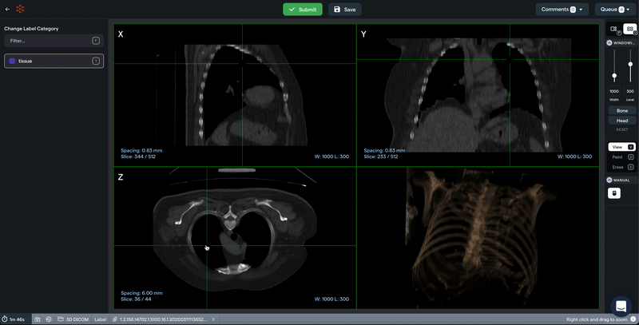
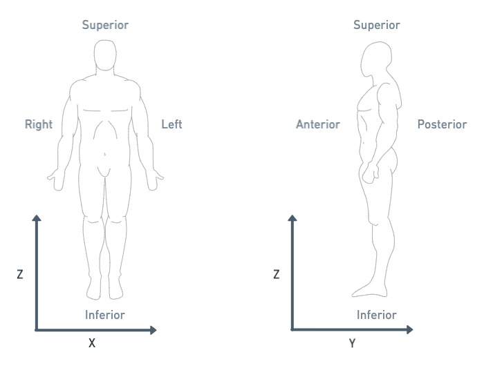
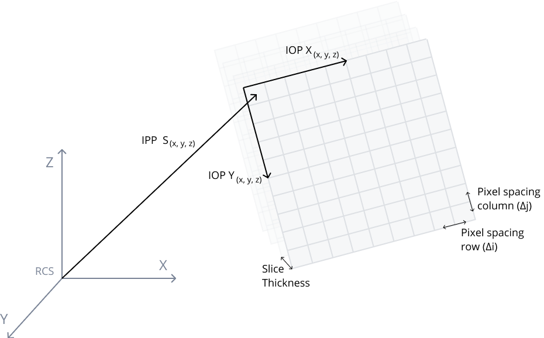
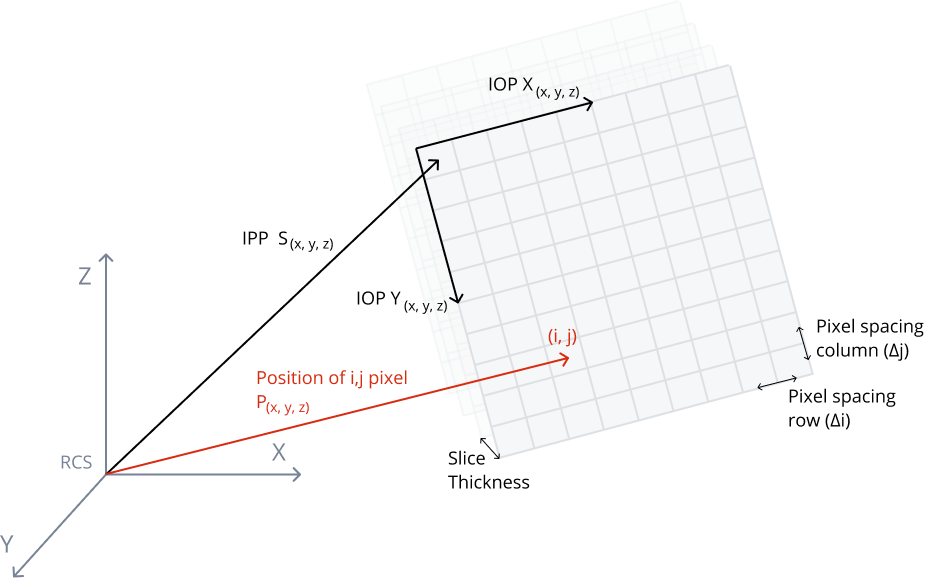
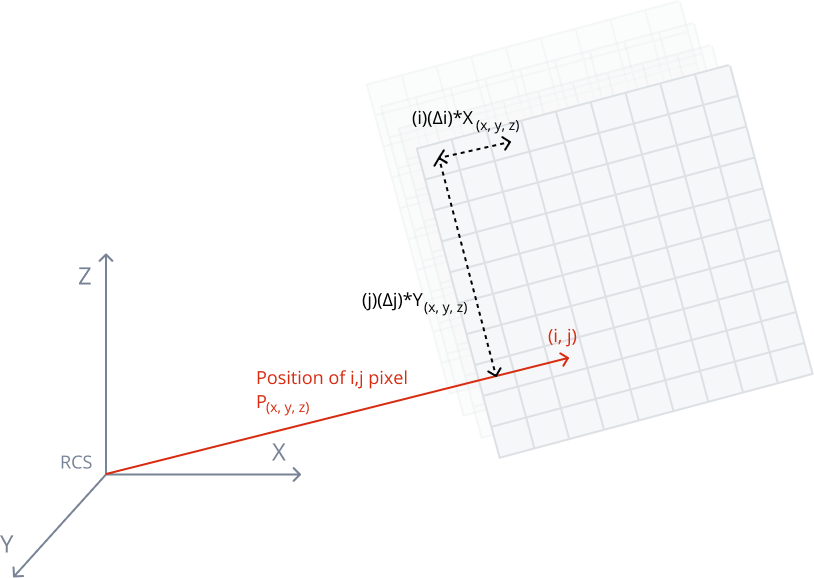
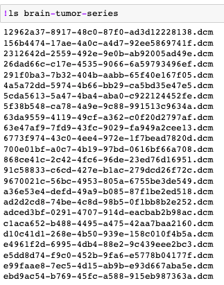
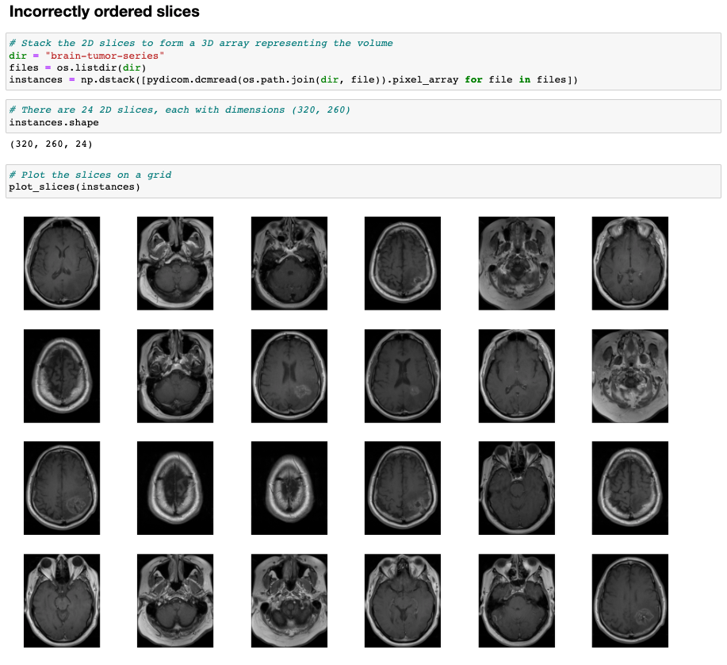
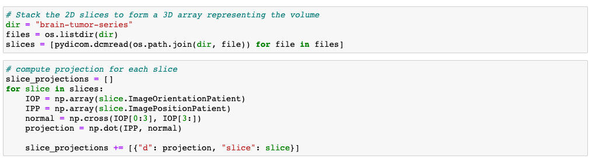
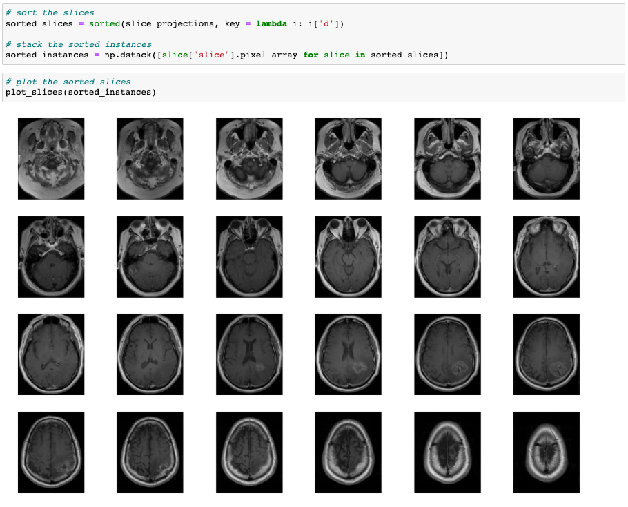

This blog aims to provide ML/CV engineers with a working knowledge of DICOM coordinate systems, and positioning and orientation of DICOM images.

If you're completely new to DICOM, I've written an Introduction to DICOM data for computer vision engineers here.

**3D Images**

What is a 3D Image? A medical imaging device like a CT scanner takes
images of a persons body from different angles to create a series of 2D
cross-sectional images through an [image reconstruction algorithm like
back-projection](http://xrayphysics.com/ctsim.html).

Stacking these 2D slices together gives us a 3D image --- see the GIF
below that shows a CT scan of the chest.

3D Chest CT scan on [RedBrick
AI](https://docs.redbrickai.com/product-updates-1/3d-medical-labeling-beta)

Normal 2D images (like a picture of a dog) just contain information
about the pixels in the image --- 3D images are more complex, each 2D
slice is stored in a file that contains pixel data information as well
as information about the position and orientation of these 2D slices in
3D space.

**Why should we care about the position of 2D images in 3D space?**

In this article, i'm going to explore two important and
common functions performed with DICOM images, that require properly
understanding the positioning and orientation of 2D slices in three
dimensions / physical space.

**Correctly ordering 2D slices to form a 3D image.**

**Representing voxels of an image in a physical dimension** (mm) to do
things like measure objects in images (e.g. tumors)

Let's start by building some working knowledge of the
coordinate frames DICOM relies on --- Reference Coordinate System (RCS),
and the Image Plane Module.

**DICOM Reference Coordinate System**

The DICOM standard defines a Reference Coordinate System (RCS) that is
patient oriented. The RCS will allow us to measure the position and
orientation of an image with respect to the patient. The RCS is defined
below.

The patient coordinate system

**The positive X direction** is towards the _left of the patient._

**The positive Y direction** is towards the _back of the patient_
(anterior to posterior).

**The positive Z direction** is towards _top of the patient_ (inferior
to superior).

**Image Plane Module**

The Image Plane Module in the DICOM orients the 2D pixel array of each
slice in three dimensions with respect to the patient.

Coordinate frame figure of image plane module w.r.t. RCS

The Image Plane Module defines multiple attributes that completely
define the position/orientation of the image --- the important ones are
defined below _Image Position Patient, Image Orientation Patient, Pixel
Spacing, Slice Thickness._

**Image Position Patient (IPP)**

The first important attribute is the IPP which gives the position of
each slice in three dimensions with respect to the RCS --- see figure
above.

_The IPP defines the x, y, and z coordinates of the upper left hand
corner (center of the first voxel transmitted) of the image, in mm
(measured from the RCS)._

**Image Orientation Patient (IOP)**

In addition to knowing where the 2D slice is in 3D, we also need to know
how it is rotated in 3D space. This information is provided in the IOP
--- see figure above.

_The direction cosines of the first row and the first column with
respect to the patient._

_Note --- the orientation of the third axis is not explicitly
communicated, but can be inferred by taking a cross-product of the first
two direction cosines._

In the DICOM standard, a _image coordinate frame_ is defined as follows:

- _The positive row axis is left to right_, or from the first pixel
  transmitted of a row to the last.

- _The positive column axis is top to bottom,_ or from the first pixel
  of a column to the last pixel in that column.

- A cross product between the row axis and column axis, will give us
  the axis along which the image is stacked.

**Pixel Spacing**

When the image is stored as Pixel Data in an array, the distance between
each voxel (along row and column) is 1 pixel. However, in physical
space, this distance can be different --- the true physical spacing
between pixels is given by Pixel Spacing (see the figure above).

_Physical distance in the patient between the center of each pixel,
specified by a numeric pair --- adjacent row spacing (delimiter)
adjacent column spacing in mm._

**Slice Thickness**

Okay, so from the Pixel Spacing element we know how voxels are spaced in
the plane of the image --- but what about in the axis normal to the
image plane? Slice thickness tells us the
'height' of a voxel in mm (see the figure
above).

_Nominal slice thickness, in mm._

_Note --- slice thickness is an element of Type 2 i.e. it is required in
DICOM files, but its value can be 0. If it is 0, the slice thickness
needs to be inferred from the IPP._

**Position of a DICOM voxel, in three dimensional space**

Now that we've gone over some of the core concepts,
let's revisit one of our topics from earlier ---
**representing voxels of an image in 3D physical space.**

Physical position of the i,j pixel w.r.t. the RCS

Looking at the image above, if we wanted to know the position of pixel
(i,j) within the RCS in (x,y,z) millimeters, we can apply a coordinate
transform.

Let's try and work that out --- we can use the values
we've discussed so far to construct the following equation
for the X position of the pixel w.r.t RCS.

If we do this for all components --- x,y,z, we get the following
transformation which gives us the position of all the pixels in a DICOM
image in physical space.

_P_xyz: The coordinates of the voxel (i,j) in mm w.r.t RCS (mm)._

_S_xyz: The Image Position Patient, which gives us position of the
center of the first voxel w.r.t RCS (mm)._

_X_xyz, Y_xyz: The row and column direction cosines of the Image
Orientation Patient (unit vectors)._

_i, j: Column index and row index respectively (index)._

_∆i, ∆j: Row and Column pixel spacing values (mm)._

Using this transformation matrix, we can find the position of all voxels
in 3D space, and can make measurements/alignments in the image with real
physical units like millimeters.

**Sorting 2D slices of a 3D image in correct order**

Finally, let's revisit the second key topic we discussed
earlier **correctly ordering 2D slices to form a 3D image.**

Let's start by seeing what happens if you
don't correctly order your slices. If we simply read in the
2D slices and visualize the images, we'll see the grid in
the image below has randomly positioned slices --- this is problematic
if you're trying to get an intuitive view of your 3D image.

(Left) Instances of a CT scan, (Right) incorrectly ordered slices
visualized.

To correctly order these slices, we need to order them in the direction
of the _imaging axis_ (axis normal to the image plane)_._ If we knew
these images were taken along the RCS X axis, we could easily order the
images by using the IPP X values. However, nothing from the DICOM files
tells us what the imaging axis is, so we have to infer it.

Referring back to our definition of IOP, we know we can find the
_imaging axis_ by performing a cross product of the _row_ and _column_
IOP vectors:

The normal vector is the imaging axis, i.e. the axis along which the
slices stack.

Now, we want to find the projection of the IPP for each slice along this
normal vector --- this projection will give as a scalar value which tell
us the position of each 2D slice along the imaging axis.

To find this projection, we need to take the dot product. We can then
order the slices using this projection.

The projection gives us the 'distance' of each
slice along the normal imaging axis.

_Now let's do this in code._ Compute the projection of the
IPP on the normal vector for all the slices.

Sort the slices based on the projection and visualize.

There you go --- perfectly ordered slices, and a perfect understanding
of the position and orientation of DICOM images!!

**References**

DICOM Standard ---
[https://www.dicomstandard.org/current](https://www.dicomstandard.org/current).

UCL, DICOM for MRI ---
[http://www.cs.ucl.ac.uk/fileadmin/cmic/Documents/DavidAtkinson/DICOM.pdf](http://www.cs.ucl.ac.uk/fileadmin/cmic/Documents/DavidAtkinson/DICOM.pdf).

‍
