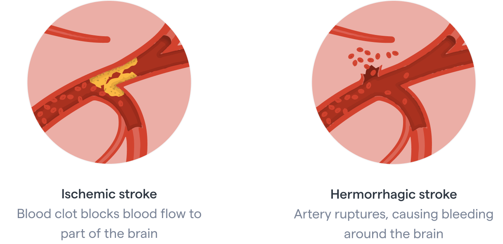
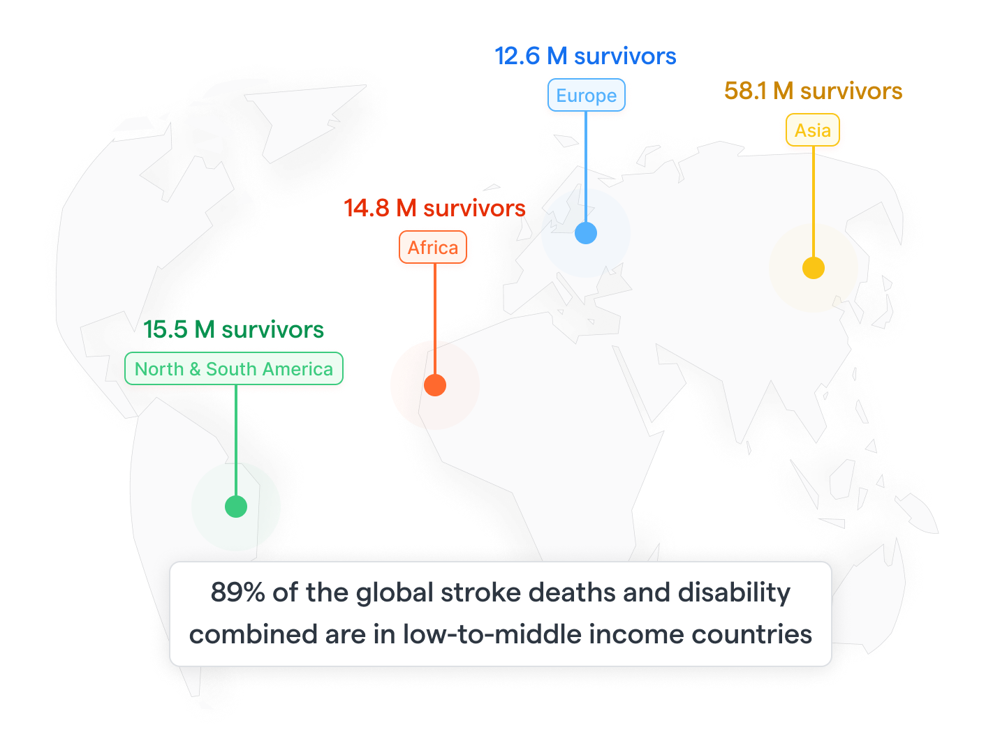
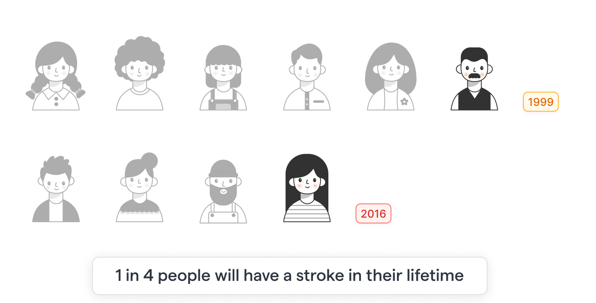
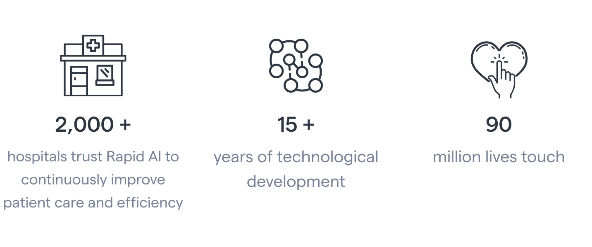
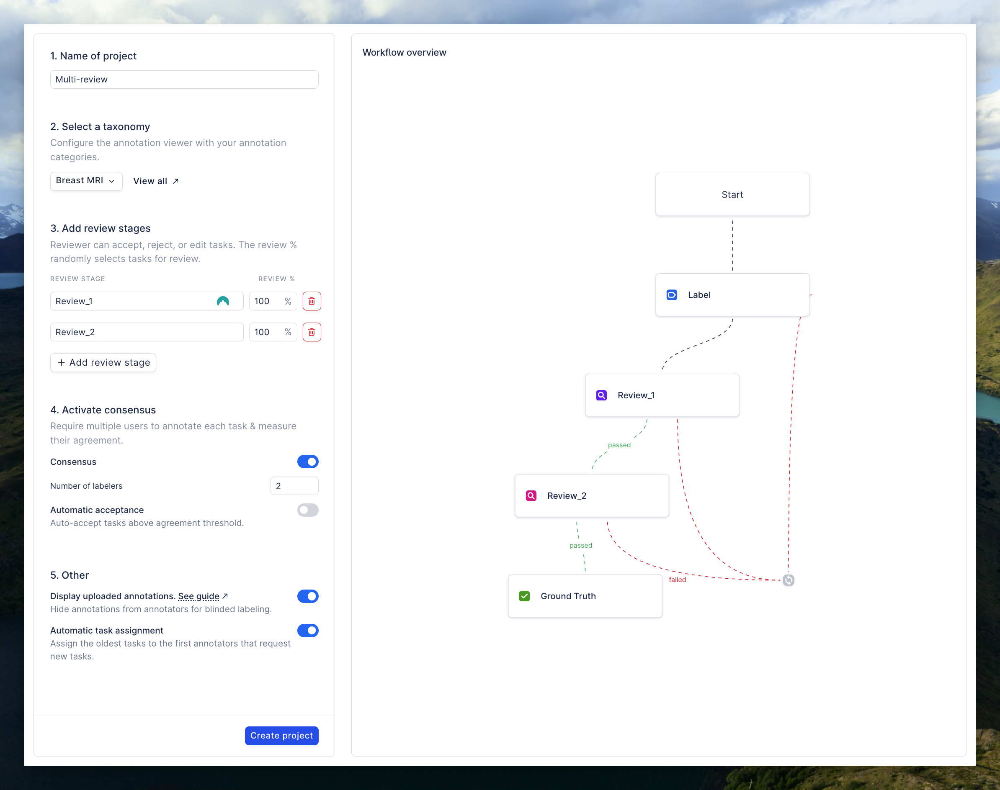

RapidAI is a global leader in using artificial intelligence (AI) to combat life-threatening vascular and neurovascular conditions. Their products are used in more than 2,200 hospitals in over 100 countries to help physicians make faster, more accurate decisions for better patient outcomes.

RapidAI offers products for the diagnosis and treatment of stroke, aneurysms, pulmonary embolism, and other vascular conditions.

We sat down with Dr. Ryan Mason to discuss RapidAI's suite of products, as well as their collaboration with RedBrick AI, but first, let's establish some medical context.

## What is a stroke, exactly?

A stroke is a medical condition where blood flow to the brain is impaired due to either a blood clot or a ruptured vessel, starving the brain tissue of vital oxygen and often leading to devastating consequences for the patient.

While episodes of strokes were recorded as far back as ancient Mesopotamia, in ancient Greece the father of medicine, Hippocrates, is credited with discovering the pathology over 2,400 years ago. He originally named the condition apoplexy, Greek for paralysis, ultimately deriving from the words apo meaning 'away or down' and pleg meaning 'to strike or hit'; hence, apoplexy meaning to strike down.

In 1658, a physician named Jacob Wepfer identified the root cause of strokes through postmortem examination of patients. Wepfer was able to identify two different forms of stroke that still hold true today — (a) ischemic stroke, where a clot blocks the flow of blood to the brain, and (b) hemorrhagic stroke, in which a blood vessel in the brain ruptures.

## The importance of rapid response

When an acute ischemic stroke occurs, seconds count for a patient. [Studies have estimated](https://blog.redbrickai.com/blog-posts/redefining-neurovascular-and-vascular-care---rapidai-redbrick-ai#:~:text=Studies%20have%20estimated) that for every minute an ischemic stroke goes untreated, a patient can lose up to 1.9 million brain cells, which is why strokes are [among the leading causes for disability in the United States](https://www.cdc.gov/stroke/facts.htm).

However, responding to an ongoing stroke invites significant logistical challenges. Even if a patient is exhibiting a suite of ischemic stroke symptoms, clinicians must conduct scans in order to be able to first exclude the presence of a hemorrhagic stroke. Once ischemic stroke is confirmed, additional imaging can help identify if there are favorable treatment conditions and the location of the clot. After the scans are taken, processed, and loaded to a viewer, the clinician must then sift through hundreds (or even thousands) of images in an attempt to locate the site of the clot or find corresponding markers that can be extremely subtle.

Once the appropriate treatment conditions and clot location are identified, the patient is often treated with a clot-breaking medication through thrombolysis or they undergo a potentially life saving procedure called a thrombectomy, wherein a clot is removed directly from a patient's blocked blood vessel.

## RapidAI's solutions

A few of RapidAI's most successful stroke solutions, Rapid LVO, Rapid CTA, and Rapid CTP modules, are deployed in hospitals around the world and greatly reduce what Dr. Mason refers to as the "door-to-needle time", or the time from when the patient enters a healthcare facility to when they begin receiving treatment.

Rapid CTA measures the reduction in blood vessel density and can quickly point a clinician to a location that is highly likely to contain the site of a stroke, in the case of anterior circulation large vessel occlusions. Rapid CTP's ability to generate automated perfusion maps on CTP scans within minutes with extremely high sensitivity and specificity provides healthcare teams with vital localization and mismatch information when every second counts for effective patient care.

> A patient comes in, they get scanned, and we're standing at the scanner waiting. I'm waiting for the images to come on to PACS, and then the stroke neurologist next to me goes "Oh! I got the images right here on my phone."
>
> Dr. Ryan Mason
> Neuroradologist

In addition to Rapid LVO, Rapid CTA and Rapid CTP, RapidAI has also created vessel segmentation and hemorrhagic stroke models utilizing Deep Learning techniques, but more on that in a moment.

## RapidAI's annotation journey

The team at RapidAI was initially reliant on open-source software to create annotated data sets and manage their data pipeline, but they soon found that their needs weren't being met.

> And there were **lots of Excel sheets** for keeping track of who had done what, who reviewed what and who approved what... after a series of projects, the work became unwieldy and it became apparent that some type of cloud-based platform would be very convenient for managing all of this.

> Dr. Ryan Mason
>
> Neuroradologist

RapidAI's projects were more complex in scope and annotation requirements than open-source tools could handle, and the decision was made to shift to a vector-based annotation tool. However, once the RapidAI team had a chance to really dig into the vector-based tool, they found that smaller issues began piling up.

> That other commercial solution wasn't designed up-front for DICOM viewing. It was just not going to work for annotating vessels.

> Dr. Ryan Mason
>
> Neuroradologist

As is often the case with more "generalist" annotation platforms, there were challenges when it came to rendering DICOM files, a format known for its universality but also lack of structural consistency. The RapidAI team also discovered that segmentation in the other tools left a lot to be desired for their specific use case.

Furthermore, several features that would be key for the annotation work RapidAI was trying to perform, such as a contour tool, thresholding ranges, and interpolation, were completely absent on many competitor's platforms. The early platforms that RapidAI explored weren't a comprehensive fit for their annotation needs. That's where RedBrick AI came in.

## RapidAI and RedBrick AI

RapidAI started working with RedBrick in January 2023, and is currently working on numerous annotation projects across multiple disciplines including stroke and cardiovascular. When we asked Dr. Mason which aspects of the software brought the most benefit to his team, he had the following to say:

> Being able to see and annotate the images in sagittal and coronal on RedBrick AI, is really essential for some projects.
>
> Dr. Ryan Mason
>
> Neuroradologist

  <video width="784" height="441" controls>
    <source src="https://media.cleanshot.cloud/media/72209/jefIBPAsAEl89pGveppPsTJkRNXH2pD0Rc7MiJ2i.mp4?Expires=1741231431&Signature=GemYIxvTS4PIKkvTRK3Iqx9MOPC0RHrvtBXt1dd~d0ovg8m1rtEdKdWypGjopB8AYRKKK6IrmRYSrrziKSgen~pxtJjVU4dFYDUwCuwxo8c0rjYW3zDecoS6MaYWX8gwDSuvUmtqH2sk9lf2exTNHikC5dPqiGijsEo1FJrzzcG0HtBjoFhXpmB0vJMQxuFsNai1HUGAsZpkycXmXmLWGlub57GLlOMbPC4XgFWlwRIjGdq4dVyxHA9WelTOhY7qN9ZXNzKOfXxffiYq~Vo-9A7V7GKBSxgzXAd1N3b0z7qhQHMRg7WgvYc4DcH-Y0eZIkWUBg0jx7Qz3MOJ6pSDcA__&Key-Pair-Id=K269JMAT9ZF4GZ" type="video/mp4">
    Your browser does not support the video tag.
  </video>

### Purpose-built for radiology AI

The ability to easily reference and annotate on reconstructed views was a game-changer for the RapidAI team, as they could now complete all of their annotation work in a single window.

> As someone who uses DICOM viewers, **it was very intuitive, very easy to navigate.**
>
> Dr. Ryan Mason
>
> Neuroradologist

### Intuitive design

DICOM viewers often oscillate between "oversimplified and limited in functionality" to "oppressive for the first 20 hours of use". RedBrick AI has been designed to make it simple to find the tools you need without having to filter through excessive menus or documentation.

> The multi-tier review has been very helpful. I can have a basic annotator and an expert reviewer, and I can allow them to ping-pong the cases back and forth until they feel like they're good. Once the scan passes their expert reviewer, it gets to me. Having the flexibility to add that in is very convenient.
>
> Dr. Ryan Mason
>
> Neuroradologist

### Flexibility by design

Data pipelines come in all shapes and sizes, and RedBrick AI gives project managers all of the control they need when it comes to creating and managing annotation flows.

### Reliability

The previous software RapidAI had used was prone to crashes, which can have devastating consequences on project timelines, budgets, and outcomes.

## Conclusion

As is often the case with teams developing AI-powered clinical solutions, the end goals of RapidAI's projects are across-the-board regulatory clearance and sweeping implementation that benefits both patients and healthcare providers around the world.

The production of quality data sets is at the core of these initiatives, which is why it is essential for organizations such as RapidAI to build and maintain data flows that allow for reliable quality control processes, minimize intra-organizational friction and noise, and make it simple for every team member (radiologists, project managers, data scientists, AI engineers, etc.) to do what they do best - their jobs.

From the very beginning, RedBrick AI has been built as a place where experts can create ground truth data sets of exceptional quality, and that mission is visible in the software we build to this day. Dr. Mason and the team at RapidAI understand this intimately:

> Lots of these problems require carefully annotated datasets. There are numerous problems you can solve if you have the right dataset and you have it annotated appropriately. Using RedBrick AI helps us build better products.
>
> Dr. Ryan Mason
>
> Neuroradologist

We here at RedBrick AI are thankful for our continued collaboration with RapidAI - it's been thrilling to cooperate with an organization that is doing so much to revolutionize the healthcare industry and improve patient outcomes for this debilitating pathology.

> The best way to predict your future is to create it.
>
> Peter Drucker
