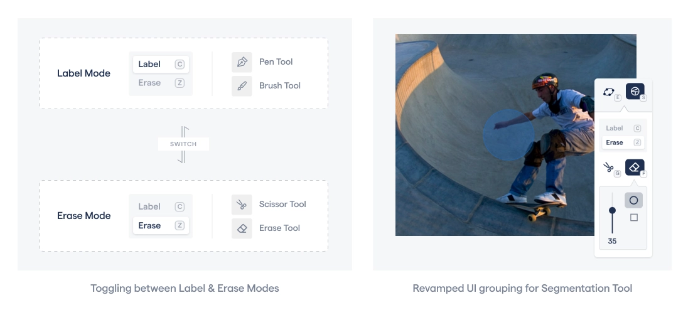
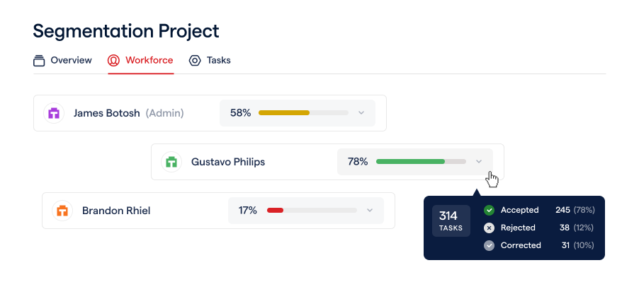
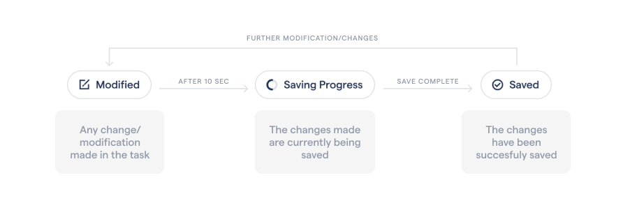

# December 2021 Updates

## Command Line Interface

We're excited to release our CLI for easily managing data exports from the RedBrick AI platform. With the CLI you can export your data with a git like interface that will fetch only the latest labels created within your project.

Configure a profile to interact with your organization through the CLI.

```
$ redbrick config
> Org ID: 540abd9a-cb3b-4fd1-a14a-ccea6ae8c31e
> API Key: srEva5ApoiavSiscM5SDzoaEegBWJYVASVqZ1bhm4pY
> Profile name: rb_20211213151951114270
✔ RedBrick AI Organization
```

Clone your remote annotation projects by selecting from a list of projects or specifying your project id. You can manage your data exports within cloned projects.

```
$ redbrick clone
✔ RedBrick AI Organization
✔ Fetching projects
> Project:
  Project 1 (4d802e03-6ce2-4d4c-905c-b1487641780f)
  Project 2 (7ad87f6c-a477-44fc-99fc-8b59eb5486e0)
```

Export just the latest changes to your labels, by running the export command within your project.

```
$ redbrick export
INFO - Refreshing cache with tasks
INFO - Refreshed 122 tasks
INFO - Exported successfully to: ./export_redbrick_latest_2021-12-13_15-27-11.json
```

## Label Auto-Saving

The labelling tool is now equipped with an autosave feature which saves your work at regular intervals. The information badge placed in the top bar will help you track the current save status of the task. The badge consists of the following states:



**Modified.** A change/modification has been made to the task which will be automatically saved

**Saving.** The tool is currently saving any change/modification made to the task

**Saved.** The changes made have been successfully saved

## Individual Labeler Quality

Now you can track the labelling quality of an individual labeler from the workforce tab in a project. This allows you to have a more detailed performance analysis of your workforce effortlessly. The quality is determined by how the data labelled by the individual is reviewed over the past 7 days.



## Segmentation Tool Updates

The labelling toolbar have a couple of major updates to improve the intuitiveness of the overall labelling experience, which are:

1. A revamped 2-column structure with a toggle to switch easily between the label and erase modes
2. Introduction of pen & scissor tool which is grouped respectively under the label and erase modes
3. New UI grouping for the segmentation tool to help the users control the shape and sizes of the tool more effortlessly


