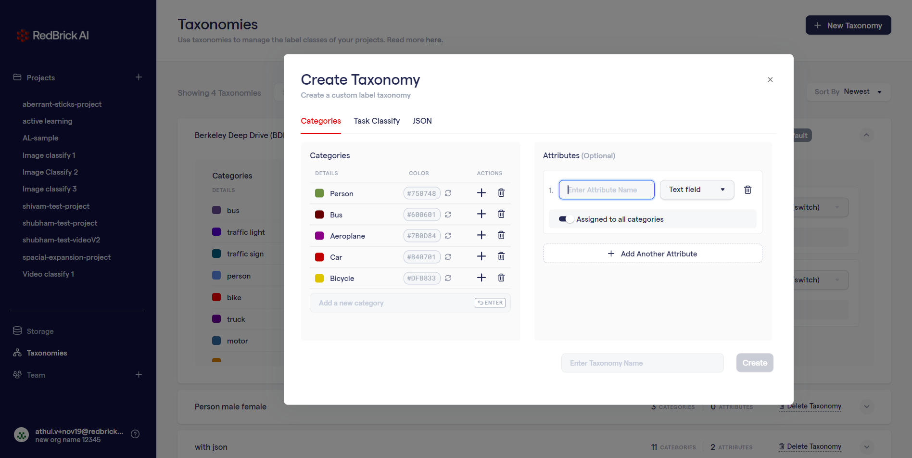
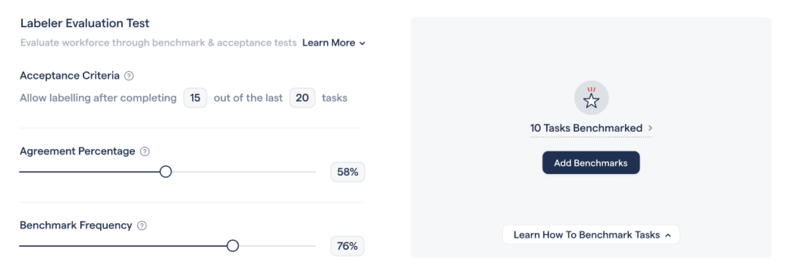
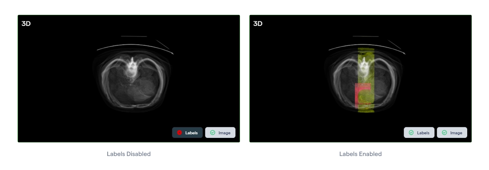

A quick overview of the latest updates and features we've introduced in January 2022 to improve the overall experience while using the tool. You may want to visit the documentation for a detailed overview of the updates.

## Revamped Taxonomy Design

The create/edit taxonomy now has an updated design considering the overall functionality and requirement of the user group. One of the major changes involve the placement of an attribute list parallel to the categories allowing for a more detailed understanding of the work flow.

By default, a created attribute will be assigned to all categories unless the toggle is disabled. When disabled, a link to assign categories would appear which when clicked will lead to a selection state to assign the necessary categories to that attribute.

The users can also create task specific categories under the 'task classify' tab which can be used mainly to classify a task based on types. The flow and functionality of the process is identical to the categories section.

# Benchmarking & Evaluation Tests

We're introducing a new feature which allows the admins to benchmark the groundtruth tasks which would be further used to evaluate the skills of new and existing set of labelers. Once a minimum number of tasks are benchmarked from the settings page, the newly joined labelers will pass through an acceptance test comprising of the benchmarked tasks. The labelling accuracy when compared to the benchmarks will then result in the labeler getting accepted or rejected.

Even after passing the acceptance test, the labelers will be subjected to periodic benchmarking tests at a frequency which can be customized by the admin.

---

# DICOM Tool Updates

## DICOM Instances

The DICOM tool have a couple of new updates associated with the instances. The users now have the ability to lock a specific label to prevent it from getting overwrited while labelling on top of it. The visibility of a label can also be adjusted by toggling the 'eye' button placed next to the lock.

## 3D Rendering

The DICOM tool have a performance optimization update where the users can toggle on/off both the 3D image and labels. This helps in maximizing the speed & performance based on the needs.

