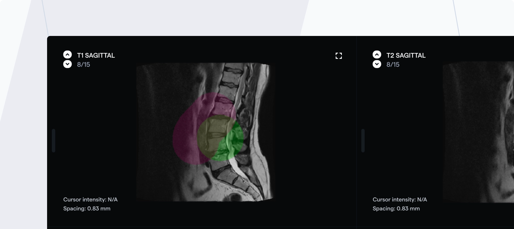

We're excited to update you on our revamped DICOM labeling interface. We have made upgrades to the interface and functionality of the DICOM labeling tool that will enhance your experience of using our platform!

## Revamped Interface

If you've used the previous annotation interface, you should immediately notice significant differences in the labeling interface - fonts, icons, layout, colors etc. We've designed the interface for efficiency and a modern/minimalistic feel.

## A New Context Panel

The annotation tool now has dedicated space for configuring tools and interacting with their settings i.e. the _context panel_ on the right side of the labeling tool.

The context panel will dynamically update depending on your currently selected tool. Unlike before, you will now have the ability to select multiple tools at once and interact with their settings at the same time e.g. applying thresholding and smoothing operations while segmenting a volume with a 3D brush.

## Overlapping Segmentations

You can now create overlapping segmentations in the DICOM tool. Previously, each voxel of the volume was assigned only 1 classification; however, you can now add multiple annotations to a single voxel. Each segmentation tool (brush, pen etc.) will have the "overlap labels" toggle, which when activated will ensure segmentations do not get overwritten, but instead overlap.

## Selecting Annotation Types

There is a brand new "Create Label" button which gives you quick access to changing your annotation type. From the dropdown you can select "Segmentations", "Classifications" or "Landmarks".

## Filter Your Task Queue

While annotating, you can now look at "All tasks" in your queue, or filter by "Skipped", "Assigned" and "Saved" tasks. Any tasks in your queue that have recently been rejected in review will immediately stand out.

## Use the Select Attribute

In addition to a boolean and text field attribute, you can now create a Select attribute. The Select attribute allows annotators to choose a single options from a dropdown list.

