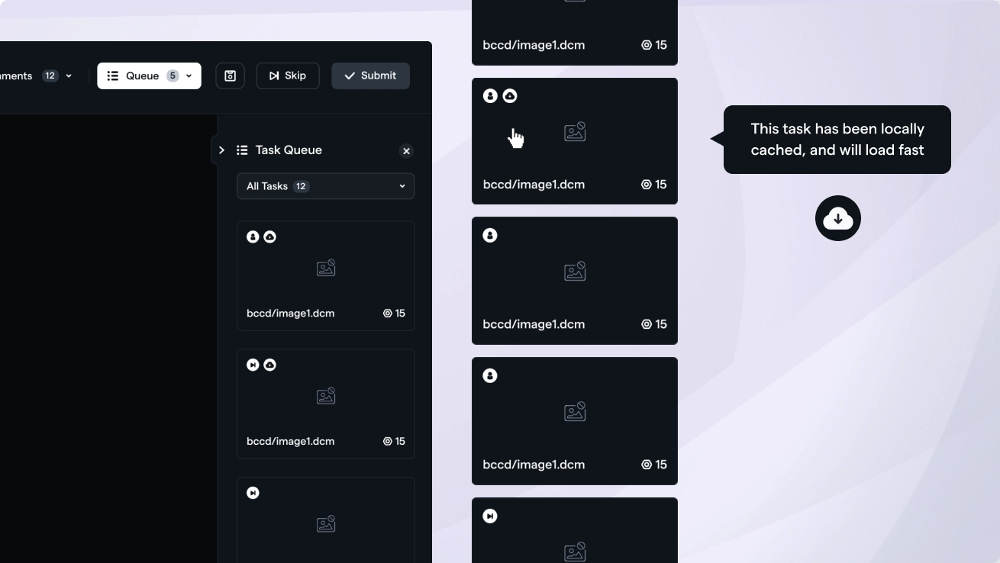
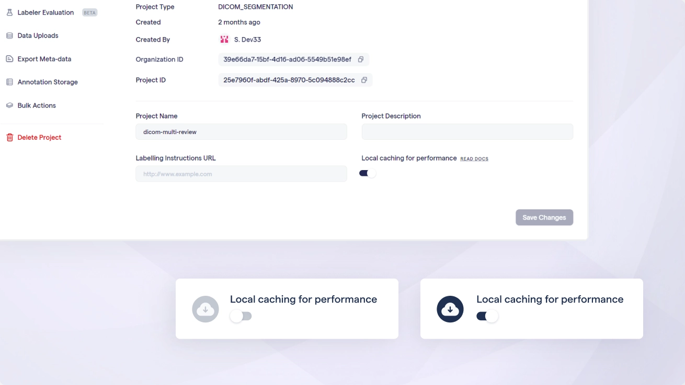
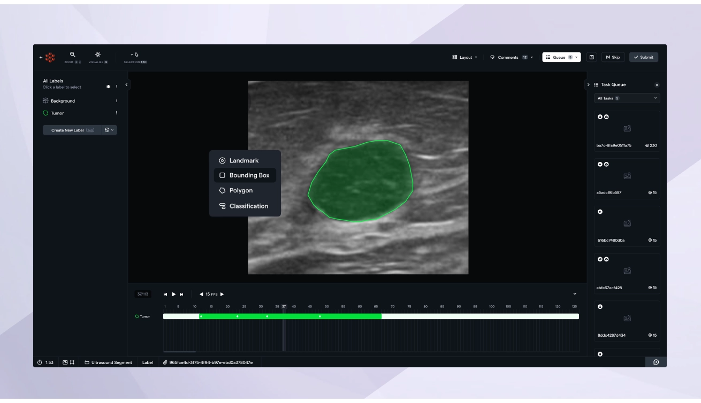
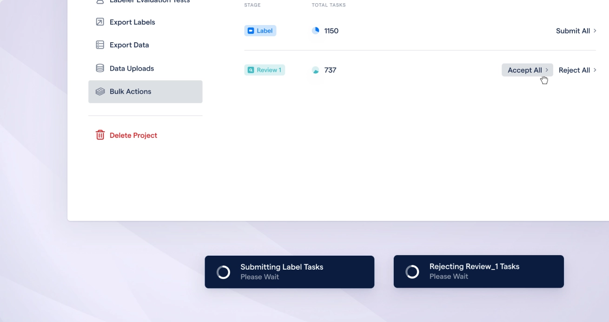

# Fast data loading, upgrades to 2D annotation and more!

In this release, we focused mostly on performance improvements. A couple of the major changes are - improving the loading experience of DICOM tasks, especially very large data, and a revamped 2D annotation toolset.

## Cache tasks ahead of time, load them instantly later

You can now manually pre-load / cache your DICOM cases in the data tab. Caching a task will store it locally in your browser and be quickly accessible from there. If you have especially large tasks, you can download a batch, walk away for a break, and come back and rapidly load all tasks when you're labeling.

[Loom video](https://www.loom.com/share/73ac78bcfb184e8eb75320faa0db20f0?sid=c31eb0c3-21a3-48d4-b8c3-9181565b7f2a)

RedBrick AI will also automatically cache your queue so that while you're labeling, future tasks will load quickly.

As an admin, you can enable/disable caching from project settings.

---

## Revamped 2D video & image annotation

We've unified all annotation tools to be made available within a single data type - **"Medical"**. Within this data type, you can upload 3D volumes, 2D images, and videos - the 2D tools have been revamped and unified with the existing 3D tools. Within the Medical data type, you will be able to create vector annotations, classifications, and segmentations (vector annotations for 3D are coming soon).

---

## Bulk Process your tasks

Often you may want to perform the same operation on all your tasks in a particular stage - e.g. accepting all tasks from Review after reviewing a portion. You can now bulk process your tasks - accept/reject in review, submit in label, and send back to label from ground truth!

