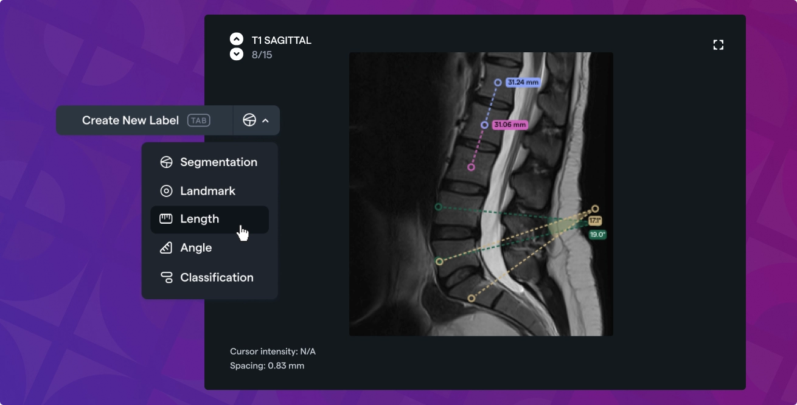
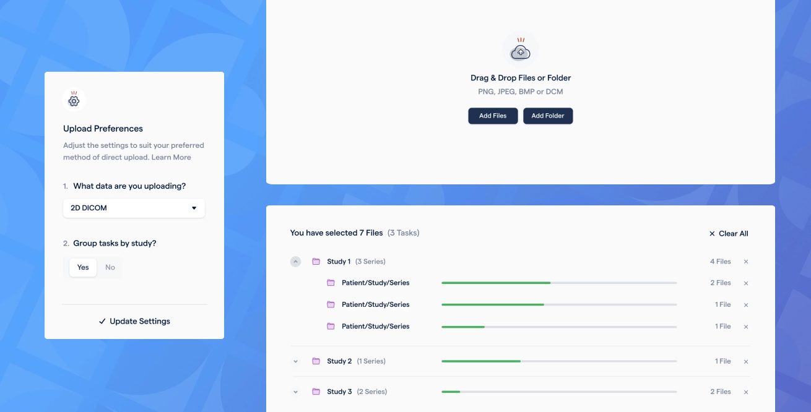
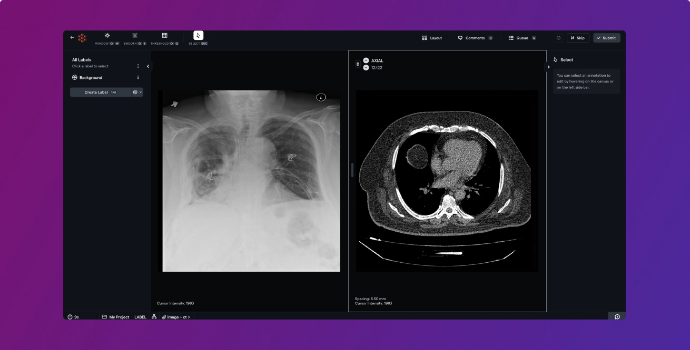
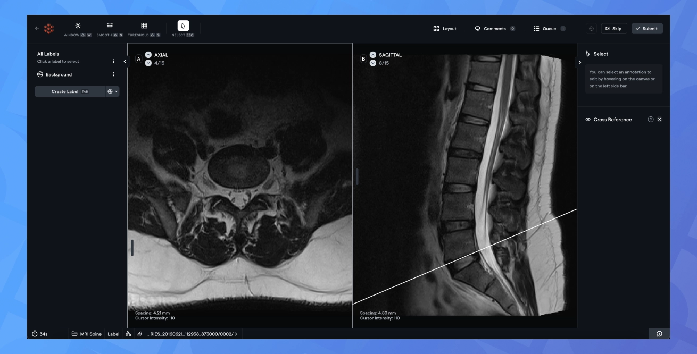

# Measurement tools, seamless data import & multi-modality support!

In this product update, we're excited to release long awaited features like measurement tools, a more intuitive data import process, and multi-modality support that will make our annotation tool more powerful and versatile!

## Measurement annotations for 3D

Add length and angle measurements to your CT and MRI series. This feature is also compatible with oblique planes, allowing you to add these annotations on any given plane. These annotations will be saved and can be edited and exported in the same way as other annotation types.

## Powerful data import

Built with patient/study/series folder structure in mind, now upload data from your computer faster and easier than before. Group tasks by study or series and generate a meaningful preview to validate your data before importing.

## Multiple modalities in a single study

The medical annotation tool now allows you to mix images, videos, and 3D volumes as needed. Utilize the new study based import format to specify each series that you want to make available for annotation. These files can be any of the types we support. For more information ([docs.redbrickai.com](https://docs.redbrickai.com/dicom-annotation/multiple-modalities))

## Cross reference lines for MRI scans

With the cross-reference feature, you can see the exact position of a specific slice from a series, in another series. This capability can be extremely useful while annotating MRI studies to properly orient yourself in other imaging planes/series.

Activate under the command palette (`ctrl+k`) with the "Toggle cross referencing" command.

## Other Changes

- **Polyline labels** - Addition of polyline labels to medical annotation for 2D images and videos.

- **Label vibrant mode** - Make a label's color high contrast green. Toggle by using the `v` hotkey or under the label options on the left side panel.

- **Visual smoothing** - Change the visualization of images from pixelated to smoothed. Activate under the command palette with the "Toggle linear pixel interpolation" command.

- **Remove storage methods** - You can now delete storage methods under the storage method tab.
