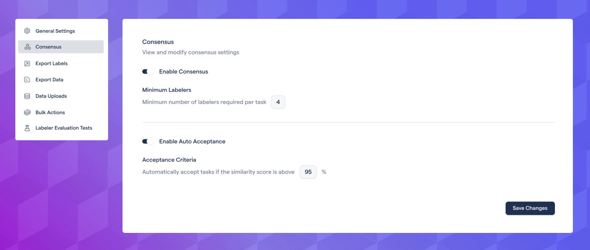
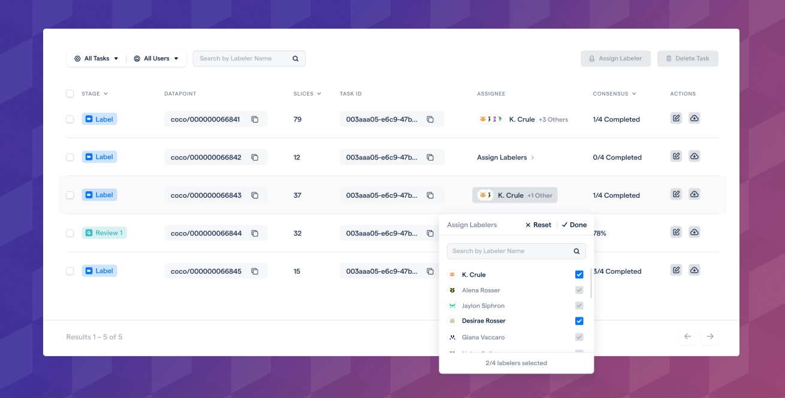
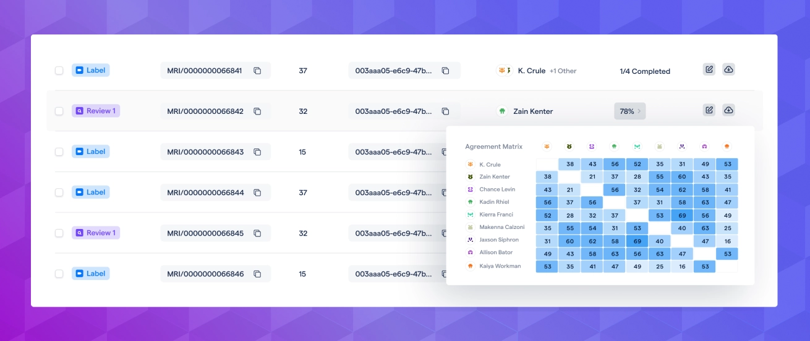

# Qualify annotations with consensus, and a new data format!

We are thrilled to release our new consensus feature to help you quantify annotation quality and generate higher quality ground truth.

With consensus, you can require several labelers to annotate each task. RedBrick AI will then calculate an inter-annotator agreement score and automatically select the best set of annotations or give reviewers the ability to arbitrate between multiple opinions efficiently.

Please visit [our documentation](https://docs.redbrickai.com/projects/consensus-inter-annotator-agreement) for a detailed overview of the feature.

## Enable consensus, and require multiple annotators

In project settings, you can enable consensus and define how many users need to annotate each task. You can also specify an acceptance threshold to accept tasks in review automatically.

## Automatic and manual task assignment

RedBrick AI will automatically assign available tasks to the required number of annotators. You can also manually assign tasks on the data page. Each annotator will label the task from scratch and will not be able to see other annotations.

## Inter-annotator agreement / similarity score

RedBrick AI automatically generates a single similarity score for each task that gives you a measure of agreement/consensus of that task. You can quickly inspect how each user agrees with every other user.

## Review arbitration

Reviewers can view annotations done by all users and edit/accept any. Add/remove any users' annotations and search/filter by category or annotation type.

As always, if you'd like a detailed overview of this feature or help getting set up, please don't hesitate to reach out directly!
