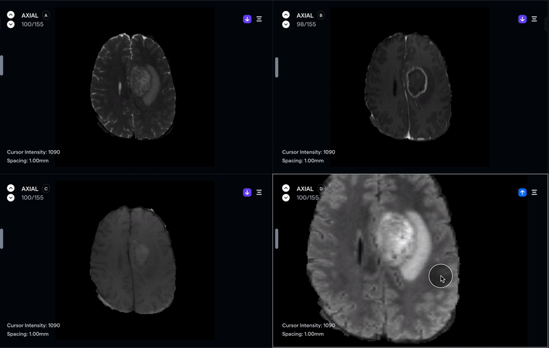
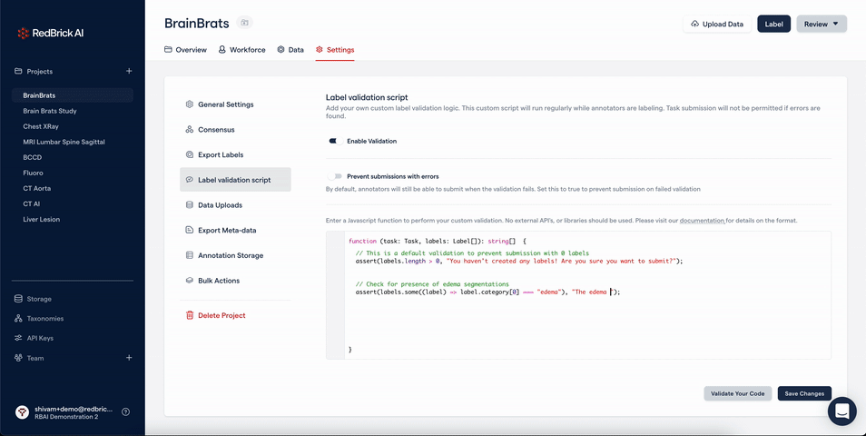
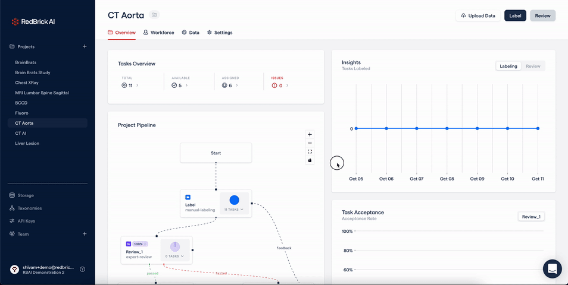
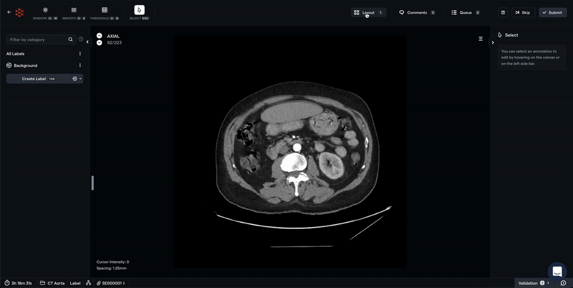

This month's updates include advanced features for annotations entire studies, maximum/minimum intensity projection, a way to enforce your labeling schema, and more! We are also announcing a major upcoming change to taxonomies, and a chance to experience the beta version.

## Segmentation Mirroring

While annotating an MRI study containing several series e.g. T1, T2, and Flair, comparing and contrasting your annotations on the different views is critical. With the Segmentation Mirroring tools, you can now project your annotations from one series to another and modify the segment on all viewports.

Read more about how to use segmentation mirroring in our [documentation](https://docs.redbrickai.com/dicom-annotation/segmentation/segmentation-mirroring?q=mirroring).

## Custom Label Validation Script

The most common source of errors in annotation projects stems from annotators accidentally deviating from annotation guidelines. With our new Custom Label Validation feature, you can write your own Javascript function to validate annotations in real time against a schema.

Either warn annotators of their mistakes before submission or completely disallow submission with errors. Learn more in our [documentation](https://docs.redbrickai.com/projects/custom-label-validation).

## Randomized Review & Automatic Assignment

You can now easily make each review stage a "randomized review" where the platform will randomly sample a subset of data for a particular review stage. Furthermore, you can now disable RedBrick AI's default automatic assignment protocol and rely purely upon manual task assignment.

## Maximum/Minimum Intensity Projection

You can now use Maximum and Minimum Intensity projections to analyze your 3D volumes. The MIP view can be [toggled inside the layout tab](https://docs.redbrickai.com/dicom-annotation/layout-series-study#max-min-intensity-projection-mip).

## Upcoming: Revamped Taxonomy

Some of our most common feature requests surround the Taxonomy feature. You've told us that you love the structured schema and the ability to reuse taxonomies across projects. However, you feel a lack of flexibility and an absence of intuitive interfaces for classification. We've integrated this feedback and are excited to give you a sneak peek of our upcoming revamped taxonomy.

For object labels, the categories and object types are linked together for simpler creation. There is a dedicated panel on the right for editing the attributes of the selected label. For classification, you will be able to separately classify at the study or series level, all while keeping the panel visible.

This is **available for limited early access immediately**, contact us if you are interested.
