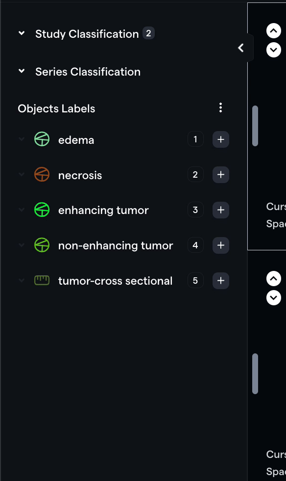
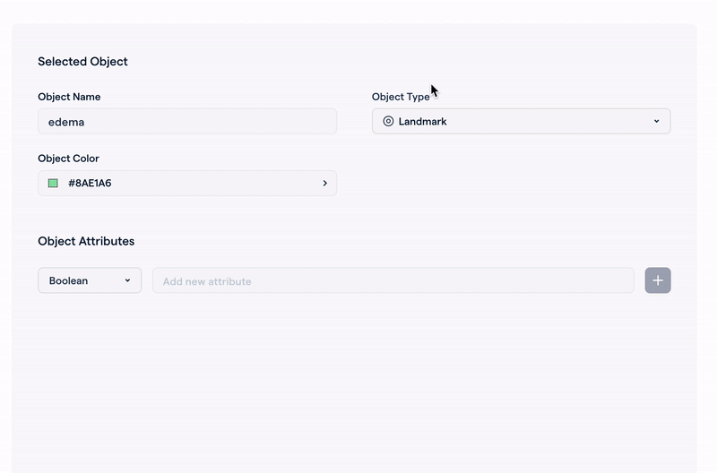
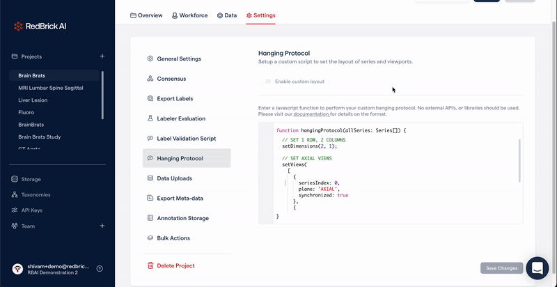
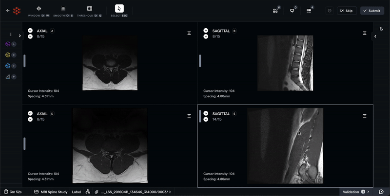
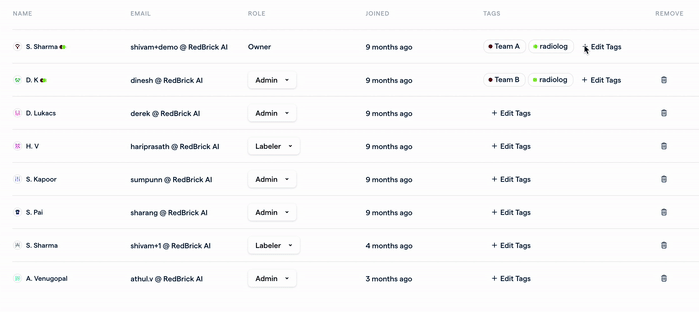

This month was full of significant updates requested by several teams. The update includes an overhauled taxonomy system for flexibility & hanging protocols to standardize annotation/image viewing layouts!

# Powerful Labeling Taxonomy

We have introduced several critical upgrades with our Taxonomy V2 release, including overhauling the structure of taxonomies. With Taxonomy V2, you can create **Study & Series Level Classifications** and **Object Labels** (segmentations, measurements, landmarks, etc.).

### Optimized annotation panel

Taxonomy V2 also significantly improves the label creation workflow, with just one click for creating annotations. We have also added shortcuts (1, 2, 3, etc.) for quickly creating instances of annotations.

### Structure and flexibility in creation & editing

While defining Object Labels, you can now pre-define the Label Type along with the category name, preventing annotators from segmenting an object that was supposed to be a landmark! The new taxonomy editor also now allows editing categories and attributes after creation.

Read more about using [Taxonomy V2 here](https://docs.redbrickai.com/projects/taxonomies). For the time being, we will continue to support Taxonomy V1, but we plan to [deprecate Taxonomy V1 in the future](https://docs.redbrickai.com/projects/taxonomies#taxonomy-v1-vs.-taxonomy-v2). Therefore, we recommend you transition to Taxonomy V2 for upcoming projects.

# Hanging Protocols

With our hanging protocols feature, you can now standardize your imaging layouts for all users in a project. The hanging protocol is a custom Javascript function that offers much flexibility and customization. Currently, you can configure the following parameters with hanging protocols:

1. Image viewer's layout, e.g., 1x1, 2x1, 3x3.

2. The contents of each viewport, e.g., Series 1 axial in viewport 0, Series 2 coronal in viewport 1.

3. Intellisync activation by default.

4. Image flipping - horizontal or vertical.

5. And more!

Please [read more about hanging protocols here](https://docs.redbrickai.com/annotation/layout-and-multiple-volumes/custom-hanging-protocol).

# Intellisync for multi-series Tasks

Intellisync allows you to synchronize the scroll position between multiple series in a single study. Synchronization is vital for comparing and contrasting annotations, and image features between related series, e.g., T1 and T2 weighted MRI scans.

The scroll position will be synchronized for viewports that are aligned (the same imaging axis). If the viewports are not aligned, we will display a **cross-reference line** to display the position of the current slice on another volume.

Please [read more about Intellisync here](https://docs.redbrickai.com/annotation/layout-and-multiple-volumes/intellisync).

# User Tagging

For teams with several users from different organizations, you can now use "User Tags" to tag each user to make project management more effortless. For example, tag all radiologists, and radiographers, so that all managers on the team know who to assign Labeling and Review tasks.

