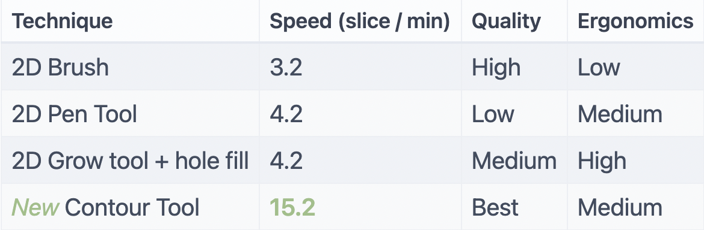

Building datasets for AI requires large amounts of time hand annotating data. The faster and more painless that process is, the better. We were able to make a purely manual annotation tool that speeds up segmentation by 500%.

In this post I share results of a comparison of a variety of manual segmentation approaches in the RedBrick AI platform for the liver segmentation task.

**Introducing the Contour Tool**

The contour tool allows you to draw contours on different slices and interpolate between them. Quickly redraw any segments that are inaccurate. You can easily skip 5--20 slices and still produce near pixel perfect annotation.

**Comparison to other approaches**

In order to have a point of comparison, I first tried out annotating the same task with "standard" manual approaches: brush tool, pen tool, and our grow tool. I then completed this same task using the Contour tool.

To evaluate this set of manual segmentation tools, I performed a liver
segmentation task because it is a common task in AI and its large size
is challenging for some segmentation tools. Each approach was evaluated
for speed, annotation quality, and ergonomics.

Let's jump straight into the results:

10 minutes using the Brush tool

5 minutes using the Contour tool

With only 5 minutes of using the Contour tool, far more slices of data
had been segmented than even after 10 minutes using any of the other
approaches. The results are summarized in the table below.

Summary of results

You can see that the Contour Tool outperformed the other techniques. The
only downside is that the requirement to precisely draw the outlining
contour can produce some hand fatigue. This is addressed by our most
recent update, content aware automatic contouring.

**Content aware automatic contouring**

To reduce the need to manually sketch the individual contours, content
aware content selection allows you to easily select and smooth a contour
to use for interpolation.

**‍**
