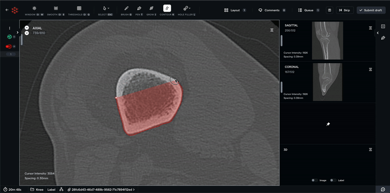
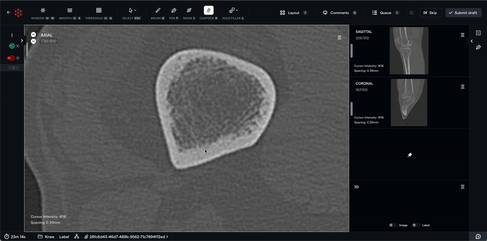
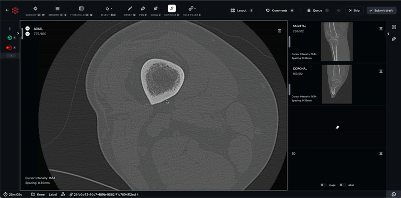
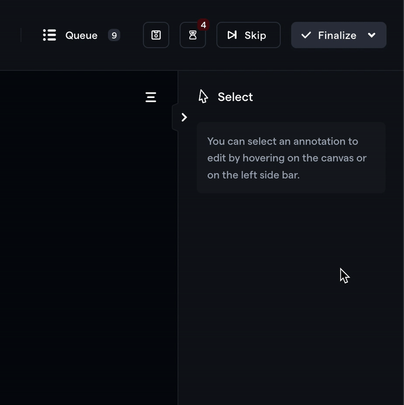
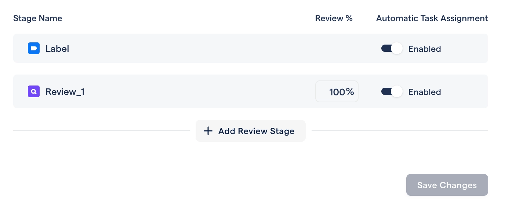

# Intelligent contouring with interpolation and workflow flexibility!

In November, we took significant strides with both our product and business. In case you missed it, we announced [our $4.6 million seed round](https://www.forbes.com/sites/davidprosser/2022/11/23/speeding-up-the-use-of-ai-in-health-with-redbrick-ais-training-tools/) by Sequoia Capital, Y Combinator, and angel investors. Thank you to everyone that has worked with us, used the product, and provided invaluable feedback. We're excited to build world-class tools to help you build high-quality datasets.

# Contouring with interpolation

We're excited to release our contouring tool, interpolation, and intelligent/semi-automated contouring. This feature has several improvements to our segmentation tools, so let's break it down. Check out detailed [documentation here](https://docs.redbrickai.com/annotation/segmentation/segmentation-tools#contour-tool).

## Contouring

The contouring tool is a more efficient way of outlining regions of interest. In contrast to other polygon-based contouring tools, with RedBrick's contouring tool, you don't have to edit nodes manually and can interactively create/edit ROIs.

## Intelligent contouring

Our intelligent contour tool is an automated way of outlining the boundary of an object. Given a seed point, the algorithm will automatically mark an ROI around the object of interest. The generated ROI can be noisy but can easily be interactively smoothed, as shown in the GIF below.

## Interpolation

The contouring tool will automatically interpolate between contours done on two different slices. You can edit any intermediate slice, and the interpolated contours will automatically update. In combination with level tracing, interpolation can be a highly efficient way of annotating 3D structures.

# Submit drafts & finalization

We've received many requests to allow submitting drafts/editing annotations after they have been submitted. To achieve this, we have updated our submission workflow:

1. You can **finalize a task to complete** working on it. Once finalized, it will be sent to the next stage and will not be editable.

2. You can **submit a task as a draft**. Drafts will remain in your queue and can be edited at any time. You can bulk-finalize all drafts or finalize them one by one.

Submitting drafts will allow annotators to work through a batch of data at once and bulk-finalize them once they are confident in their work.

You can read more about how draft finalization works in our [documentation here](https://docs.redbrickai.com/projects/how-task-assignment-works#labeling-queue).

# Add and remove review stages

You can now add review stages after creating a project from project settings. To remove a review stage, set the "review percentage" to 0.

