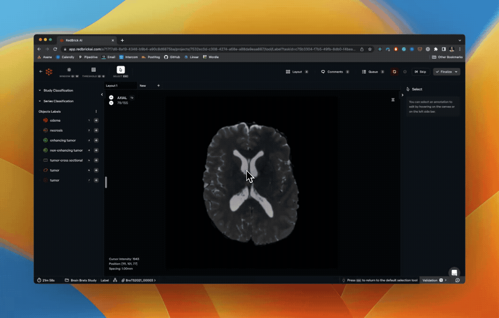

I am pleased to announce that RedBrick AI has achieved SOC-II Type 1 compliance, according to the American Institute of Certified Public Accountants (AICPA) standards for SOC for Service Organizations, also known as SSAE 18. This compliance reflects our continued commitment to offering enterprise-grade software to our customers.

RedBrick AI was audited by Prescient Assurance ([https://www.prescientassurance.com/](https://www.prescientassurance.com/)).

# Load Series Asynchronously

In January, we released major upgrades to our data loading framework and our handling of multiple series. Previously, our viewer would load all series before enabling interaction if you had annotation tasks with multiple series (for example, T1, T2, & Flair scans). With this new update, we will asynchronously load individual series allowing interaction with individual viewports as the data loads.

# Improved memory management

RedBrick AI's viewer now only loads the minimum number of series required to visualize your task. With the new memory optimizations, large studies can be loaded in the viewer without worrying about memory issues. You can load volumes by dragging unloaded volumes into a viewport.

# Custom Layout Tabs

You can now create multiple tabs with different layouts that allow rapid configuration switching. For instance, you can have an MPR view of a single series in one layout and visualize multiple series together in another layout.

> Note: Toggling the MPR mode for any series (either through the dropdown on the top right of viewport or using the shortcut `ctrl + shift + m` will automatically create a new layout tab.

# Data rows page size & selection

You can now increase the number of data rows displayed under the Project Data tab. The increased page size, combined with updates to row selection, allows for flexible and quick task selection (for assigning, deletion, etc.).

> You can select multiple rows by - selecting the first row + holding `shift` + holding the last row. Doing so will select all intermediate rows, even across pages.

