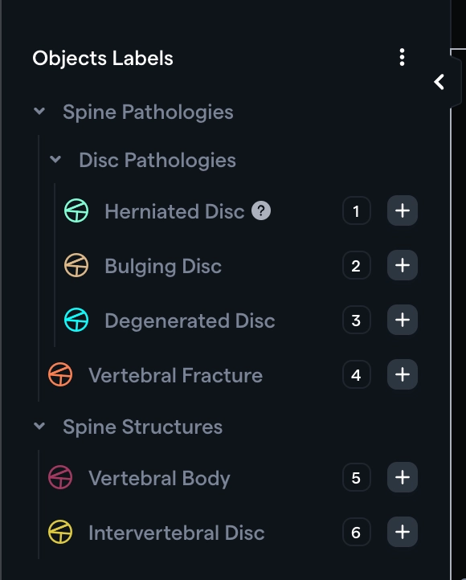
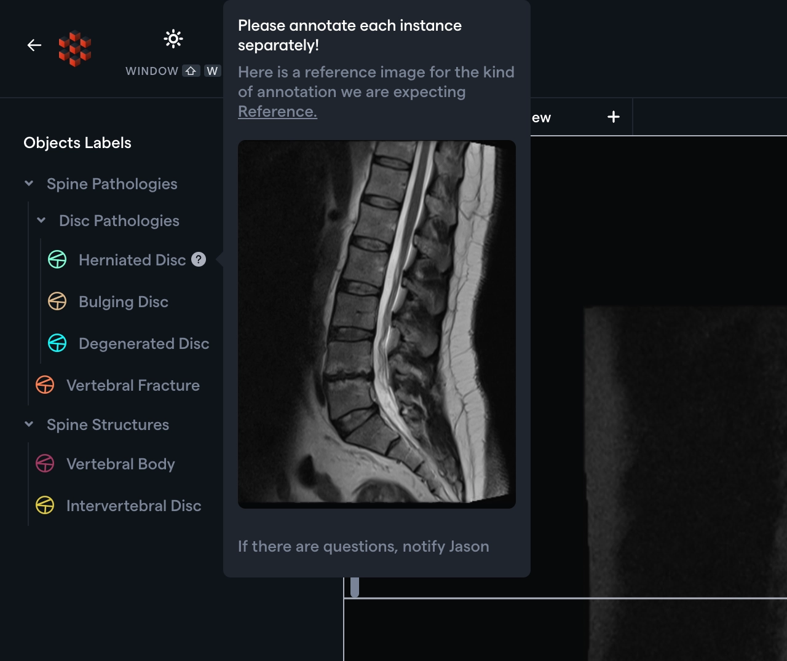

Spring is in the air, and so are our latest product updates! We've been busy bees this May, bringing you a bouquet of new features to make your workflow bloom. So let's jump in and look at what we've got in store!

# Taxonomy Upgrades

We've responded to your request to add additional flexibility to our taxonomies. This month's updates include two key additions, mainly targeted at better support for large taxonomies.

## Nested Taxonomies

You can now create a nested taxonomy structure to organize many classifications or object labels. We have refreshed the UI of the Object Label instances to stand out well within a complicated nested structure.



If you have an extremely long list of features to annotate, it can make a lot of sense to organize it in a nested structure, creating an ergonomic and friendly interface for annotators.

## Taxonomy Hints

When you have many classifications or object labels, you may also want to provide instructions **_per object category;_** so that the annotations objective are easily available and clear.

You can now add **_Hints_** per taxonomy object category — the hints can be raw text or rich HTML, allowing you to add images and other text formatting.



> ✅ [Visit our documentation](https://docs.redbrickai.com/projects/taxonomies#nested-taxonomies) for instructions on how to create nested taxonomy and add hints to your taxonomy

# 3D F.A.S.T.️ ⚡️

Last month we released our Fast Automated Segmentation Tool powered by Meta's Segment Anything Model. We're excited to extend F.A.S.T.'s capabilities to 3D. You can now annotate across two slices, and the tool will fill in the gaps propagating the automatic segmentations across slices!


> ✅ Read more about using [F.A.S.T. in 3D here](https://docs.redbrickai.com/annotation/segmentation/segmentation-tools#generating-3d-segmentations-with-f.a.s.t.).

# Programmatically Configure Annotation Tools

Our platform offers several different annotation tools with settings to adjust their functionality. However, for most projects/annotation tasks, you will likely use a single set of annotation tools configured in a particular way.

To address this need, we have added the ability to configure annotation tool settings through our [hanging protocols script](https://docs.redbrickai.com/annotation/layout-and-multiple-volumes/custom-hanging-protocol). You can configure the following parameters for brush, pen, contour, hole filling, island removal & paint bucket tools:

1. Enable/disable particular tools. If disabled, users cannot use the tool for annotation.

2. Define the available modes i.e. 2D, 3D, or both.

3. Select the default mode, for example, 2D.

4. Specify the default tool to be used for annotation.

Let's say you want to prevent users from using the brush tool and have the pen tool be selected by default in 2D mode only; use the following script:

```javascript
setSegmentationSettings([
  {
    toolName: "pen",
    enabled: true,
    modes: ["2d"],
    defaultTool: true,
  },
  {
    toolName: "brush",
    enabled: false,
  },
]);
```

Viola! Now you have full control over programmatically defining tool availability and their settings.

# Quick view change & Full-screen mode

For any particular series, quickly switch between the imaging plane, reconstructed views, 3D view, and MIP view using the new view dropdown.

When in the labeling tool, press the `F` shortcut key to enter full-screen mode. Cut out all the distractions and laser in on the task at hand!


