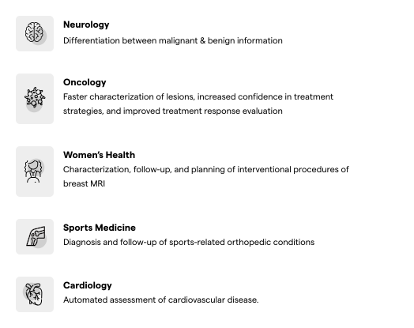
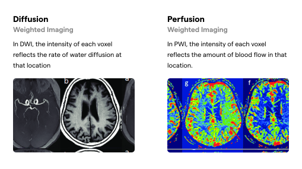
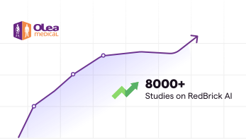
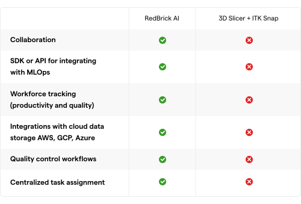

**Improved Diagnosis for Life - Olea Medical & RedBrick AI**

Shivam Sharma

July 7, 2023

Olea Medical is a trailblazer in the field of medical imaging, globally
recognized for its intelligent MRI and CT medical imaging software
applications. Their mission is to create innovative imaging solutions
that serve human beings by delivering improved diagnostic information
for better patient care --- "Improved diagnosis for life."

Olea Medical was founded in 2008 and has since been adopted by over 250
key research institutions worldwide. In 2015, Olea Medical joined Canon
Medical Systems to offer new clinical-added value to healthcare
providers.

**Olea Medical Products**

Olea Medical has developed several multi-vendor post-processing
solutions for MRI and CT scanner images. Olea Medical offers solutions
for the following:

**Accessing critical stroke information quickly**

One area of focus for Olea Medical is in helping with the analysis of
stroke cases. Stroke is a medical condition where the blood supply to
part of the brain is interrupted or reduced, depriving brain tissue of
essential oxygen and nutrients. Quick intervention is crucial in a
stroke because each minute of delay can result in the loss of a
significant number of brain cells.

Two imaging techniques crucial in the diagnosis of stroke are
Diffusion-weighted Imaging (DWI) and Perfusion-weighted Imaging (PWI).

In acute stroke, cells swell due to a lack of oxygen and nutrients,
leading to cytotoxic edema, which restricts the movement of water
molecules. These areas of restricted movement appear brighter on DWI
maps, which helps with the detection of stroke.

Similarly, in areas of the brain affected by stroke, blood flow is
reduced or absent, and these areas appear darker on PWI maps.

Olea Medical\'s products can automatically generate stroke maps in a
matter of seconds. This provides radiologists with a reliable and quick
tool for detecting stroke. Since many imaging and diagnostic centers
receive a large number of possible stroke patients daily, the speed and
usability of Olea\'s platform are valuable additions.

Olea medical also has a strong focus on research & development and has
over 150 scientific publications on their technology. As a leader in
image post processing, Olea is now expanding it[']{dir="rtl"}s offerings
by incorporating Artificial Intelligence (AI) into their product
offerings.

**Structure and Collaboration through RedBrick AI**

The first step in training an AI model is to create a high-quality
annotated ground-truth dataset, where the annotations should reflect the
model\'s expected predictions. For example, if you want the model to
segment brain tumors to calculate tumor size, you must first manually
segment thousands of images as a reference standard.

As you expand your annotation efforts to larger datasets and more
annotators, collaboration and project management become challenging.
Many Radiology AI teams turn to open-source tools such as ITK SNAP or 3D
Slicer, along with Excel worksheets and Google Drive, to manage their
projects. However, as Jean-Francois points out, this can be a
challenging approach to manage.

The issue with existing tools, like ITK SNAP and 3D Slicer, is they are
point solutions. You really need a platform that helps you with the
entire annotation cycle. That[']{dir="rtl"}s really where RedBrick AI
comes in for us --- to have a **structured and collaborative** way to
manage the process from a single interface. **Our process has improved a
lot**, and our overall **annotation loop is much faster.**

Jean-Francois Weissmann

Research and innovation Engineer

Researchers often choose tools such as ITK SNAP and 3D Slicer due to
their comfort and the capability of the segmentation tools. However,
modern Machine Learning Operations workflows make it prohibitive to have
a locally installed system that does not work well with the cloud.

3D Slicer is a very capable tool, but it[']{dir="rtl"}s quite complex.
ITK SNAP on the other hand is simple but quite limited. Both of these
tools are locally installed, and therefore collaboration becomes quite a
pain. For us, **these tools are just not modern enough.**

Jean-Francois Weissmann

Research and innovation Engineer

As the scale of your annotation project grows, involving external
annotation teams to augment internal efforts may become necessary.
Managing external teams using Open Source tools is untenable and poses
data security risks.

Using RedBrick AI, we[']{dir="rtl"}re able to involve many people in the
annotation process. For example, we can easily add external labelers to
our projects. **This was absolutely not the case before** because of the
lack of collaboration and the need to send data to them. With RedBrick
AI, we[']{dir="rtl"}re able to store data on our cloud bucket and
quickly set up a project to collaborate with external teams.

Jean-Francois Weissmann

Research and innovation Engineer

**Purpose built annotation for Radiology AI**

The challenge of annotation is not exclusive to developing AI in
Radiology. Other SaaS platforms have emerged as leaders in different
industries, assisting AI teams in building complete annotation and
training pipelines. However, these platforms are insufficient in
healthcare due to the absence of specialized tools.

Medical imagery is much more complex than standard imagery, as it has
unique formats and is 3D in nature. Therefore, the task of segmenting
medical imagery warrants specialized tools that modern annotation
platforms lack.

For medical imaging, what RedBrick AI[']{dir="rtl"}s competitors had to
offer was really way behind. **RedBrick AI[']{dir="rtl"}s layer of data
organization really stands out**, and we felt **RedBrick AI had the most
advanced medical labeling tools.**

Jean-Francois Weissmann

Research and innovation Engineer

Using the right segmentation tool can save you hours in annotation
projects. At RedBrick AI, we are highly committed to building elite
segmentation tools and making them widely accessible through the
browser. For instance, we recently launched our Fast Automated
Segmentation Tool, powered by Meta AI\'s Segment Anything Model, which
semi-automatically segments structures in radiology scans.

The 3D brush tool and pen tool with thresholding **are killer**. The
Fast Automated Segmentation Tool has also been quite appreciated by our
team --- it[']{dir="rtl"}s **quite amazing on contrasted images.**

Jean-Francois Weissmann

Research and innovation Engineer

Our team at RedBrick AI feels incredibly fortunate to work with
customers at the forefront of healthcare AI. We are excited to continue
supporting Olea Medical in their mission to improve diagnosis for life.

RedBrick AI is **really fast on feedback** whenever we have questions.
It[']{dir="rtl"}s really good to know when we have questions; we will
not be stuck for a long time. RedBrick AI is very **agile in the way
they work, and that makes a big difference for us.**

Jean-Francois Weissmann

Research and innovation Engineer
