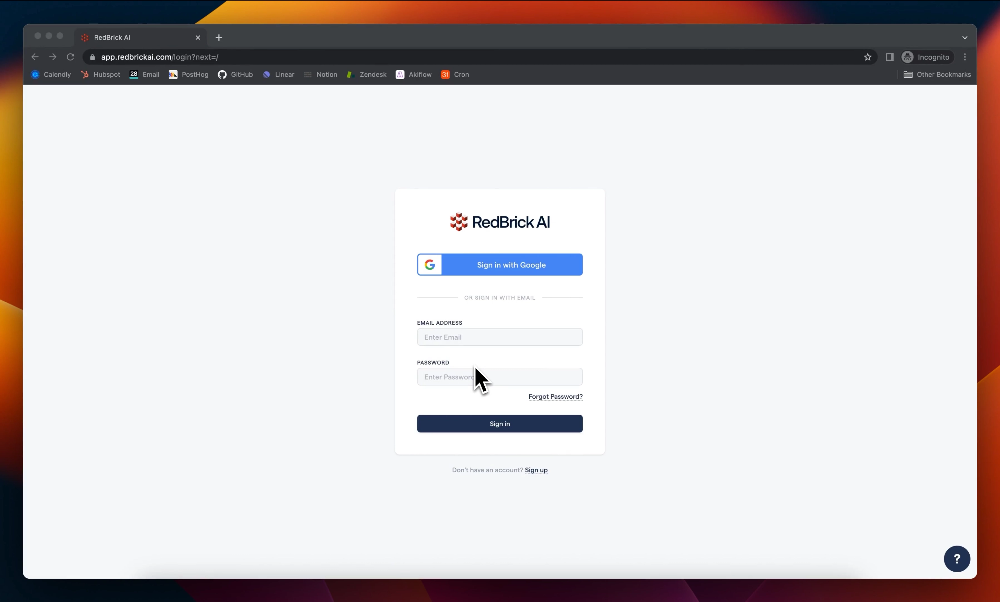
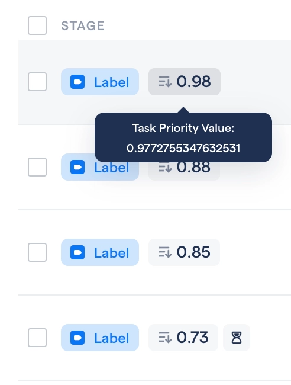

# Cinematic 3D Visualization, Custom Meta-Data, and More!

Hi folks! I'm excited to cover our June 2023 updates including new features for 3D visualization, custom meta-data upload, SAML and Google-based Single Sign-On, task priorities for active learning.

# Cinematic 3D visualization

Till date RedBrick AI had a basic 3D visualization of scans that gave users a very limited picture of the image. We're excited to release a revamp to the 3D visualization which includes cinematic rendering, and de-coupled (from the 2D views) windowing!

# 2D Segmentation Outline

We often received inputs from customers who wanted to view the outline of a segmentation without the are shading to have a clear view of the image under the segmentation — you can now do exactly that! All segmentations have a outline, you can adjust the opacity to hide the shading, or use the standard flow for hiding the entire segmentation.

# Upload custom series & task meta-data

It can be useful to upload additional metadata along with your tasks to provide labelers with extra context when viewing and annotating images. You can now upload custom series and study-level metadata key-value pairs. These can include links to supporting documentation, additional information about the image and/or patient, or any other relevant supporting information.

# SAML and Google Single Sign On

RedBrick AI now supports SAML and Google-based Single Sign-On (SSO). If you already have a RedBrick AI account, you can sign in using Google, and your account will be merged with your existing one. Please contact us if you would like your organization to use SAML-based SSO.

# Task priorities for Active Learning

You can assign a priority between [0,1] to tasks in your queue in order to reorder your labeling queue. This feature is most commonly used to build an active learning workflow.

Active learning is a machine learning technique that involves selecting the most informative data points to label, in order to improve the accuracy of a model. By assigning priorities to tasks in your labeling queue, you can create an active learning workflow that focuses on labeling the most important data points first.

# Quick Layout Adjustment

We now have a faster way to adjust your layout when working with multiple series. Simply hover over the thumbnails in the layout tab to add your series to the desired viewport! Of course, you can still drag and drop to set up your viewport as well.

