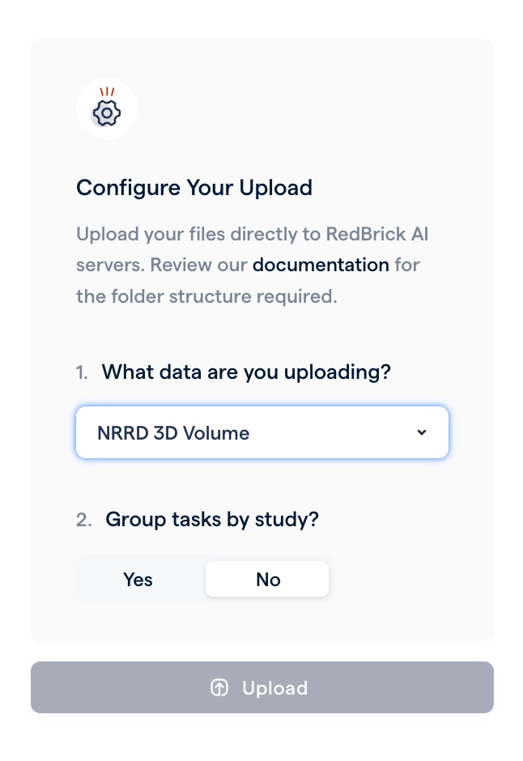
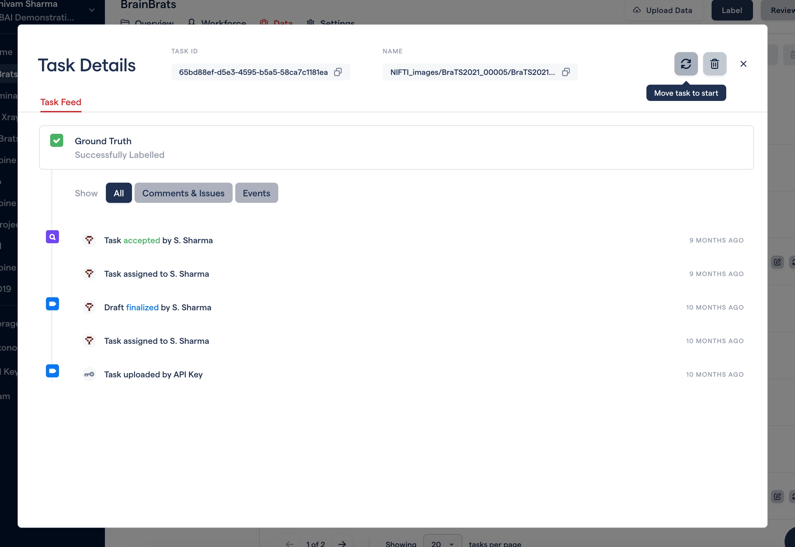

# Privacy Policy & F.A.S.T. updates, version history for annotations, and more formats

This release is jam-packed with new features, from customizable tool settings to version history for annotations. We also cover key updates to our privacy policy and our Fast Automated Segmentation Tool (F.A.S.T.)! Read on to learn more. 🚀

# F.A.S.T. ⚡️& Privacy Update

A few months ago, we released a beta version of our Fast Automated Segmentation Tool (F.A.S.T.). We received great feedback from our customers and are excited to announce that F.A.S.T. is now out of beta!

## F.A.S.T. ⚡️will be available as is for 4 weeks

F.A.S.T. uses powerful GPUs to compute image embeddings quickly, providing a fast user experience. Due to the additional cost of operating GPUs, **F.A.S.T. will only be available in our Enterprise tier**. For current customers who are not in the Enterprise tier but are interested in using F.A.S.T., we will contact you with options for continued use. To ensure no disruption to current workflows, **F.A.S.T. will continue to be available to all customers for the next 4 weeks as is**.

## Privacy update

We have made minor changes to our privacy policy to reflect the new release of F.A.S.T. to all customers. Please note that this is the same privacy notice you would have agreed to prior to enabling F.A.S.T. within your organization.

[Please see the latest privacy policy here](https://redbrickai.com/policies/privacy.pdf).

# Customize Tool Settings

Our platform is utilized by teams working with various radiological modalities, ranging from X-ray classification to complex multi-series MRI segmentation. To support these use cases, we offer multiple segmentation tools that perform better in certain scenarios compared to others. However, we understand that most customers only require a few segmentation tools per project. That's why we have introduced the ability to customize the available tools for your project through the Project Settings page!

You can now:

- Enable or disable each segmentation tool in a project.
- Select the default tool.
- Select the allowed modes, i.e., 2D or 3D for each tool.
- Select the default mode for each tool.

# Label Version History

We are excited to announce the ability to view and restore previous versions of annotations. We have received feedback from annotators and reviewers that when they make accidental changes to annotations they want the ability to revert back to a previous set of annotations. With this new feature, you can do exactly that!

# New formats: NRRD and RT-Struct!

With this release we're expanding the formats that we support. We now allow for NRRD image uploads, and exporting segmentations in RT-Struct.

To import your NRRD images, simply select the NRRD option during direct upload:

To export your segmentations in RT-Struct, use the following commands:

- Command Line Interface: `redbrick export --rt-struct`
- Python SDK: `project.export.export_tasks(rt_struct=True)`

# Time Based Filtering

Previously, our dashboards that display information on project status and progress had only crude time-based filtering. Now, with the new time-based filtering on the Overview, Data, and Workforce pages, you can filter your project activities with greater control.

# Other Updates

- **Taxonomy V1 is deprecated** and you will not be able to create or update Taxonomy V1's anymore.

- **Task caching is now on by default** in all projects. As soon as you visit a projects dashboard, your task queue will automatically start caching for a seamless data loading experience.

- **The context panel is resizable** allowing you to increase the width. This can be especially useful when you have many label attributes.

- **You can send Ground Truth tasks back to the label stage** through the UI. Simple click on a task and you will see the send back to ground truth action in the task dialog.

