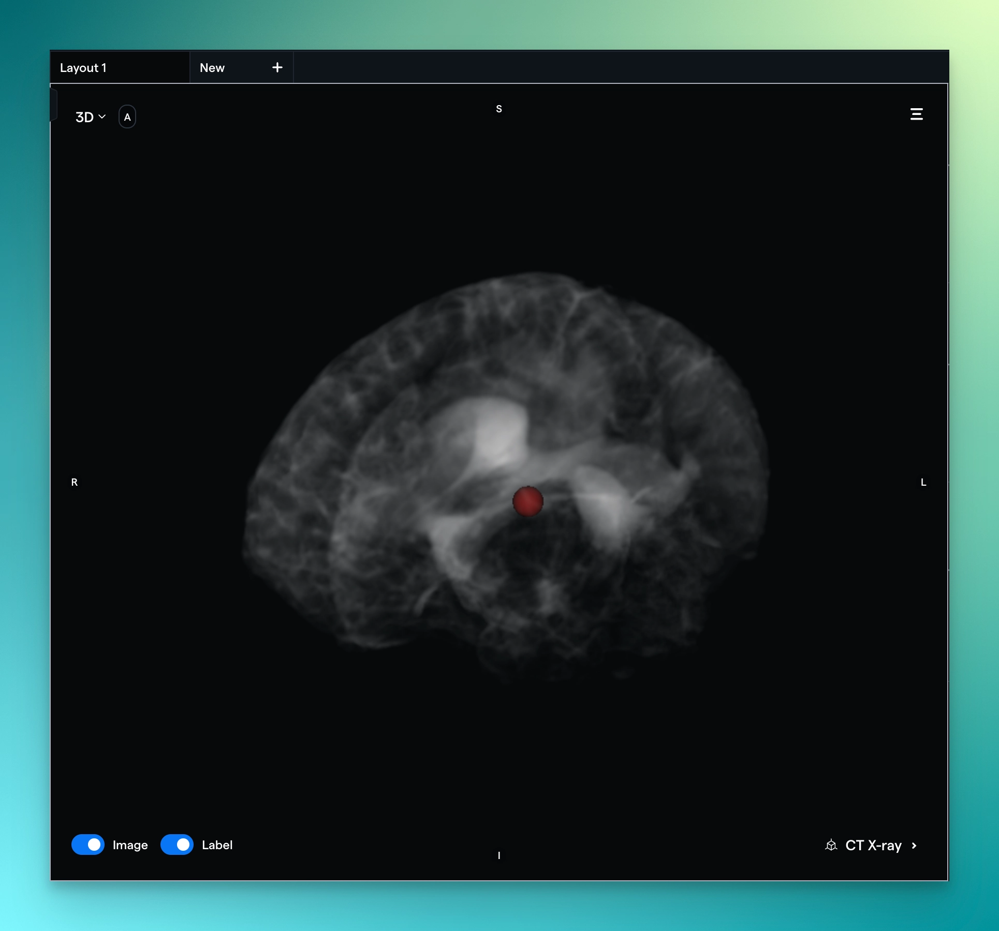

Hi folks! We have a few quick updates to share with you.

# We're attending BioTech X in Switzerland!

We will attend the Switzerland BioTech X conference from 5th Oct — 6th Oct! If you're also attending the conference, we would love to meet with you; please [book a meeting using this link](https://calendly.com/dereklukacs/biotechx-redbrick-ai-meeting). Looking forward to seeing you there!

# Become a super user by attending our Webinar Demo!

[Registration has opened](https://us06web.zoom.us/webinar/register/WN_p3RFNixoSbCm5jyb-x_M_w) for the first-ever RedBrick AI Annotation Tool Demo, a live webinar dedicated to mastering the art of annotation on RedBrick! Join us for a walkthrough of our segmentation tools, environment settings, common annotation flows, and other helpful features that will make your work on the platform even smoother and faster, as well as a Q&A to wrap things up!

**Who's Invited?** Anyone looking to shorten their path to becoming a super user on RedBrick AI!

**When's the Event?** October 18th at 16:00 GMT (21:30 IST, 12:00 ET, 9:00 PT).

**How Can I Sign Up?** Attendees should register using the form [here.](https://us06web.zoom.us/webinar/register/WN_p3RFNixoSbCm5jyb-x_M_w)

# Train annotators by creating a Reference Standard

Teams have expressed that they often create dummy projects on RedBrick AI or send pre-annotated files via email to annotation teams for training purposes. Now, you can create a group of ground truth tasks called "Reference Standard" that annotators can see.

The Reference Standard can be used for initial training and onboarding or as a set of ground truth annotators can refer to at any time to ensure accurate annotation.

# A beautiful Top bar with quick tutorials

As our annotation tool has become more capable, the number of tools and settings has also increased. To make all tools easily accessible on screens of all sizes, we have redesigned the top bar. Additionally, we have added short tutorial videos for each tool. Simply hover over a tool for 2 seconds, and a video will appear!

# Improved display of 3D landmarks

To further enhance our 3D view, we have improved the rendering of landmarks in the 3D view!

Stay tuned for more updates and advancements in our annotation toolset!
