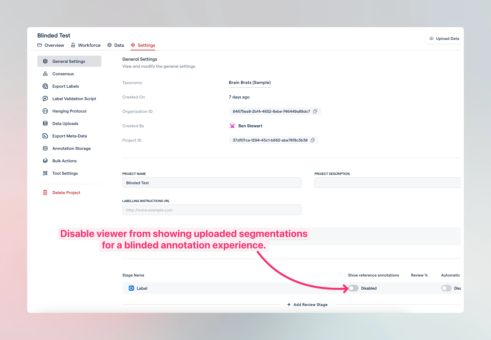
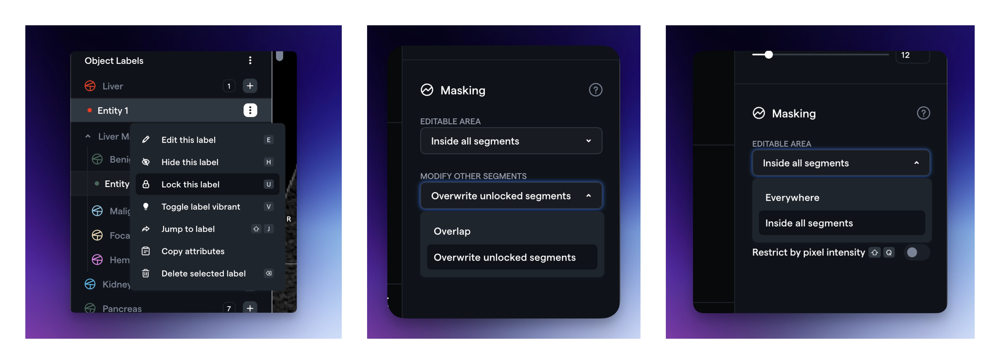

# RSNA 2023, Annotation Version Explorer, Semantic Segmentation Export and more!

Hi folks! We're excited to be present at RSNA 2023 in Chicago from November 26th - November 30th. If you're attending, please make sure to drop by our booth #3580 to meet our team! We will be doing some fun give aways, challenges, and fireside chats!

## Annotation Version Explorer

RedBrick AI keeps track of all versions of your annotations as they progress through the label and review cycles in your workflow. This is beneficial not just for compliance and auditing purposes, but also for creating high-quality annotations.

### See how annotations evolve through the workflow

You can easily switch to earlier versions of your annotations to compare them with the current ones. This feature is particularly useful during data review, as it allows you to track the progression of annotations since the most recent feedback.

### Restore to Previously Saved Versions

RedBrick AI consistently saves annotations while you work, guaranteeing no data loss. If you make a mistake or want to revert to a previous checkpoint, you can restore any prior version of your annotations.

## Semantic Segmentation Export

Previously, RedBrick AI supported only instance segmentation export. This meant each segmentation was represented in the exported NIfTI file with an instance ID, which could vary across files depending on the number and order of created instances.

However, we received feedback from customers who occasionally create multiple instances but wish to export segmentations semantically. In other words, they want each occurrence of a category to map to the same class ID in the exported NIfTI files.

To accommodate this, we've made several updates and added the following flags to the CLI:

1. `—semantic`: Each segmentation instance will be exported as a separate NIfTI file. The .nii.gz file will be named after the category, and the segmentation will map to the class ID, which remains consistent across all NIfTI files.

2. `—single-mask`: Use this flag if you want to perform a semantic export but only want to export one .nii.gz file per task.

3. `—binary-mask`: This flag will export each instance as a separate .nii.gz binary mask file. Each segmentation will be represented by 1 in the mask, and the files will be named after the category name.

# Nesting and hints through Taxonomy UI

We have previously released the capability to add HTML hints & nesting to taxonomies through the SDK. These hints provide instructions to annotators and nesting of taxonomy categories allows for improved organization. We are excited to announce that this functionality is now available in the Taxonomy creation UI!

# Evaluate Model Segmentations with Blinded & Unblinded Annotations

Now, when you upload segmentations with your images, RedBrick will automatically calculate the Intersection over Union (IOU) between the uploaded segmentations and the initial labels from annotators. This provides a measure of how much the uploaded segmentations differ from the annotations that labelers have made.

### Evaluate annotators through blinded annotations

You can set up the viewer to conceal the segmentations you've uploaded. Despite this, RedBrick AI will still calculate the IOU (Intersection over Union) between the annotations made by the labeler and the uploaded segmentations. This enables assessment of the differences between the labeler's annotations and the uploaded ones when the annotator cannot see the uploaded segmentations.

# Boolean Operators & Updates to Thresholding

We have enhanced the user experience for performing boolean operations on two segmentations. The following functions enable all boolean operations:

- **Editable Area:** This defines where the current segmentation will apply. "Inside all segments" will only enable segmentation within other unlocked segmentations.

- **Modify Other Segmentations**: This determines whether the current segmentation should overlap or overwrite other segmentations.

- **Segmentation Lock/Unlock**: Setting an annotation as locked will prevent it from being edited.

Additionally, you can now find the thresholding function in the Masking section on the right side, under "Restrict by pixel intensity".
