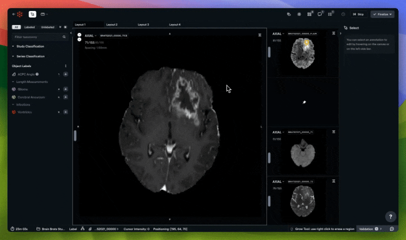
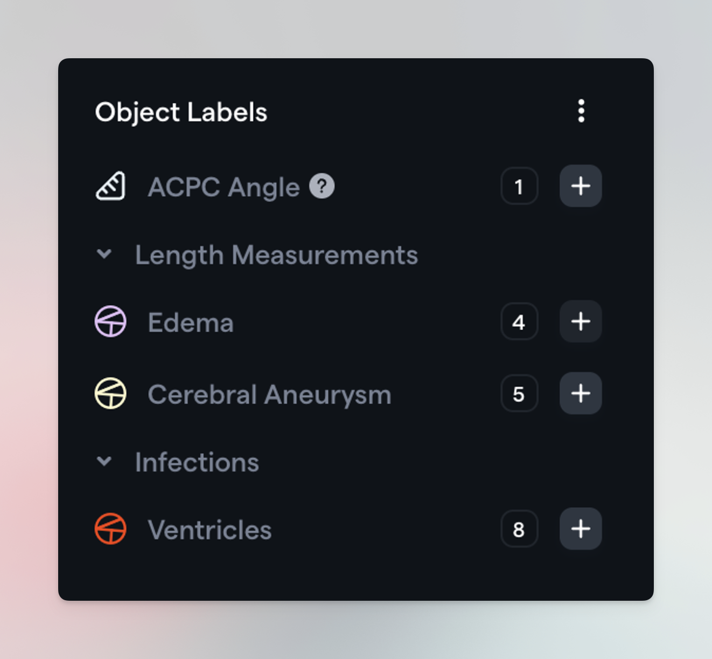
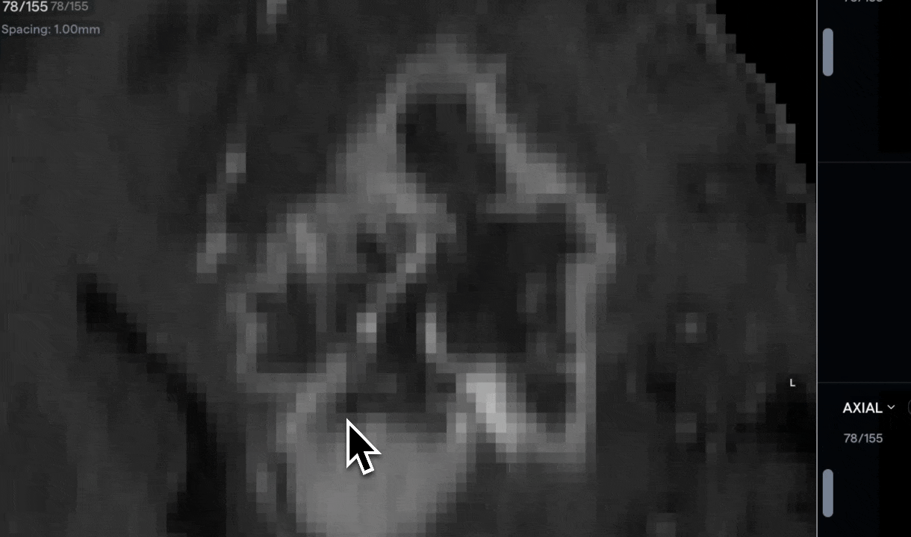
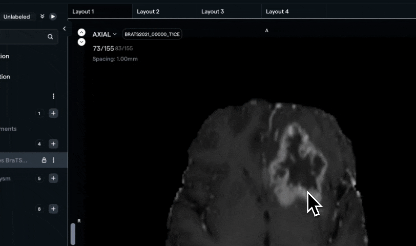
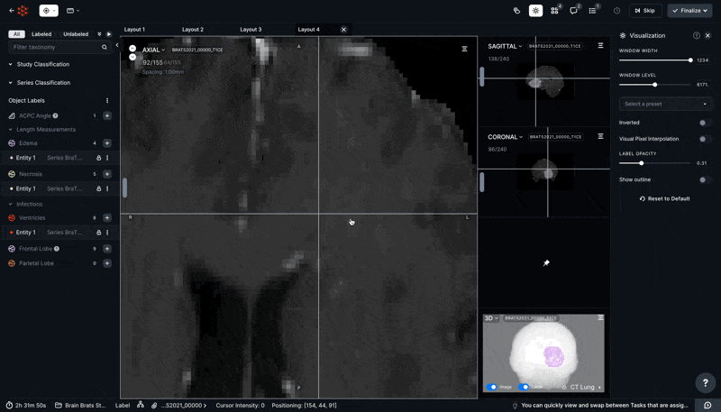

Volumetric segmentation of necrosis and edema

Ben Stewart

January 23, 2024

## Overview

For this walkthrough, we will be segmenting two types of high-grade
gliomas (necrosis and edema) using various weighted scans.

Our data consists of MRI acquisitions of the following sequences: T1W,
T1W gadolinium-enhanced (i.e. T1CE), T2W, and FLAIR.

## Structure 1: Edema

Before jumping into annotations on the TICE, let's set up
our labeling environment.

### Windowing Settings

If you'd like to adjust default Windowing settings, you can
do so by:
1. opening the Visualization Panel and adjusting the sliders, or
2. mousing over a viewport and using CTRL+LMB+drag
3. dragging your mouse left and right will adjust the Windowing Width
4. dragging your mouse up and down will adjust the Windowing Level

### Windowing Settings Mastery

Now it's time for you to try!

Your RedBrick AI environment has several sample projects that you can
use to explore the platform's features.

- Open any Task in the Brain Brats Study (Sample) Project
- Adjust the Windowing settings by using both of the methods described
above
- Zoom in on any brain scan and toggle Visual Pixel Interpolation in the
Visualization Panel to see the difference. (If you're not
sure how to zoom in on a scan, click on the "?" button in
the Annotation Tool or check out our documentation
[here](https://docs.redbrickai.com/annotation/overview#navigating-your-volume))

- Close the Visualization Panel by clicking on the "X" in the top right corner

- **Bonus:** close the Visualization Panel ***without*** clicking on the
"X" in the top right corner

### Your First Annotation

It's time to create an annotation in RedBrick AI!  Select
**Edema** by clicking on the plus sign next to it in the lefthand menu.

*Hotkey Alert: you could also press "4" on your keyboard to create a new Edema label.*

Step Two is choosing the right tool for the job! In this case,
we'll explain how to use the **Contour Tool** to volumetrically
segment the **Edema**.

### 2D Contour Tool

Let's start by annotating a single slice.

RedBrick AI's Contour Tool allows you to create precise
contours using one of three methods:

1. Point and click - use `LMB` to place points on the canvas, drawing a
contour between the points
2. Click and drag - use `LMB`+`drag` to draw a contour on the canvas
3. Smart Contouring - while holding `CTRL`+`ALT` (or `CTRL`+`OPTION` on MacOS), hover over a boundary to automatically generate a contour. Use LMB to create the contour, or `LMB`+`drag` to smooth the contour.

When you're satisfied with a contour, be sure to **Rasterize**
it by either clicking on the Rasterize button in the right hand **Context Panel** (see below) or by pressing `SHIFT`+`ENTER`.

The rasterization process transforms the contour you've created into a segmentation mask, which applies your annotation to the image.

The following short video demonstrates all of the 3 contouring methods mentioned above.

As you can see in the video, the Smart Contouring method does most of the work on its own with the help of properly configured Windowing settings.

Please note that you can also mix and match contouring methods to edit
your contour!

### 2D Contour Tool Mastery

Complete the tasks below to demonstrate an understanding of how to use
the Contour Tool in 2D (i.e. on a single slice):

1. create a contour using the point and click method
2. create a contour using the click and drag method
3. create a contour using Smart Contouring
4. Bonus: smooth a Smart Contour using LMB+drag

### 3D Contour Tool

Like many tools on RedBrick AI, the Contour Tool can be used in both 2D and 3D. Annotating in 3D will make this work flow much faster, so let's explore how to do that with interpolation.

As the diagram shows, you can create contours over many slices at once
by **contouring the first and last slices in the range**. Let's
see what this looks like in the Annotation Tool.

After creating contours on slices 70 and 73, the Contour Tool
automatically filled in the gaps.

There are 2 common ways to edit a contour:
1. Continue to edit it using the Contour Tool, or
2. Rasterize the contour and edit the segmentation mask using any of the other Segmentation Tools (i.e., Brush Tool, Pen Tool, Adaptive Brush, etc.)

### 3D Contour Tool Mastery

Complete the following tasks to gain a basic understanding of how
interpolation works with the Contour Tool:
1. Create a set of 5 contours by interpolating across a range of 5 slices
2. With the Contour Tool selected, edit an existing contour
3. After rasterizing a Contour, use either the Brush Tool or the Pen Tool to edit the segmentation mask
4. Bonus: interpolate across a large range of slices (30 or more) - how do the contours you created at the end of the slice ranges affect the interpolation?

### Annotating the Edema

It's time to take everything you've learned
and put it into action!

Let's review the flow:

1. Configure Windowing settings
2. Create annotations using the Contour Tool and interpolation
3. Review the annotations using your preferred tools (e.g. Brush Tool, Pen Tool, Contour Tool, etc.)

You can find a full video outlining the process below:

[Annotating the
Edema](https://www.loom.com/share/f499a17154cc4ab7a4214c3e30aed98b?source=embed_watch_on_loom_cta)

Finding the best combination of tools for a given use case is one of the most effective ways to make annotating less difficult, and there's no "one size fits all" solution.

For example, my personal workflow in the video above looked like this:
1. Set Windowing settings for highest possible contrast around the boundaries of the target structure
2. Use Smart Contouring and interpolation to rapidly create 3D annotations
3. Use the 2D Contour Tool to touch up individual slices as needed
4. Rasterize the contour, repeat Steps 2-4 until the entire structure is completed
5. Disable Visual Pixel Interpolation in the Visualization Panel
6. Use the 3D Hole Filling Tool to ensure there are no stray empty pixels in my 3D annotation
7. Use the 2D Brush Tool and 2D Pen Tool to touch up the segmentation masks on each slice
8. Save my work

For now, we can move on to our next structure - **Necrosis**.

## Structure 2: Necrosis

Now that we have our Edema label in place, it's time to add
some Necrosis labels!

### Windowing Settings Mastery

Using the knowledge you gained above, make sure your Windowing settings are configured in anticipation of annotating Necrosis inside of the brain tumors.

*We're going to want to maximize the pixel contrast between the Necrosis and the surrounding Edema. Read on to learn why!*

For this part of the walkthrough, we're going to let you
decide how to configure your environment. Please find a list of
environment settings below.

- Configure your Windowing settings
- Configure your pixel interpolation toggle
- Configure your Layout

### Label Actions

There are many things that can be done with labels in RedBrick AI, and we call these functions **Label Actions**.

We have more [in-depth documentation elsewhere](https://docs.redbrickai.com/annotation/creating-editing-and-deleting-annotations#other-object-label-actions), so we recommend checking that out if you're curious. For now, let's stick to the most useful info that may not be immediately obvious:
1. When you stop working on a Label Entity, it is locked automatically.
2. Your Series must be in a currently open viewport tab in order for Jump to Label to work.
3. If you have a Label Entity selected, you can mouse over the viewport and use the corresponding hotkey to save yourself tons of clicks.

### Label Actions Mastery

Taking a moment and committing one or two Label Actions hotkeys to memory will save you hours while annotating. Complete the following tasks to demonstrate your understanding of Label Actions.
- Toggle highlighted mode for an Entity using the relevant hotkey
- Scroll to an empty slice and use Jump to Label to return to your annotation
- Create a new Entity and then delete it
- Bonus: the text for certain Label Actions changes depending on the Entity state - can you find all of the changes?

### Overlapping Segmentations

When you have a segmentation selected, the [Masking Panel](https://docs.redbrickai.com/annotation/visualization-and-masking#masking)
appears on the righthand side of the screen.

The [Masking Panel](https://docs.redbrickai.com/annotation/visualization-and-masking#masking)
consists of the following elements:

- Editable Area dropdown
- Modify Other Segments dropdown
- Restrict by pixel intensity toggle (which we're ignoring for now)

In order to properly annotate this Necrosis, we'll need an understanding of the first two fields - Editable Area and Modify Other Segments. Please see the following brief video for an overview of these fields:

[Overlapping
Segmentations](https://www.loom.com/share/536fa33679814e2f909e4944b1c0f8ba?source=embed_watch_on_loom_cta)

[Overlapping
Segmentations](https://www.loom.com/share/536fa33679814e2f909e4944b1c0f8ba?source=embed_watch_on_loom_cta)

If you prefer to read, here's a text summary as well:

*Editable Area: Everywhere allows you to annotate anywhere on the canvas, and Inside all segments only allows you to annotate inside of an existing segmentation.*

*Modify Other Segments: Overlap allows you to paint on top of other annotations, and Overwrite unlocked segments means that painting on top of an existing annotation will delete the underlying annotation.*

Demonstrate your understanding of overlapping segmentations by doing the
following:

* Create a "throw-away" Edema annotation anywhere on the
canvas
* Create a Necrosis annotation inside of your "throw-away" Edema annotation
* Hide the Necrosis label you just created - what do you see?
* Enable Editable Area: Inside all segments and create a Necrosis annotation inside of your "throw-away" Edema annotation
* Enable Editable Area: Inside all segments and create a Necrosis annotation outside of your "throw-away" Edema annotation - does it work?
* Enable Modify Other Segments: Overwrite unlocked segments and create a Necrosis annotation inside of your "throw-away" Edema annotation
* Hide the Necrosis label you just created - what do you see?

In certain cases, it's extremely useful to cross-reference
a single scan modality with another.

RedBrick AI has two features that allow you to do so:

**Intellisync** allows you to synchronize multiple Series at once.

**Label Mirroring** allows you to visualize annotations on multiple Series
at once.

We're going to combine these features for our Necrosis
workflow, but before that, let's do the following:

1. Create a 2x1 Layout Tab

2. Put the Axial view of the FLAIR image in the lefthand viewport

3. Put the Axial view of the T1CE in the righthand viewport

4. Make sure both Series are centered (by pressing SPACE)

5. Highlight the Edema label (so it's more visible)

The final result should look something like this:

When all of that is done, let's activate Intellisync and
Label Mirroring on these two Series.

You can find both of these settings by clicking on the hamburger menu in the top right of a Series viewport.

*When using Intellisync, the "host" Series will have a blue
upward-facing arrow! You can also mouse over this arrow to see which Series is "hosting" the mirrored labels.*

### Intellisync and Label Mirroring Mastery

These two features will be critical when annotating the Necrosis, so let's review briefly.

Complete the following tasks to demonstrate an understanding of Intellisync and Label Mirroring:

* Toggle Intellisync on and off on multiple Series using both the menu and the corresponding hotkey
* Mirror your Edema annotation so that it displays on another Series
* Use both Intellisync and Label Mirroring to see how your Edema annotation displays on other scans

### Annotating Necrosis within the Edema

It's now time to pull together everything
you've learned!

* Use all of your knowledge of the Annotation Tool's features
to produce a full annotation of Necrosis within the Edema

Once you're done, you will likely have something that looks
like this.

### Wrap-up and Additional Resources

Congratulations! You've made great progress on the road to
RedBrick mastery by making it all to the end of this use case. Pat
yourself on the back!

We wish you the best of luck in your annotation journey moving forward.
Don't forget to reach out to us at
[support@redbrickai.com](mailto:support@redbrickai.com)
with any questions or feedback!

If you'd like to learn more about the platform, please feel
free to consult the following resources:

[RedBrick AI Documentation](https://docs.redbrickai.com/)

[RedBrick AI SDK Reference](https://redbrick-sdk.readthedocs.io/en/stable/sdk.html)

[RedBrick AI YouTube Channel](https://youtube.com/@redbrickai)

[RedBrick AI Changelog](https://changelog.redbrickai.com/)

[RedBrick AI Blog](https://blog.redbrickai.com/)
