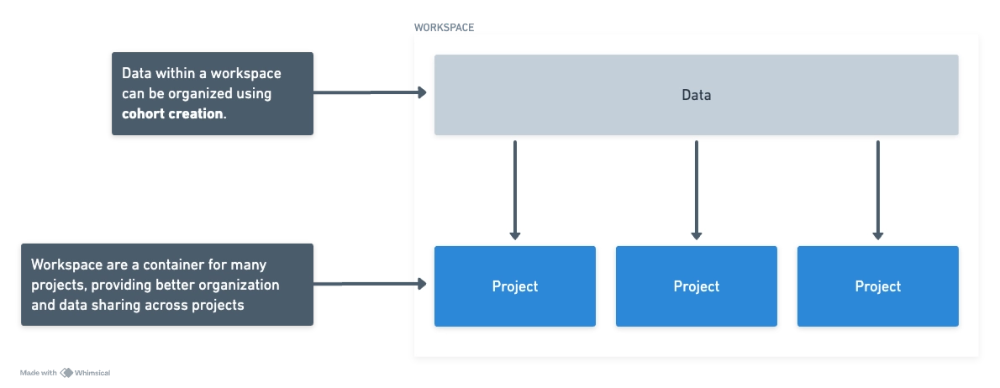
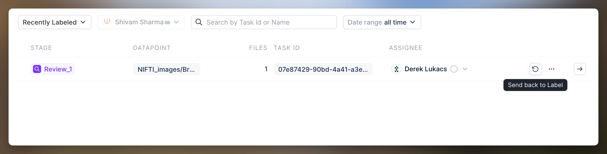
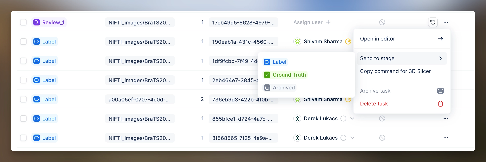
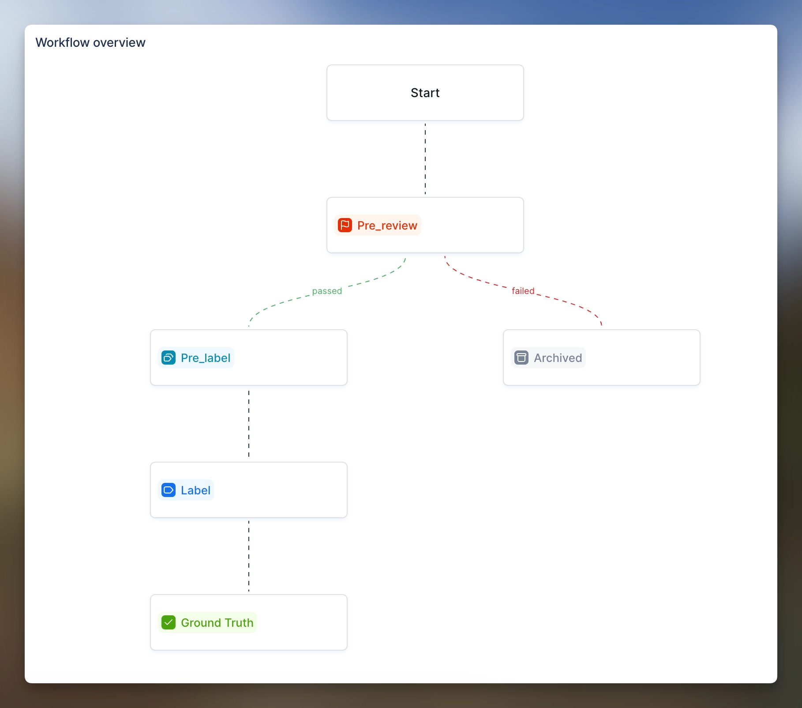
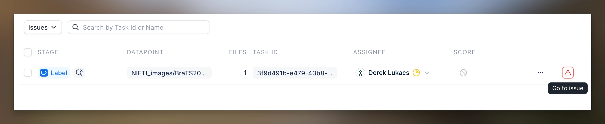
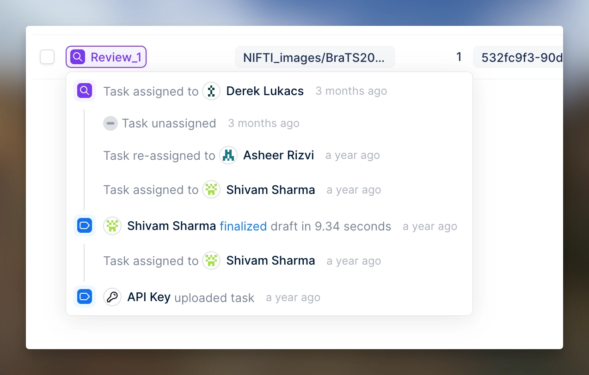
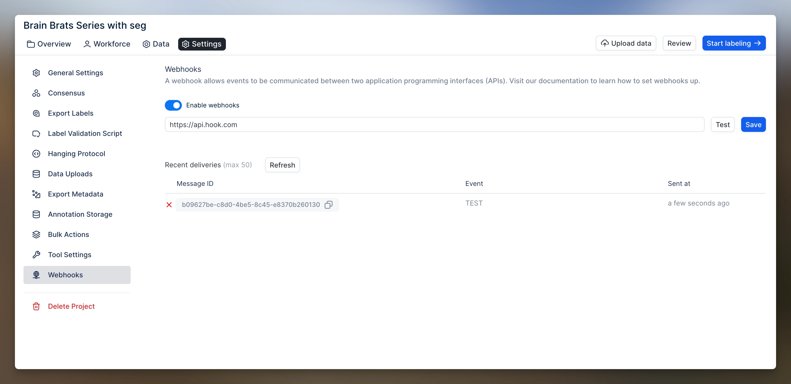

# RedBrick 1.0

# Updates that are coming next week!

We're writing to inform you that we will release an extensive set of changes next week. We are giving you a heads-up so you can prepare! **These changes will go live on Saturday 6th April, 2024**. You'll receive more information about the intention behind the changes soon; over here, we're providing a more practical summary of the changes.

## Workspaces and cohort creation

We are introducing a new concept called "workspaces." These workspaces allow you to group similar projects and share data between them.

We also have a new data quality control layer called "cohort creation" (previously soft-launched), making it easy to manage your data with searching, filtering, and summarization tools. Read more about cohort creation here: [https://redbrickai.com/cohort](https://redbrickai.com/cohort). You can still create standalone projects as you are currently used to.

## Introducing RedBrick AI Boost

The RedBrick Boost add-on is a self-hosted container that enables tight integration of AI assistance tools into the RedBrick AI ecosystem. At launch, Boost supports two features: FAST's server-side component and an automatic CT scan pre-segmentation model.

Since launching the FAST segmentation tool last year, we have received many requests for the ability to self-host this for privacy, compliance, or performance reasons. Starting July 2024, we will deprecate the RedBrick-hosted FAST and replace it entirely with Boost. Boost will be charged at an hourly metered rate to scale alongside your GPU usage. Get in touch with us at [support@redbrickai.com](mailto:support@redbrickai.com) to get started with Boost.

## Updated contouring tool suite

We've upgraded our contour tool to offer many more refined annotation capabilities that don't exist in other browser-based tools. With the new contouring tool, you will be able to:

- Edit any mask created as a contour. Previously, an explicit rasterization step was required to go from contour to mask. Now, there is a fluid & automatic transition between contour and mask.

- You can now hover over an arbitrary edge of a contour and interactively drag by a node to edit contours.

The existing contouring tool has the following changes to it:

1. The old contour tool is now the "interpolate tool," allowing you to select an existing contour on two slices and interpolate between them.

2. The old pen tool is now the "3D scissors" tool, which retains only the best part of the pen tool for 3D viewing.

## Updates to project workflows

Several long-awaited features have been added that unlock new capabilities for your project's workflow.

1. **Task clawback:** Annotators who have finalized a task can now "clawback" if a reviewer has not started reviewing it. This should help with a typical scenario where an ADMIN had to go in and manually reject the task to send it back to an annotator.

   

2. **Send task to stage action**: You can now send any task to any stage at any time.

   

3. **Archive stage**: A new way to remove tasks from your projects without deleting them permanently. The most common use case would be discarding bad-quality images from the annotation queues.

   

4. **Pre-review:** A new review stage is now implemented at the beginning of your project to assess the quality of your data. Any rejected tasks will be moved to the archived stage.

5. **Pre-label**: A new duplicate annotation stage for miscellaneous use cases such as SDK pre-labeling.

6. **Overwrite annotations SDK method**: A new SDK method enables you to overwrite annotations at any point in the pipeline. This is useful in many active learning workflows.

7. **Task duplication**: A new project configuration that automatically duplicates your tasks. This allows you to have the same image annotated by multiple users and independently reviewed. This was a common shortcoming of our consensus/super truth framework.

## Comments upgrades

Two highly requested changes to comments are being introduced: replying to comments and leaving comments on a specific annotation.

## Other notable changes:

The following updates have been made to the system:

- The process for raising an issue has been altered. All actions, such as responding to issue comments and sending the task back to the labeler, can now be performed within the annotation viewer.

  

- The task details have been removed, and a tooltip with the same information will appear when you click on the stage indicator.

  

- A webhook event has been implemented for "task-entered stage."

  

- In review, auto-assignment will no longer assign the task to the user who labeled it.

- The assignment attribution will now be shown in the task history, indicating whether the task was automatically assigned or assigned by another user.

- The visual consistency of labels, such as bounding boxes and polygons, has been improved.

- The legacy benchmarks feature has been fully deprecated and removed.

- The legacy Taxonomy V1 feature has been fully deprecated and removed.

- The look and feel of the system has been renewed.
