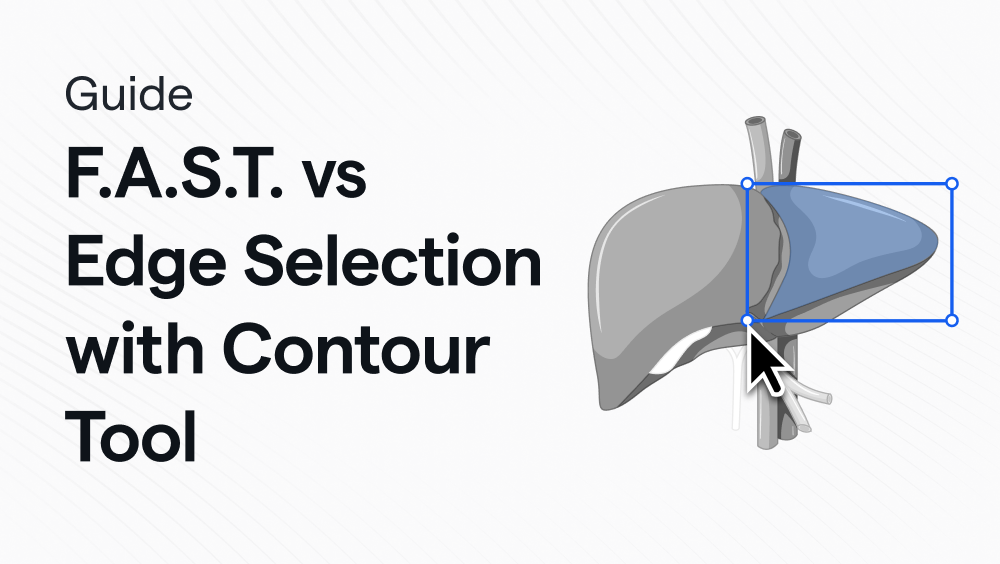
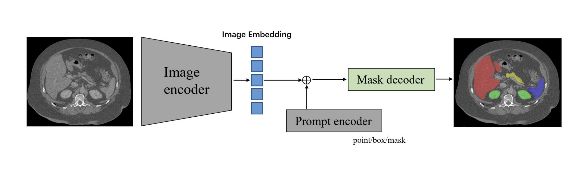
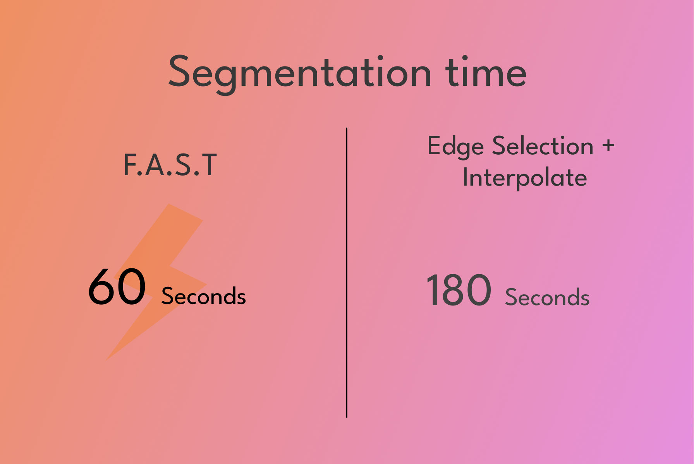

Liver Tumor segmentation: F.A.S.T vs Edge Selection with Contour tool

Vikas Chauhan

May 24, 2024

## Introduction
The liver stands as the largest solid organ in the human body, exerting crucial functions in metabolism and digestion. Unfortunately, primary liver cancer ranks as the second most fatal cancer globally. Moreover, owing to its susceptibility to both primary and secondary tumor development, the liver poses significant challenges to the accurate segmentation of lesions due to its heterogeneous and diffuse nature.

Liver tumors may originate within the liver itself or migrate from other abdominal or distant organs, necessitating meticulous analysis for comprehensive tumor staging. However, the conventional manual segmentation process employed in 3D CT scans proves time-consuming, lacks reproducibility, and yields results subject to operator variability.

To address these challenges, we present a comparison of liver tumor segmentation times using two distinct tools within the RedBrick AI suite:

1. **F.A.S.T (Fast Automated Segmentation Tool)**: This tool offers rapid segmentation capabilities, aiming to streamline the process and mitigate the laborious nature of manual segmentation.
2. **Edge Selection + Interpolate Tool**: This alternative method involves a combination of edge selection techniques followed by interpolation to delineate tumor boundaries, potentially offering more nuanced segmentation results.

By evaluating the efficiency and efficacy of these tools, we aim to provide insights into optimizing liver tumor segmentation workflows.

## What is F.A.S.T?
F.A.S.T (Fast Automated Segmentation Tool) revolutionizes the process of medical image segmentation by offering rapid and accurate generation of both 2D and 3D segmentations. Powered with Meta AI's SAM, a cutting-edge technology tailored for medical imaging, F.A.S.T stands as a versatile solution applicable across all radiology modalities.

Powered by sophisticated algorithms and machine learning capabilities, F.A.S.T ensures consistent and reliable annotations, alleviating the manual burden and accelerating the annotation process. Whether it involves identifying pathology, outlining anatomical structures, or mapping disease progression, F.A.S.T's automated annotation prowess streamlines annotation workflows, empowering annotators to focus on nuanced tasks and model refinement.

### Meta's SAM model

The Segment Anything Model (SAM) is a pioneering foundation model for image segmentation tasks. SAM has been trained on the largest segmentation dataset to date, the [Segment Anything 1-Billion mask dataset (SA-1B)](https://ai.facebook.com/datasets/segment-anything/). SAM can identify objects in images and generate a mask for any object, impressively showcasing its zero-shot capabilities, which allow it to adapt to new domains without additional training data. SAM uses a vision transformer-based image encoder to extract image features and compute an image embedding, and a prompt encoder to embed prompts and incorporate user interactions.

### How does SAM work?

Large Language Models (LLMs) like GPT-3 excel at adapting to new domains, partially due to their ability to prompt relevant responses. Drawing inspiration from LLMs, the Meta team designed SAM to have a promptable interface, enabling it to adapt to new domains and tasks.

SAM is trained to provide a valid segmentation mask for any prompt. In this context, a prompt refers to details about a region of interest, such as a key point, bounding box, or text identifying objects in an image.

Prompting offers an interactive way to use an AI model. This approach requires the model to support real-time operation (or close to it) on CPUs and browsers. To achieve this, SAM uses an encoder-decoder architecture. The computation-intensive process of calculating image embeddings occurs once, after which different segmentation masks can be produced with different prompts in real-time (less than 50 milliseconds!).

## F.A.S.T vs Edge Selection + Contour tool

This guide provides a direct comparison between the F.A.S.T and Edge Selection + Contour tools for segmenting a liver tumor. The comparison will focus on the time taken to segment a liver tumor using each of these tools.

### Project and Data Setup

#### Create Taxonomy

Let's start by creating a taxonomy to define what we will annotate. We will create a "Lesion" object label of segmentation taxonomy type.

*Please [visit our documentation](https://docs.redbrickai.com/projects/taxonomies) for instructions on creating taxonomies.*

#### Create a New Project

The next step is to create a new project with a label and review workflow using the taxonomy we just created.

*Please [visit our documentation](https://docs.redbrickai.com/projects/get-started-with-a-project) for instructions on creating Projects.*

#### Dataset

The next step is to import the Liver Tumor dataset into our project. For this use case, we will use a dataset from the [LiTS - Liver Tumor Segmentation Challenge.](https://competitions.codalab.org/competitions/17094#learn_the_details-isbi2017)

The dataset is diverse and contains primary and secondary tumors with varied sizes and appearances with various lesion-to-background levels (hyper-/hypo-dense), created in collaboration with seven hospitals and research institutions. Seventy-five submitted liver and liver tumor segmentation algorithms were trained on a set of 131 computed tomography (CT) volumes and were tested on 70 unseen test images acquired from different patients.

You can access the subset of data [here](https://drive.google.com/drive/folders/1pOCb9NWSNET3kxJH3440qWgAXGX9AnEm?usp=sharing)

*Please [visit our documentation](https://docs.redbrickai.com/importing-data/direct-data-upload) for instructions on uploading data.*

### Setting up the viewer

Upon opening a case, you may find that the windowing settings aren't ideal for viewing and annotating the lesion. Adjust these settings by using the windowing shortcut, `ctrl` + `left` mouse drag or click on the visualization tool on the top right header.

After determining your optimal window width and level, set it as the default for your project using [RedBrick AI's hanging protocols](https://docs.redbrickai.com/annotation/layout-and-multiple-volumes/custom-hanging-protocol). Hanging protocols allow you to preconfigure your viewer with custom scripts. To set windowing, use the `setWindowing` function.

We'll begin by segmenting the liver tumor across the slices using the edge selection, interpolation, and contour tools.

### Segmenting using Edge selection, Contour, and Interpolate tool

We'll begin by segmenting the liver tumor across the slices using the edge selection, interpolation, and contour tools.

- First, create a new object label and select the edge selection tool.
- Then, select the edge of the tumor lesion in one slice. After the lesion is segmented, refine it using hole filler tools and adjust the edges with the contour tool.
- Repeat these steps to segment the lesion into other slices. Once done, select the interpolation tool and highlight the edges of the first segment until the edge color brightens. Do the same for the last slice lesion.
- The interpolation tool will then create edges for all the slices in between.
- If you're satisfied with the interpolation, click the rasterize button on the right bar to segment the lesion for all the slices.

<iframe src="https://www.loom.com/embed/492e3b134d59478db718fe3869e1df23?sid=a4742fc8-f008-472f-838e-c7419b84973a" frameborder="0" webkitallowfullscreen mozallowfullscreen allowfullscreen style="position: absolute; top: 0; left: 0; width: 100%; height: 100%;"></iframe>

### Segmenting using F.A.S.T Tool

After creating and selecting the object label,

- click on the F.A.S.T Tool on the toolbar. Select the tool, then left-click and drag the mouse to highlight the area you want to segment. Double-click to apply the segmentation.
- Once you've selected the area, reinforce your segmentation by applying a positive point with a left click, and a negative point with a right click.
- Repeat the above step for an additional slice. Once you've finished with the segmentation, click on the "Finalize" button or use the "Shift + Enter" shortcut to finalize.
- After this, the tool will interpolate the bounding boxes across the slices.

<iframe src="https://www.loom.com/embed/79c26e878ad34876ba5316e64965d9ac?sid=436f8831-f451-4a4b-8b4f-fcf0215be990" frameborder="0" webkitallowfullscreen mozallowfullscreen allowfullscreen style="position: absolute; top: 0; left: 0; width: 100%; height: 100%;"></iframe>

### Time taken to segment

Finally, we can compare the time taken to annotate a lesion using both tools. F.A.S.T. can save roughly one-third of the annotation time compared to the other tool. Thus, F.A.S.T. can be an extremely useful tool for projects involving a large number of annotation tasks, significantly reducing the overall annotation time.

### Additional Resources on F.A.S.T

If you have any questions or feedback on F.A.S.T, Please reach out to us at [support@redbrickai.com](mailto:support@redbrickai.com).

Additional resources on F.A.S.T

- A Brief Overview on how to use F.A.S.T - [Link](https://www.youtube.com/watch?v=IVo77jjPtTM)
- F.A.S.T. ⚡️ Meta AI’s Segment Anything for Medical Imaging. - [Link](https://blog.redbrickai.com/blog-posts/fast-meta-sam-for-medical-imaging)
