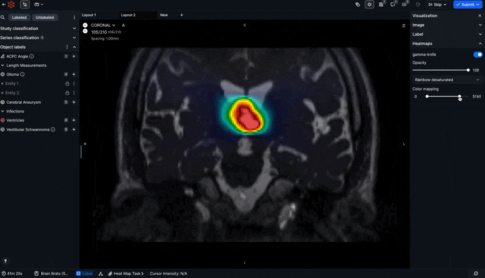
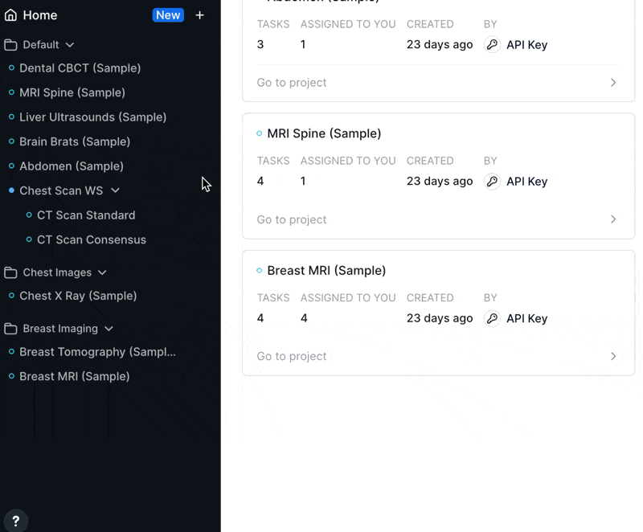
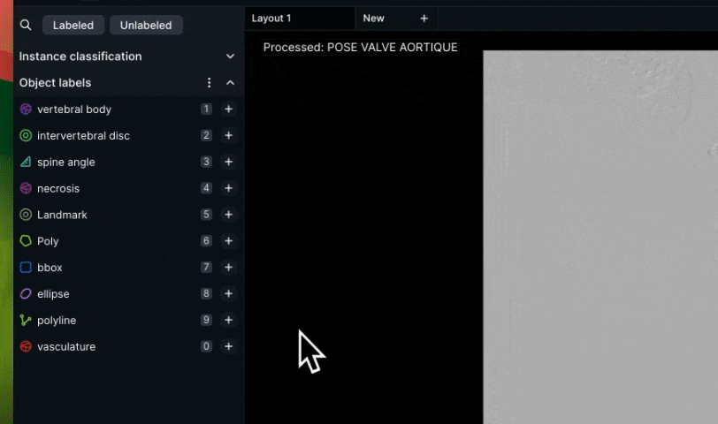

# RedBrick AI July 2024 Product Updates

Version 1.0.9

## What's New at RedBrick AI?

Now that summer's coming to a close and Q2 is officially behind us, we here at RedBrick wanted to share a comprehensive update about the features we managed to build since our April announcement of RedBrick 1.0.

Spoiler alert - we've been busy bees, but that doesn't really work for a clever summer-centric metaphor. Read on!

## Heatmap Visualization for Deeper Insights

We are excited to announce that RedBrick AI now supports the visualization of **heatmaps** and other similar structures, such as perfusion maps, radiotherapy maps, and more!

This powerful feature allows your team to unlock deeper insights by overlaying scalar volumetric data over the base image for reference purposes. You can adjust multiple color gradients and thresholding options to visualize your data with greater precision and clarity.

## Sections for Enhanced Project Organization

One of our most anticipated features, **Sections**, is now live, and we think Marie Kondo would approve.

Designed for admins who want to keep all of their Workspaces and Projects neat and tidy, Sections act as folders that can be easily sorted, named, hidden, and more. Navigating and managing your RedBrick resources in the lefthand toolbar is now easier than ever!

## AltaDB is live!

After a successful beta, **AltaDB** has officially graduated into 1.0! An extra special thanks from us to everyone who contributed.

AltaDB is a proprietary cloud storage solution that's designed to revolutionize data I/O and organization of DICOM studies on RedBrick AI. If you're curious about how to reduce your loading times by 7-10x and make perfect RedBrick JSON with a single click, head over to [https://altadb.com/](https://altadb.com/) to schedule a meeting or reach out over email!

## Segmentation Toolkit on 2D DICOM Video

For those who have been longing to move away from Polygons, your time has come! You can now harness the full power of the RedBrick AI segmentation toolkit on 2D DICOM videos with access to our Pen, Brush, Adaptive Brush, and more!

## Cineloop for 3D Volumes

Alternatively, if you've been looking for a video player-like experience with your 3D CTs and MRIs, we built that too! You can now easily activate Cineloop on any 3D Volume to turn your viewport into a mini-video player - perfect for classifying individual frames, quickly creating interpolated 2D annotations in 3D space, and much more!

## Enhanced Video Player for a Smoother Experience

In addition to adding segmentation label support to our video player, we've rolled out a series of improvements designed exclusively around quality of life and performance. You can now enjoy a much smoother video loading, viewing, and playing experience (particularly if you're using a high number of frames or annotations)!

## Better AWS Experience with S3 Transfer Acceleration

For teams utilizing Transfer Acceleration with their AWS setup, good news! Now you can leverage all of the benefits of your increased network speeds when working on RedBrick as well! Simply check the box on your Storage Method and you're good to go!

## Revamped UI

Those of you have been on the platform have surely noticed the new UI optimizations we've been rolling out. We hope that you enjoy the new, more polished look and feel for your Home Pages, Projects, toolbars, and tabs!
