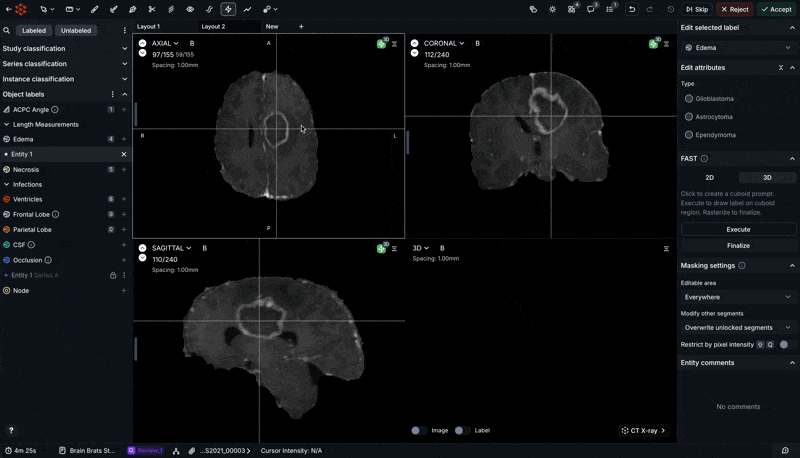

The end of summer brought another major release for RedBrick AI and a swathe of new features, several of which were widely requested.

As always, we're grateful to all of the individuals and teams who contributed feedback and helped us make the platform more intuitive, more robust, and with even more utility. A big thanks from the team!

Let's dive right in...

## 3D F.A.S.T.

"But wait, I could previously use F.A.S.T. for 3D annotations. So what's the deal?"

F.A.S.T. has joined the rest of our Segmentation Toolkit and received a dedicated 3D Mode! Users can now activate F.A.S.T. in 3D mode to generate a cuboid around a region of interest (ROI) that you'd like to annotate. Then, sit back and let 3D F.A.S.T. take care of the rest!

## Worklists

A brand new feature, the Worklist is a user-specific, RedBrick-wide list of all of your outstanding Tasks. It's now easier than ever before to keep track of your todo lists across Projects, manage your caching, monitor disk space usage, and more!

## Expanded Analytics

Project Managers and Team Leads rejoice, for Project Analytics and Task Analytics have finally arrived! We've done our best to bring the flexibility and might of Python-based reporting to the frontend, and we hope you'll love this first iteration.

Project Analytics allow users to easily access records of their work inside of a Project, including various metrics for labeling and/or reviewing time, Task completion, and workflows.

Admins can also access these records for **_all users within a Project_** (yes, you heard it right), but we're still not done.

You can now access Task Analytics to see a comprehensive overview of what annotation work has been done on a Task, as well as its history and Stage-specific time-based stats.

## Taxonomy duplication

Gone are the days of asking coworkers with API keys to programmatically duplicate large, complicated Taxonomies, as you can now duplicate any existing Taxonomy with just two clicks in the UI!

(FYI For the RedBrick SDK Masters out there, this operation doesn't carry over archived elements).

## Settings shortcuts and UI updates

If you're an Admin, you'll now see a series of button-like shortcuts for quick access to your Project's settings. Now your hanging protocols, label validation scripts, caching settings, and much more are only a click away.

On top of that, we've done our usual trimming and streamlining of several elements, including two new buttons in the Annotation Tool. We hope you enjoy the fresh new look!

## 3D Heatmaps

We added Heatmaps in our previous release, and we're continuing to iterate over them (and other things). You can now see your heatmaps in 3D viewports and toggle the views on and off with brand new hotkeys if you're trying to quickly swap between views!

## Cached environment settings

Wouldn't it be nice to open a scan, make all the visual adjustments you want to make, and then never have to do that configuration again?

We thought so too, so now that's the case! A variety of environment settings will be retained in your browser cache so you won't have to re-adjust all of your sliders every time you open a Task.
