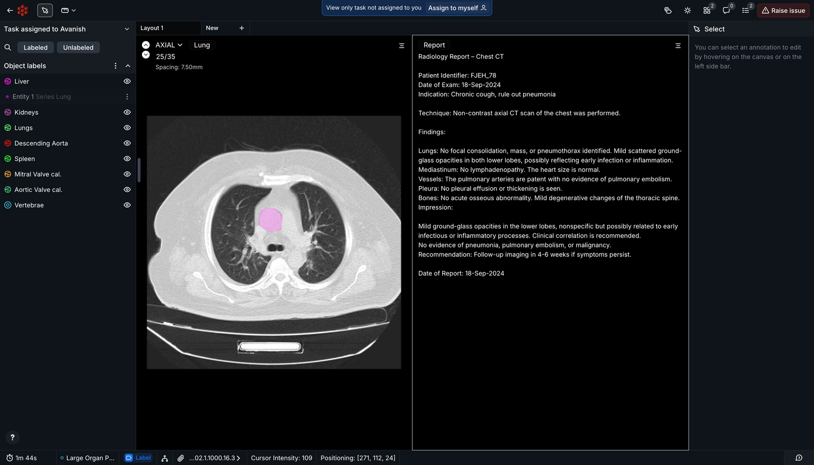
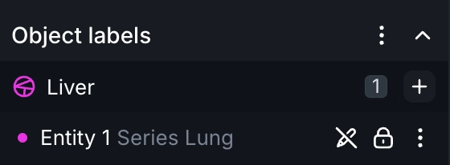

Q3 ended on several high notes here at RedBrick AI as we added many new features to the ensemble designed to make the platform more intuitive, more robust, and more customizable!

No matter what your role is in your RedBrick Organization, we have something exciting to dive into. As always, our deepest thanks to our users who provided feedback that helped us build all of the following.

## Mask Propagation Tool, powered by SAM2

You can now leverage the might, accuracy, and speed of SAM2 inside of the Annotation Tool to make 3D segmentation nearly effortless! Simply prime the model and generate annotations across an entire volume with one click.

Our Mask Propagation Tool is powered by RedBrick Boost! Reach out to us for more details.

Visit our [Docs for more information](https://docs.redbrickai.com/annotation-and-viewer/segmentation/segmentation-tools#mask-propagation-tool).

## Document Viewer

Among our many updates designed to make the Editor look and feel even more like your favorite PACS / DICOM viewer, the Document Viewer allows you to bring radiological reports, AI-generated clinical summaries, and much more to provide critical context without having to rely on Task or Series metadata anymore.

Visit our [Docs for more information](https://docs.redbrickai.com/annotation-and-viewer/viewer-basics/document-viewer#uploading-documents-to-redbrick-ai).

## Read-only Labels

As the name suggests, users can now upload labels as read-only, completely preventing any sort of modifications within the RedBrick Editor. However, we didn't stop there - if you need granular control over which users can or cannot modify read-only labels, we built that in too.

Check out your Project's General Settings to see for yourself!

Visit our [Docs for more information](https://docs.redbrickai.com/annotation-and-viewer/creating-editing-and-deleting-annotations#read-only-labels).

## Study Selector

A new layer of verticality has been added to the Editor with our Study Selector, which automatically filters out DICOM files and provides an easy-to-navigate interface to traverse your scans in a way that respects their hierarchy.

We launched this with the hopes that organizing your timepoints, longitudinal studies, or even just "big Tasks" will be a bit less of a hassle.

Visit our [Docs for more information](https://docs.redbrickai.com/annotation-and-viewer/viewer-basics#study-selector).

## Label Groups

Having a mountain of useful data after exporting a project is nice, and having a bit more order within it is even nicer. Users can now create groups of linked annotations in the RedBrick Editor that, upon export, will each have a unique identifier, making mapping a breeze.

Visit our [Docs for more information](https://docs.redbrickai.com/annotation-and-viewer/creating-editing-and-deleting-annotations#label-grouping).

## Customizable Hotkeys

Radiologists rejoice, for the day has come! Now you can have full control over your keyboard shortcuts in the Dashboard and Editor alike, allowing you to easily re-map your hotkeys to suit whatever your personal preference may be. Bring your favorite configuration from your most-used PACS viewer or internal tool and make your RedBrick experience your own like never before!

Visit our [Docs for more information](https://docs.redbrickai.com/organizations/user-preferences#configuring-customizable-shortcuts).

## New Formats

We've added support for MHD, MHA, and DCE MRI formats.

Visit our [Docs for more information](https://docs.redbrickai.com/importing-data/uploading-data-to-redbrick#supported-annotation-import-formats).

## Quality of Life Updates

A lot of the previous cycle's planning was centered on making standard workflows even more intuitive and "common sense", which led to many of the features detailed above.

RedBrick veterans have likely also noticed several changes - Taxonomies now visible during Project creation, more flexibility with maximized / minimized viewports, more Layout tabs, and more (now customizable) Dashboard and Editor shortcuts to let you build the annotation flows your team needs, no matter the protocol.
