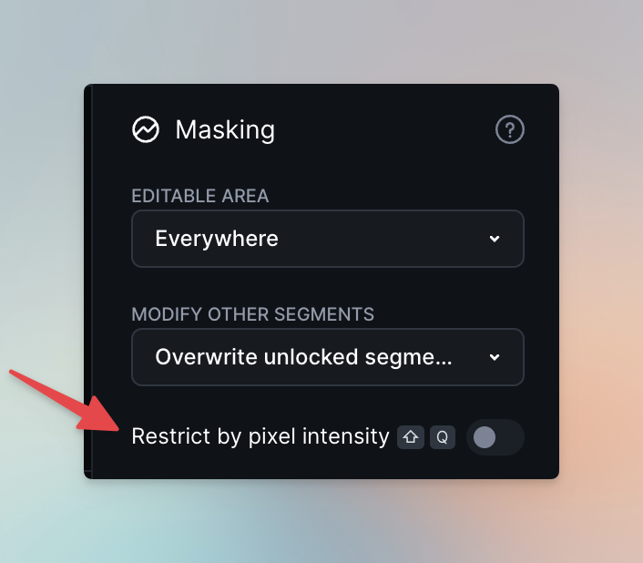
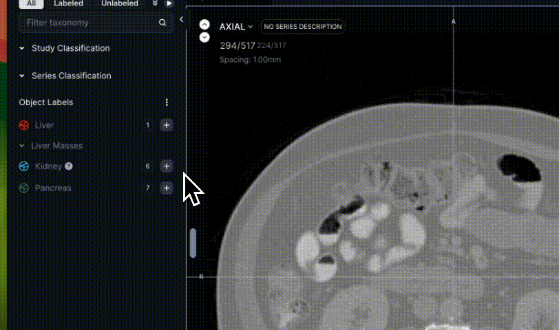
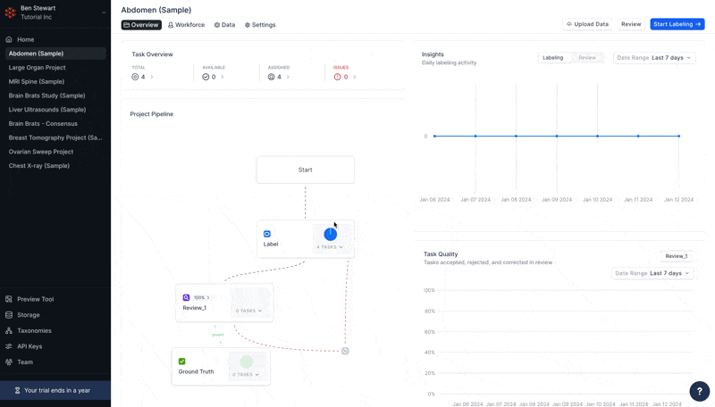
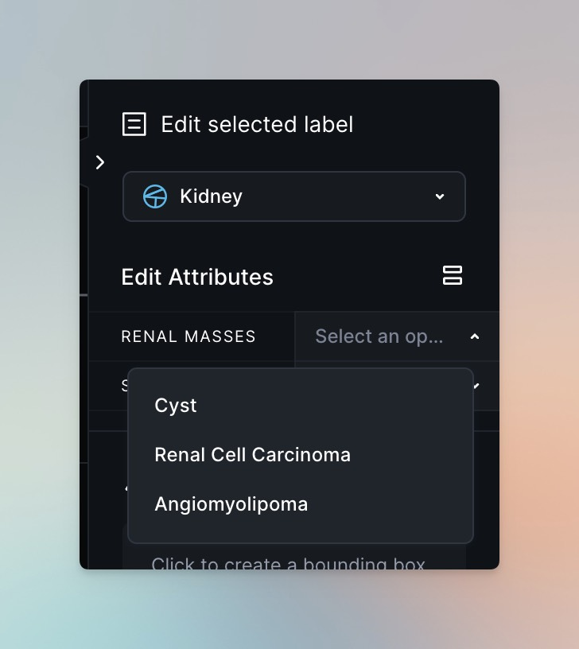

Segmentation of large organs in abdominal CT scans

Ben Stewart

January 23, 2024

## Part I - Configuring your environment

For this walkthrough, we will be using scans from the Abdomen (Sample)
Project included with your RedBrick AI trial.

Throughout this document, you'll find check boxes that you
can fill in after completing the associated task. For example:

* Open a Task in the Abdomen (Sample) Project in RedBrick AI

### Masking

You can apply pixel-based thresholding to any image or volume on
RedBrick to define a "paintable" range when annotating.

For more information on the Masking Panel, check out our [full
documentation](https://docs.redbrickai.com/annotation-and-viewer/visualization-and-masking#restrict-by-pixel-intensity).

To define your thresholding range:

Create a new segmentation in the left hand toolbar

Click the Restrict by pixel intensity toggle in the right hand Context Panel



Adjust the slider as necessary to increase or decrease your paintable range (i.e. the flashing blue regions of the canvas)



For annotating the Kidneys, try a range of 60-610!

## Part II - Annotation

### For Admins - setting a default thresholding range

If you're familiar with DICOM and PACS viewers,
you've likely made use of [Hanging Protocols](https://docs.redbrickai.com/annotation-and-viewer/viewer-basics/custom-hanging-protocol#custom-hanging-protocol-format-reference), and they're also available on RedBrick AI!

```ts
setThresholding(0, 40, 610)
```

Head to Project Settings → Hanging Protocol and paste the above function into the field to define a project-wide thresholding range:




### Annotating the kidneys

Let's explore several ways to annotate the kidneys using
the Segmentation Toolkit.

### 3D Brush + Masking

When using Masking, you can't paint outside of the flashing
blue regions of your canvas. We can combine this setting with the 3D
Brush to paint across slices very quickly, as demonstrated in the video
below.

[Annotating the kidney video](./Annotating%20the%20kidney%20with%20the%203D%20Brush,%203D%20Hole%20Filling,%20&%203D%20Island%20Tool.mp4)


Flow toolkit:
* 3D Brush Tool
* 3D Hole Filling - to ensure no stray holes in the kidney annotation
* 3D Island Tool - to delete any stray voxels outside of the kidney

### 3D Contour Tool

Using the [3D Contour
Tool](https://docs.redbrickai.com/annotation-and-viewer/segmentation/segmentation-tools#contour-tool) doesn't require the use of thresholding, so we're going to adopt a different approach for the left kidney.

[Smart Contour Tool:](https://docs.redbrickai.com/annotation-and-viewer/segmentation/segmentation-tools#contour-tool) hold CTRL+ALT (or CTRL+OPTION on MacOS) and hover over the boundary of a structure to display the Smart Contour. Once you are satisfied with the Contour, click LMB to create it or LMB+drag to smooth the Contour.

The 3D Contour Tool utilizes interpolation to create contours across a defined range. See the diagram below:


Let's get some labeling done - follow along in the
Annotation Tool!
* create a second Entity for Kidneys
* disable Restrict by pixel intensity (if you have it enabled)
* scroll to the top or bottom of the un-annotated kidney
* create a contour on a single slice
* rasterize the single contour by clicking on Rasterize in the right hand Context Panel (or using SHIFT+ENTER)
* create a 3D contour using interpolation & rasterize it

[Annotating the kidney](./Annotating%20the%20kidney%20with%203D%20Contour%20Tool.mp4)


Flow Toolkit:
* 3D Contour Tool
* 3D Hole Filling - to ensure no stray holes in the kidney annotation
* 2D Adaptive Brush Tool - to ensure pixel-perfect cleanup after the
contours are done

### 3D F.A.S.T.

RedBrick AI also offers AI-assisted segmentation with our Fast Automated Segmentation Tool, or F.A.S.T.

Like the 3D Contour Tool, [F.A.S.T.](https://www.notion.so/da3b77b233034b3fa0d0d4aacf97fc5b?pvs=21) uses interpolation to allow you to annotate rapidly across a slice range.

F.A.S.T. is enabled for all free trials, so let's give it a try.

* select the Entity you want to segment (or create a new one)
* use LMB to create a box around the Kidney

* use LMB again to complete the box and activate F.A.S.T.
* after the segmentation is generated, use LMB to supply F.A.S.T. with
positive feedback (i.e. "annotate here")
* after the segmentation is generated, use RMB to supply F.A.S.T. with negative feedback (i.e. "do not annotate here")


[Video of annotating the kidney with 3D FAST](./Annotating%20the%20kidney%20with%203D%20FAST.mp4)


### Object Label Attributes

In some Projects, your administrators will ask you to assign extra data attributes to certain Object Labels.
* select one of your Kidney Entities and then look at the right hand Context Panel

* expand the Renal Masses field



Selecting one of these Attributes will map it to whichever Entity you
currently have selected, making it visible to your data / MLOps
colleagues upon export.

You can read more about Object Label Attributes in our official
documentation
[here](https://docs.redbrickai.com/projects/taxonomies#object-label-attributes).

### Annotating the liver & pancreas

It's time to put everything together and define a flow that
works best for you.

* annotate the Liver using any of the above methods (or a combination of them)

* annotate the Pancreas using any of the above methods (or a combination of them)

## Part III - Export

## Semantic Export

This Project and walkthrough are making use of semantic annotation, and those curious can read about the different types of annotation [here](https://docs.redbrickai.com/annotation-and-viewer/segmentation/instance-vs.-semantic).

RedBrick AI offers a special type of [data export](https://docs.redbrickai.com/python-sdk/sdk-overview/exporting-annotations) (called Semantic Export) that can greatly simplify your team's post-processing efforts and provide peace of mind for quality control purposes.

Light Reading:

* [SDK Overview (Python)](https://docs.redbrickai.com/python-sdk/sdk-overview)
* [General Export Information (Python)](https://docs.redbrickai.com/python-sdk/sdk-overview/exporting-annotations)
* [Full Python APIReference](https://redbrick-sdk.readthedocs.io/en/stable/sdk.html)

Whether you're working in Python or the CLI, you can make
use of Semantic Export to ensure that you will always have only one annotation per Object Label.

### Python
```python
project = redbrick.get_project(org_id, project_id, api_key, url)

project.export.export_tasks(semantic_mask=True)
```
### CLI
```bash
# in local directory

redbrick export --semantic
```
## Wrap-up and Additional Resources

Congratulations! You've made great progress on the road to
RedBrick mastery by making it all to the end of this use case. Pat yourself on the back!

We wish you the best of luck in your annotation journey moving forward. Don't forget to reach out to us at [support@redbrickai.com](mailto:support@redbrickai.com)with any questions or feedback!

If you'd like to learn more about the platform, please feel free to consult the following resources:

* [RedBrick AI Documentation](https://docs.redbrickai.com/)

* [RedBrick AI SDK Reference](https://redbrick-sdk.readthedocs.io/en/stable/sdk.html)

* [RedBrick AI YouTube Channel](https://youtube.com/@redbrickai)

* [RedBrick AI Changelog](https://changelog.redbrickai.com/)

* [RedBrick AI Blog](https://blog.redbrickai.com/)
