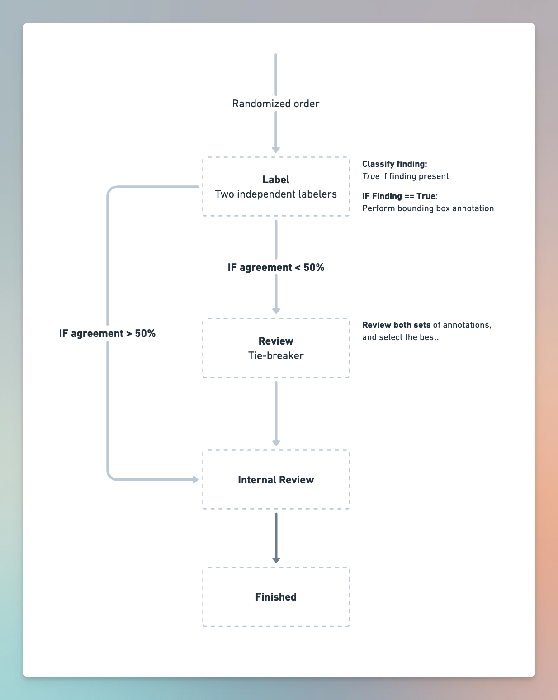
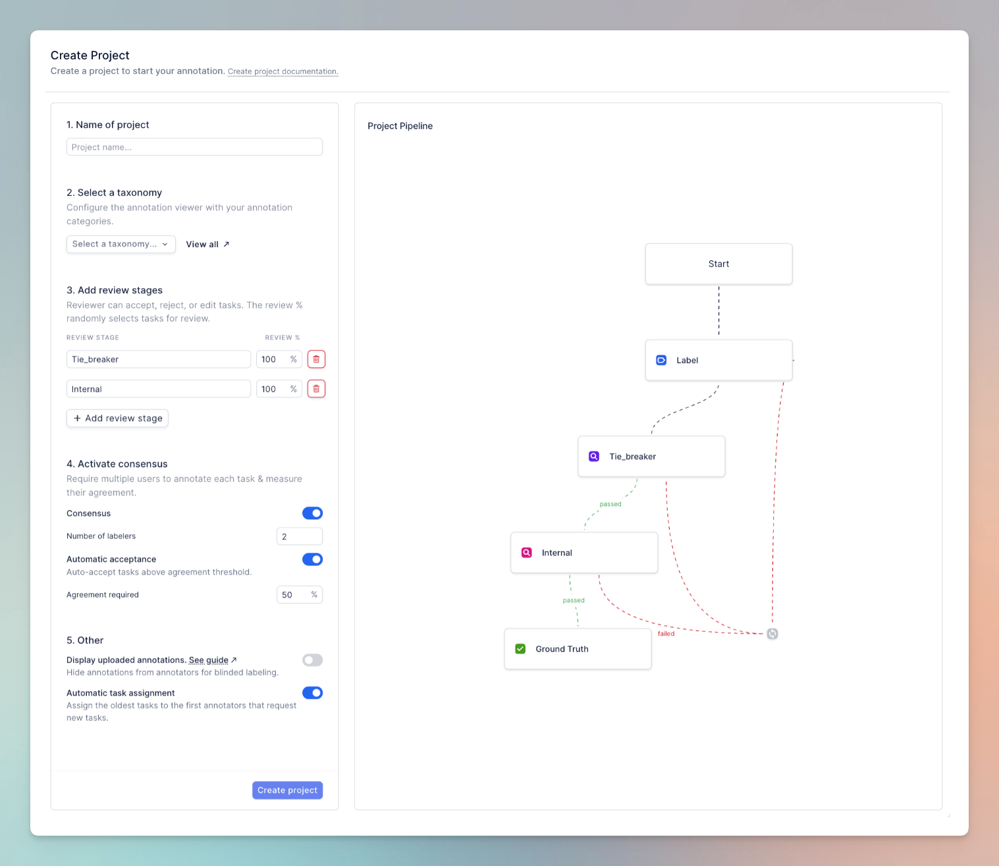

FDA clinical validation study for Chest X-ray anomaly detection
algorithm

Shivam Sharma

February 5, 2024

RedBrick AI customers use the platform for both ground-truthing and clinical validation studies. Depending on the scale and complexity of the algorithm, clinical validation studies can have complex workflow requirements, including measuring inter-annotator agreement and comparing the performance of annotators blinded & unblinded to Computer Aided Diagnosis (CAD) annotations.

In this document, we'll walk through how RedBrick AI can be used for a hypothetical clinical validation study of a chest anomaly detection algorithm. Our chest anomaly detection algorithm will classify an image as normal or abnormal. If abnormal, it will draw a bounding box around one of the following anomalies --- Aortic enlargement, Atelectasis, Calcification, Cardiomegaly, Consolidation, ILD, Infiltration, Lung Opacity, Nodule/Mass, Other lesion, Pleural effusion, Pleural thickening, Pneumothorax, Pulmonary fibrosis.

## Study design

In this study, we will compare the performance of Computer Aided Diagnosis against expert annotators. See the image below for the study workflow:



The components of the workflow are:

1. **Label**: We'll have two labelers independently annotate each scan. They will be required to classify scans that have Findings present. If a finding is present, they must draw a bounding box around the finding.

2. **Review**: We'll have a single reviewer review all scans with less than 50% IOU agreement between the two labelers. The reviewer's objective is to (a) select the best set of annotations and (b) do annotations from scratch if both labelers were wrong.

3. **Internal Review**: This stage is meant to simulate an internal review
process amongst the engineering team. Within this review stage,
reviewers will be able to see the final set of annotations generated and
compare them to uploaded Computer Aided Diagnosis annotations to see how
the model compares to human annotators.

Project setup on RedBrick AI

*Most of the project setup can be done via our Python SDK. In the subsequent sections, we will walk through sections of project setup scripts. You can [access the entire script here](https://github.com/redbrick-ai/guides/blob/main/fda-chest-anomaly/main.ipynb).*

### Creating a taxonomy

We need to define a taxonomy that allows our annotators to annotate correctly. There are two tasks:

1. **Study Classification**: Mark true if Finding is found.
2. **Object Detection**: Draw a bounding box around the finding belonging to one of these categories — Aortic enlargement, Atelectasis, Calcification, Cardiomegaly, Consolidation, ILD, Infiltration, Lung Opacity, Nodule/Mass, Other lesion, Pleural effusion, Pleural thickening, Pneumothorax, Pulmonary fibrosis.

Creating a taxonomy [can be done through the UI](https://share.redbrickai.com/jQmtVGW3) or through [the Python SDK](https://redbrick-sdk.readthedocs.io/en/stable/sdk.html#redbrick.organization.RBOrganization.create_taxonomy):

```python
org = redbrick.get_org(api_key, org_id)

taxonomy = redbrick.create_taxonomy(
			    "X-ray anomaly",
			    object_types,
			    study_classify
)
```
See our SDK documentation for the format of object_types and study_classify.

The end result will be the following taxonomy:


### Creating a project

We need to create a project with the workflow references above. As with
the taxonomy, this can be done through the Python SDK or UI. Here are
the specific things to keep in mind:

1. **Review stages**: Add two review stages, the first will be the tie-breaker, the second will be the internal review.
2. **Taxonomy**: Select the previously created X-ray anomaly taxonomy.
3. **Consensus**: Enable consensus, require 2 labelers per task, and enable auto-acceptance above 50% agreement.
4. **Uploaded annotations**: Disable display of uploaded annotations. This will ensure the Labeler and the first reviewer cannot see the uploaded CAD results. We will assign the internal reviewer as an admin, who will be able to see the uploaded CAD results.



You can re-create this workflow through the Python SDK too:

```python
project = org.create_project_advanced(
	name=project_name,
	taxonomy_name=taxonomy_name,
	stages=[
		redbrick.LabelStage(
			stage_name="Label",
			config=redbrick.LabelStage.Config(auto_assignment=False,
			show_uploaded_annotations=False),
			on_submit="Tie_breaker"
		),
		redbrick.ReviewStage(
			stage_name="Tie_breaker",
			config=redbrick.ReviewStage.Config(auto_assignment=False),
			on_accept="Internal",
			on_reject="Label"
		),
		redbrick.ReviewStage(
			stage_name="Internal",
			config=redbrick.ReviewStage.Config(auto_assignment=False),
			on_reject="Label"
		)
	]
)
```

### Uploading data

* Download the [DICOM files and annotations from here](https://drive.google.com/drive/folders/1bI02FdZ2OnbwbxfkR9TN5omjJB0VmX-w?usp=drive_link). You can find comprehensive documentation on the [annotation formats here](https://docs.redbrickai.com/python-sdk/formats/full-format-reference).

The JSON file has a list of items similar to the object below. Each
object represents a single annotation task, in this case, a single x-ray
with its CAD results.
```json
{
	// A user-defined unique name for this task.
	"name": "00150343289f317a0ad5629d5b7d9ef9",

	// A single entry in "series" for 1 x-ray in this task.
	"series": [
		{

			// Path to the DICOM image.
			"items": "data/00150343289f317a0ad5629d5b7d9ef9.dicom",

			// Normalized coordinates of the CAD bounding boxes.
			"boundingBoxes": [
				{
					"pointTopLeft": {
						"xNorm": 0.1005940594059406,
						"yNorm": 0.5027910685805422
					},
					"hNorm": 0.05861386138613861,
					"wNorm": 0.0689792663476874,
					"category": "Pleural thickening"
				}
			]
		}
	],

	// Tasks are ordered by "priority". If you assign a random value [0,1]
	// for each case, the queue will be ordered randomly.
	"priority": 0.371,

	// CAD Classification for this task.
	"classification": {
		"attributes": {
			"Finding": true
		}
	}
}
```


After downloading the data using the link above, you can import it like this:


```python
with open("items.json", "r") as file:
	items = json.load(file)

tasks = project.upload.create_datapoints(
	storage_id=redbrick.StorageMethod.REDBRICK,
	points=items
)
```


This will import all the x-ray images and the CAD results — the
classifications and bounding boxes.

### Adding validation checks to prevent annotation errors

A common pitfall of annotation projects is instructions are
under-defined, often leading to violations of the annotation schema. For
example, annotators may forget to perform a classification task or add
extra bounding boxes when only one is expected.

We will add validation checks to ensure annotations obey a logical
schema. These validations are done by user-defined Javascript code
running in the browser in real time while labelers annotate.

For our project, we will check the following:

1. If the Finding is marked True, there must be a bounding box annotation.
2. There can only be 1 bounding box annotation.

Add the following script to the Label Validation entry in Project
Settings.

```js
// Check if finding is present & count bounding boxes
let isFinding = false
let bboxCount = 0

labels.forEach((label) => {
	if(label["labelType"] === "STUDYCLASSIFY") {
		isFinding = label["attributes"][0]["value"]
	}
	if(label["labelType"] == "BBOX"){
		bboxCount += 1
	}
})

// Assert a single bounding box is present if the Finding is marked true.

if(isFinding) {
	assert(bboxCount === 1, "You\'ve marked Finding as true. Please draw a single bounding box around the finding.")
} else {
	assert(bboxCount === 0, "You\'ve marked Finding as false. Please remove all bounding boxes.")
}
```


## Going through the workflow

### Adding users to the project & assigning cases

Let\'s invite our labelers and reviewers with the project setup and data upload complete. We will have two users perform annotation in Label, one reviewer in Review, and admins perform Internal Review.

First, [invite all users to your organization from the Team tab](https://docs.redbrickai.com/organizations/inviting-your-team). Note that you'll want to invite users for the Label and Review stages as members and Internal Review users as admins.

Next, invite the users to your project and assign them to the relevant stages. Once they've been added to a project, you can start assigning cases to them from the Data tab.

*Because we've enabled Consensus in this project, we can assign each Labeling case to two annotators.*

‍


Once cases have been assigned, your users will see them appear on their dashboard. They can begin labeling by simply clicking on Start Labeling.


### Reviewing tasks and measuring consensus

Tasks, where the two labelers had \> 50% consensus, will automatically be routed to Internal Review. Other cases will be routed to Tie breaker review, where we can see all opinions and select the best set of annotations or create annotations from scratch.


*You will see two percentages on your labeled tasks Consensus and Score. Consensus measures the agreement between the labelers. Score measures the agreement between the labelers and the uploaded CAD annotations.*

Once you assign the tasks queued in Tie Breaker review, your reviewer will be able to compare both sets of annotations and select the best.


### Comparing against CAD results in internal review

Once the tiebreaker has been completed, the tasks will move on to internal review. Internal reviewers can compare the user-generated annotations against the uploaded CAD annotations.


## Exporting final cases
Once both review stages are complete, tasks will move to Ground Truth. These cases can be exported using the CLI or Python SDK. Please [follow along with the documentation here](https://docs.redbrickai.com/python-sdk/cli-overview/exporting-annotations) to understand how to export tasks.
