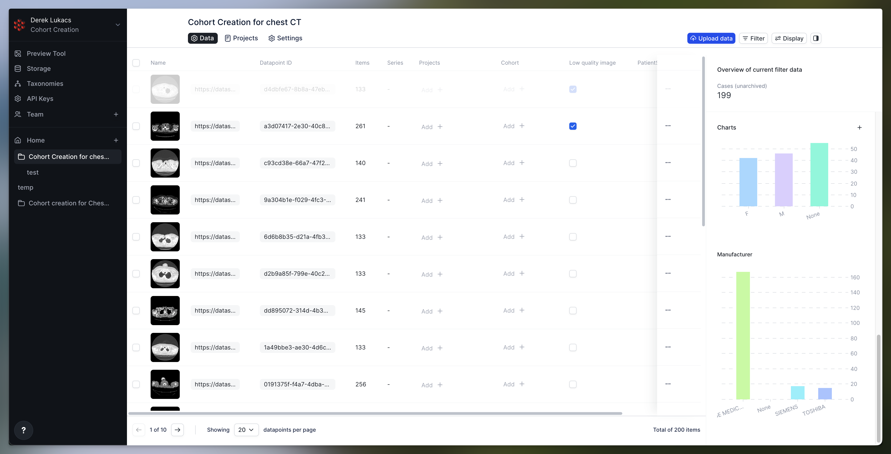
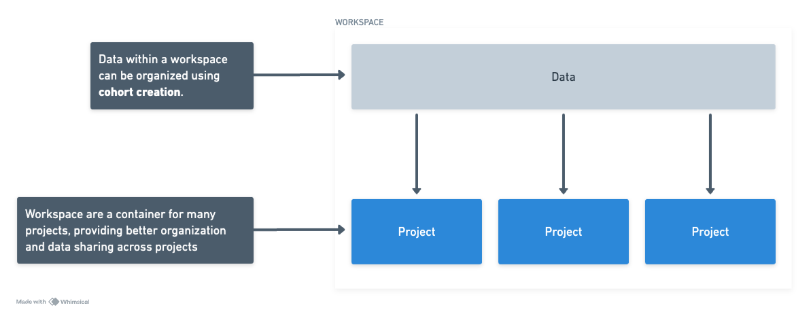

Data curation and cohort creation on RedBrick AI

Derek Lukacs

March 22, 2024

## Introduction to Cohort Creation

You can use the [RedBrick AI cohort creation feature](https://redbrickai.com/cohort) to upload, index, share, ensure reproducibility, and control the quality of your studies before you send them for annotation. Every project requires a different approach to data selection for building a cohort, but most ground truthing and validation projects pay attention to the balance of parameters such as gender, age, and country of origin. For example, FDA validation studies require certain percentages of the data to be sourced from the USA.

The RedBrick AI cohort creation allows you to search, filter, and organize your data before sending it for annotation. This guide will walk you through an example of uploading data, configuring a workspace, and utilizing the cohort creation features.



### Preparing Your Data for Upload

Any existing RedBrick AI users should find uploading data to a cohort creation workspace familiar. You will upload a JSON file which specifies the location of your DICOM or NIfTI images stored in the cloud, such as in an AWS S3 bucket. In addition to these image paths, you will specify the metadata for each study. This metadata can be for any fields you want. This could be extracted from the DICOM tags of your study, or from a different source such as clinical outcomes.

In this guide, we start with our data stored in a common pattern: images stored in an S3 bucket and a CSV file that specifies metadata that has been extracted. To prepare the data for upload, all we need to do is reformat this information and save it as a JSON file.

```python
# A script for converting from CSV to a JSON file for uploading to RedBrick AI
import csv
import json

def csv_to_list_of_dicts(filename):
	with open(filename, "r") as file:
		reader = csv.DictReader(file)
		data = list(reader)
	return data

# Use the function
cases = csv_to_list_of_dicts("tags_and_paths.csv")

def item_to_redbrick_usable_url(item: str) -> str:
	"""
	Convert the item stored in the csv file to something that RedBrick can
	use.

	This will vary depending on where your images are stored. In this case,
	images are stored

	at a public url. Yours is probably stored in an S3 bucket and your paths
	will be generated differently.

	Check docs.redbrickai.com for more information.
	"""

	return "https://datasets.redbrickai.com/chest_ct_lidc_idri/" + item

upload_format = []
for case_ in cases:
	# ['LIDC-IDRI-0195/1-102.dcm', 'LIDC-IDRI-0195/1-103.dcm', ...]
	items = case_["items"]

	# parse the way items were stored in the csv file
	items = json.loads(items.replace("'", '"'))
	del case_["items"]

	metadata = case_

	upload_format.append(
		{
			"items": [item_to_redbrick_usable_url(item) for item in items],
			"metaData": metadata,
		}
	)

# Write to a JSON file
with open("upload_format.json", "w+") as file:
    json.dump(upload_format, file, indent=2)
```


Download this [Python file here](https://github.com/redbrick-ai/cohort-creation-guide/blob/main/csv_to_json.py) and the [JSON file here](https://github.com/redbrick-ai/cohort-creation-guide/blob/main/upload_format.json). This JSON file follows the RedBrick AI [items list format](https://docs.redbrickai.com/importing-data/import-cloud-data/creating-an-items-list).

This will produce a JSON file in the following format:
```json
[
	{
		"items": [
			"https://datasets.redbrickai.com/chest_ct_lidc_idri/LIDC-IDRI-0125/1-013.dcm",
			...
		],
		"metaData": {
			"PatientID": "LIDC-IDRI-0125",
			"StudyDate": "20000101",
			"StudyTime": "",
			"AccessionNumber": "",
			"Modality": "CT",
			"Manufacturer": "GE MEDICAL SYSTEMS",
			"StudyDescription": "",
			"SeriesDescription": "",
			"PatientName": "",
			"PatientBirthDate": "",
			"PatientSex": "",
			"BodyPartExamined": "CHEST",
			"SliceThickness": "1.250000",
			"KVP": "120",
			"DistanceSourceToDetector": "949.075012",
			"DistanceSourceToPatient": "541.000000",
			"GantryDetectorTilt": "0.000000",
			"TableHeight": "156.500000",
			"RotationDirection": "CW",
			"XRayTubeCurrent": "400",
			"CountryOfResidence": "",
			"PatientIdentityRemoved": "YES",
			"PatientPosition": "FFS"
		}
	},
	...
]
```

## Uploading Your Data to a Workspace

We first create a workspace through the Homepage of the UI. A workspace
is a container in RedBrick AI that brings together data and multiple
projects that share that data. You will perform cohort creation and data
curation inside a workspace.

Workspaces are containers that allow you to organize data using cohort
creation. That organized data can then be sent to multiple projects for
annotation.



Navigate to the data tab of your workspace and upload your JSON file. Making sure to select the correct storage method.


### Configuring Your Metadata Schema

Then we can configure the workspace according to our metadata schema that we extracted from our CSV file. This is done under settings where we will add all of our columns and their schemas. This schema is extremely flexible and is not strictly enforced on the uploaded data. That is to give maximum flexibility to your data format and to allow your schema to evolve over time.

You can also configure the manual classification options. We will go more into this later, but this allows you to manually classify your studies.


### Performing Manual Classification

In order to perform manual classification of data, you can update the classification schema under the workspace settings. These classifications can be a variety of types including True or False, Selection, Multi Selection, or a Textfield. You can then modify these classifications and use them for searching and filtering.

This classification can be performed from the table or while previewing images.


### Viewing Data Distributions

You can view histograms of your metadata and classification distributions from the collapsible right side panel. These histograms will adapt to your filter conditions. For example, we can filter out all data that does not have PatientSex values of M or F.


### Building a Cohort

To create a new cohort just enter the name into the cohort selection. Now you can add datapoints to the cohort. A common workflow is to filter by some metadata fields that you care about, then check the class balance in your cohort, then supplement your cohort with additional data to achieve your desired balanced cohort.


### Previewing a Datapoint

You are able to preview an entire datapoint by opening it in the editor. From here you will be able to add the datapoint to a cohort, a project, or update its classifications. Metadata is available through the viewport button.


### Sending Data for Annotation

To send data for annotation, you can just select the datapoints you want to annotate and then click the "Add to project" button. This can be used in conjunction with the filters and cohorts to easily add the data you want to your project.


### Summary

This guide walked you through the process of creating a cohort in RedBrick AI, starting with uploading and preparing your data, and ending with sending it for annotation. It covered configuring metadata, classifying data manually, analyzing data distributions, and adding data to projects. The steps provided aim to help you efficiently manage and curate your datasets, ensuring they meet the specific requirements of your research or projects. With RedBrick AI, you have the tools to easily organize and analyze your data, making your data annotation tasks simpler and more effective.
