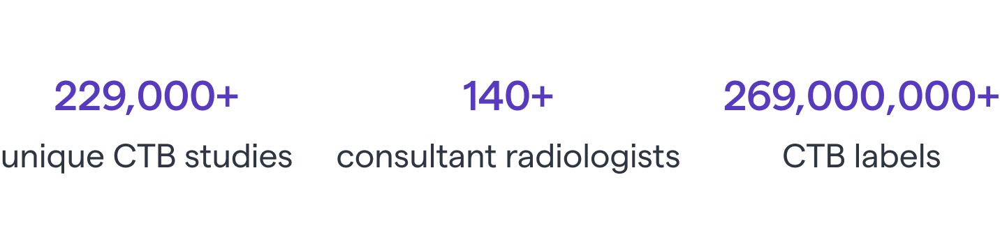
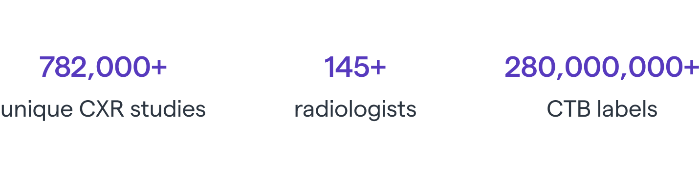
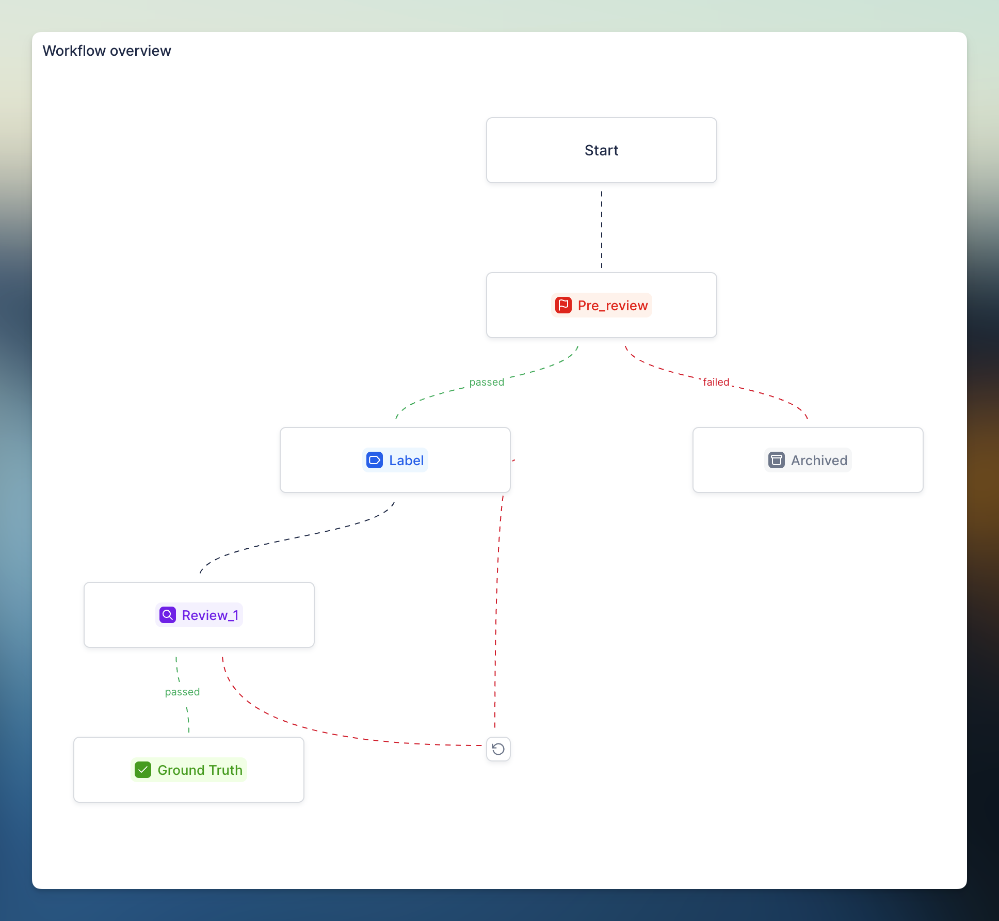
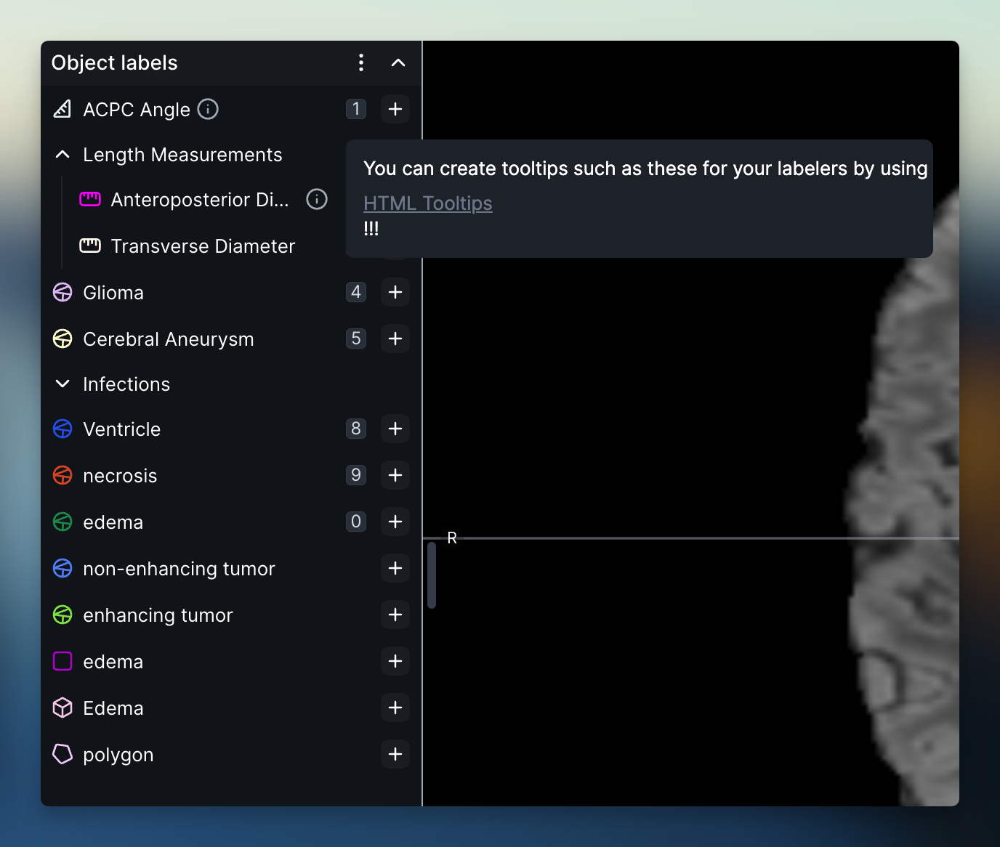

Comprehensive radiology AI algorithms - Annalise & RedBrick AI

Shivam Sharma

April 25, 2024

We recently had a conversation with Jarrel Seah, the Associate Director for Clinical AI of [Harrison.ai](http://harrison.ai/). We discussed their suite of radiology AI products, [Annalise.ai](http://annalise.ai/), and their use of RedBrick AI in preparing training data.

> We have raw data which is unburned fuel, and RedBrick AI is the engine that lights it on fire.
>
> Jarrel Seah
> Associate Director for Clinical AI

[Annalise.ai](http://annalise.ai/) is a joint venture between the Australian healthcare technology company, [Harrison.ai](http://harrison.ai/), and one of the world's largest radiology companies, I-MED Radiology Network. This partnership enhances the capability of imaging analysis AI to provide comprehensive modality solutions.

## The case for comprehensive AI algorithms

[Annalise.ai](http://annalise.ai/)'s core differentiation is its focus on comprehensive AI algorithms. These algorithms analyze medical images for the presence of several common findings in a given imaging procedure. Other radiology AI companies tend to offer narrow AI solutions that focus on a single specific clinical need, for example, only detecting the presence of pneumothorax in chest X-ray's.

Narrow AI algorithms, while beneficial for specific tasks, come with limitations. Their specialized focus means they can only address a singular aspect of a broader diagnostic challenge, potentially overlooking other clinically relevant findings. This specialization can lead to fragmentation in clinical workflows, where multiple narrow AI solutions are needed to cover the full spectrum of diagnostic tasks, complicating integration and adoption.

The main advantage of comprehensive AI algorithms is their ability to streamline diagnostic workflows, offering a unified solution that reduces the need for multiple specialized tools. This not only simplifies integration into existing healthcare systems but also enhances diagnostic accuracy and efficiency by providing a broader analysis from a single scan, ultimately leading to improved patient outcomes.

> In radiology there are a lot of subtle things that are easy to miss during reporting of abnormalities. We're interested in building AI tools that achieve superhuman detection of these abnormalities.
> 
> Jarrel Seah
> Associate Director for Clinical AI

## Deep and broad AI

Jarrel describes Annalise's differentiated philosophy of building AI tools with both deep and broad capabilities.

### Depth

> On a basic level, an X-ray can be classified as normal or abnormal. However, without identifying the cause of the abnormality, this classification offers limited value.
> 
> For instance, not only do we want to detect pleural effusion, but we also aim to measure its size and further classify its attributes, such as whether it's a loculated effusion.
> 
> Jarrel Seah
> Associate Director for Clinical AI

### Breadth

> For any imaging modality, say chest X-ray, there are orthogonal things that you can detect. For example, you can detect fractures, pneumonia, or heart disease, none of which depend on each other.
> 
> We want to cover enough breadth so that we can confidently say that we've detected everything we need to know about the chest X-ray for reporting.
> 
> Jarrel Seah
> 
> Associate Director for Clinical AI

## Assign, assist and assure with Annalise.ai

Annalise's core offering are two comprehensive AI solutions, Annalise Enterprise CXR for analyzing chest x-rays, and Annalise Enterprise CTB for detecting anomalies on Brain CT studies.

Jarrel describes their AI products as having three pillars:

1. Assign: AI tools are used on cases before a radiologist reviews them. This enables the tools to highlight critical findings to radiologists sooner.
2. Assist: The AI tools present findings either alongside or superimposed on images at the time of reporting, which aids in making a diagnosis more efficiently.
3. Assure: The AI tools can be run retrospectively on already read cases for quality assurance purposes.

[Annalise.ai](http://annalise.ai/) delivers its AI tools to customers either through APIs, which are integrated with dictation systems like Microsoft Nuance, or via their proprietary viewer that operates alongside the clinical diagnosis viewer, as well as integrating with PACS systems through standards such as DICOM secondary capture. The viewer is most widely used for assist use-cases; whereas, the API's are used to power many different triaging (assign) and assurance use cases.

Annalise CTB product

## Powering annotations with RedBrick AI

[Annalise.ai](http://annalise.ai/)'s goal of developing comprehensive AI, with extensive and in-depth analysis capabilities, requires them to manage a large and complex labeling operation in-house.

> The cornerstone of Annalise.ai is labelling and data. It's a competitive advantage and point of pride for us that we run our own labelling operations in a comprehensive way.
> 
> Jarrel Seah
> 
> Associate Director for Clinical AI

[Annalise.ai](http://annalise.ai/) employs a large distributed workforce to handle a vast scale of annotation across modalities.

> For our chest X-ray product, we're labeling over 700,000 chest X-rays three times each, resulting in over 2.1 million distinct data points. We implement a similar scale for our other products.
> 
> Jarrel Seah
> 
> Associate Director for Clinical AI

RedBrick AI began a collaboration with Annalise in the latter half of 2023. Prior to this, Annalise was using a different commercial annotation platform that didn't specialize in radiology annotation.

> We were previously working with Labelbox, which wasn't a long-term solution. Labelbox didn't support advanced tools like detailed annotation attributes or sophisticated tools to assist with volumetric segmentation.
> 
> Jarrel Seah
> 
> Associate Director for Clinical AI

Today, Annalise's team is familiar with the RedBrick AI platform, as their large-scale production projects are well underway.

> RedBrick AI is really integral to how we develop AI at Annalise. It allows us to label all of our data in a comprehensive and efficient manner, and also save time using the automatic segmentation functions.
> 
> Jarrel Seah
> 
> Associate Director for Clinical AI

## Building a reliable process

At Annalise, managing the quality of annotations is a primary concern due to the scale of operations. Jarrel stated that minor inconsistencies in annotations can cause significant inconvenience. These inconsistencies necessitate a large-scale effort to correct the annotations, which can be costly in terms of both time and money.

> Previously, approximately 1-5% of data contained annotation inconsistencies due to deviations from the labeling schemas. These inconsistencies necessitated multiple rounds of review and batch re-labeling.
> 
> Orchestrating this relabeling process is challenging at our scale. For instance, it requires serving the same cases to specific annotators to maintain context.
> 
> Jarrel Seah
> 
> Associate Director for Clinical AI

**RedBrick AI is of the philosophy that a reliable process begets high quality annotations**. The platform provides various features for creating a reliable process that consistently produces high-quality labels. For instance, customers frequently implement multi-step review processes to ensure multiple evaluations of each data point.

Jarrel emphasized the success they found with RedBrick AI's Label Validation feature. This feature allows customers to write custom Javascript code that checks labeler's annotations in real-time in the browser. Custom validation scripts allows customers to validate a complex labeling process against an intricate schema. For instance, they can enforce creations of five instances of segmentations if a specific attribute is marked as true.

> RedBrick AI has a really nice label validation feature that allows us to program custom validation checks that throw errors notifying labelers of mistakes in real-time, which is super valuable for us and really saves time.
> 
> From a medical device perspective this is really important too. Every time we discover inconsistencies or errors in our labels we have to document that which turns into a nightmare. Receiving correct labels upfront is really valuable.
> 
> Jarrel Seah
> 
> Associate Director for Clinical AI

## Deep and broad taxonomies

Annalise's annotation efforts are unique in the size of the taxonomies during annotations. The ability to efficiently navigate a large nested taxonomy on the user interface is crucial to accelerating annotation speed.

> RedBrick AI's flexibility of modalities and taxonomies is really valuable, for example, being able to do instance level segmentations with detailed attributes for each instance.
> 
> Jarrel Seah
> 
> Associate Director for Clinical AI

‍

Using some form of Active Learning or model-assisted annotation is really important for maintaining efficiency at scale. RedBrick AI offers a [comprehensive SDK](https://sdk.redbrickai.com/) and workflows to allow customers to leverage the models they're training in-the-loop.

> RedBrick AI offers flexibility for us to use a lot of AI automation to pre-populate fields which saves us a lot of time.
> 
> Jarrel Seah
> 
> Associate Director for Clinical AI

In conclusion, RedBrick AI is extremely excited to work with customers at the vanguard of AI in radiology.
