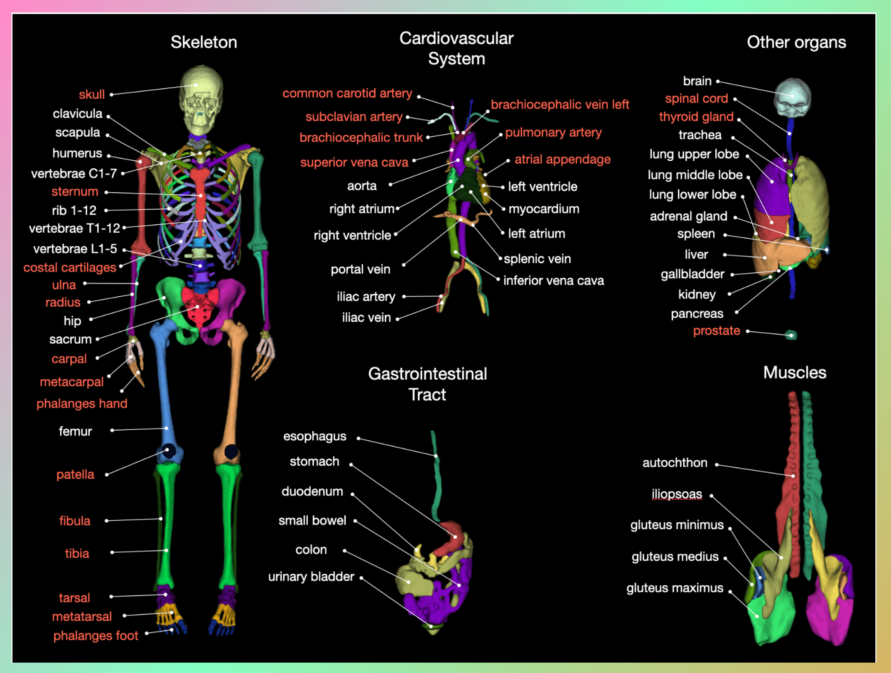

Segmentation of Healthy Abdominal Organs with CT Segmentator

Vikas Chauhan

June 10, 2024

![[cleanedup/19/image1.png]]

## Introduction

The ever-increasing number of radiological images leads to the need for computer-based evaluation methods. One important building block for the automatic analysis of radiological images is the segmentation of major anatomical structures.

### Current Challenges

Manually segmenting images is a laborious process, often leading annotators to focus solely on the structures immediately relevant to their research. Consequently, they create datasets tailored to specific tasks, but not necessarily comprehensive enough for broader applications. This approach has resulted in a proliferation of specialized segmentation methods in the recent history of AI in radiology. Unfortunately, the majority of these tools remain inaccessible to the wider scientific community. Consequently, researchers worldwide are continuously burdened with the arduous task of reinventing the wheel, leading to redundant efforts and significant time, cost, and resource investments.

## Introducing CT-Segmentator

CT Segmentator is a powerful tool that can automatically segment 117 classes in the CT segment. CT Segmentator is trained on a large diverse dataset of more than 1228 subjects. CT Segmentator can perform three-dimensional volumetric segmentation of important body structures rapidly and accurately.



CT Segmentator can accelerate every AI and radiomics project involving CT that requires segmentation. In many cases, Annotators can use CT Segmentator as the first step in their processing pipeline.
## Segmentation of Healthy Abdominal Organs

In this guide, we will be segmenting the Healthy Abdominal organ using CT Segmentator which allows you to automatically segment up to 117 classes in the CT segment.
### Taxonomy Setup

Let's start by creating a taxonomy to define what all organs we want to segment.


*If you are planning to create more than 10 taxonomies, we recommend you use the SDK method.*

### Create Taxonomy using SDK

```
create_taxonomy(name, study_classify=None, series_classify=None, instance_classify=None, object_types=None)[source]

Create a Taxonomy V2.

PARAMETERS:
name (str) – Unique identifier for the taxonomy.

study_classify (Optional[List[Attribute]]) – Study level classification applies to the task.

series_classify (Optional[List[Attribute]]) – Series level classification applies to a single series within a task.

instance_classify (Optional[List[Attribute]]) – Instance classification applies to a single frame (video) or slice (3D volume).

object_types (Optional[List[ObjectType]]) – Object types are used to annotate features/objects in tasks, for example, segmentation or bounding boxes.
```

You can access the SDK documentation
[[here]{.underline}](https://sdk.redbrickai.com/sdk.html#).

## Setting up Project

Once we have taxonomy created, the next step is to create a new Project.


To integrate CT Segmentator into your project workflow, you need to activate it by clicking the slider button.
‍


Once activated, begin mapping the taxonomy from the CT Segmentator to your created taxonomies.

## Uploading the Data

The dataset for this guide is from [CHAOS - Combined (CT-MR) Healthy Abdominal Organ Segmentation Challenge Data](https://zenodo.org/records/3431873). The database contains CT images of 40 different patients. These patients are potential liver donors, who have healthy (no tumors, lesions, or any other diseases) liver. The CT images were acquired from the upper abdomen area of the patients at the portal venous phase after contrast agent injection.

*A small sample of this Dataset can be accessed from [here](https://drive.google.com/drive/folders/1FoHR4tjxKPsp7EmJAVHfNzyR0WR_eq1K)*

We're using the direct upload method to upload our data here.

<div style="position: relative; padding-bottom: 62.5%; height: 0;"><iframe src="https://www.loom.com/embed/8e149121f2874dfc92b38823b23f4cb8?sid=9cc8db5b-46b5-40d3-876e-900f9a0f8bfe" frameborder="0" webkitallowfullscreen mozallowfullscreen allowfullscreen style="position: absolute; top: 0; left: 0; width: 100%; height: 100%;"></iframe></div>
## Automated Segmentation using CT segmentator

After uploading the data, the next step involves the CT Segmentator, where the uploaded images are automatically segmented. Upon clicking "start labeling," you proceed directly to the labeling stage.

<div style="position: relative; padding-bottom: 62.5%; height: 0;"><iframe src="https://www.loom.com/embed/28ab40a325d546eea7c32def102a6ae8?sid=5727b95e-894f-41a7-9ad7-6156524046d3" frameborder="0" webkitallowfullscreen mozallowfullscreen allowfullscreen style="position: absolute; top: 0; left: 0; width: 100%; height: 100%;"></iframe></div>

![[cleanedup/19/image3.png]]
