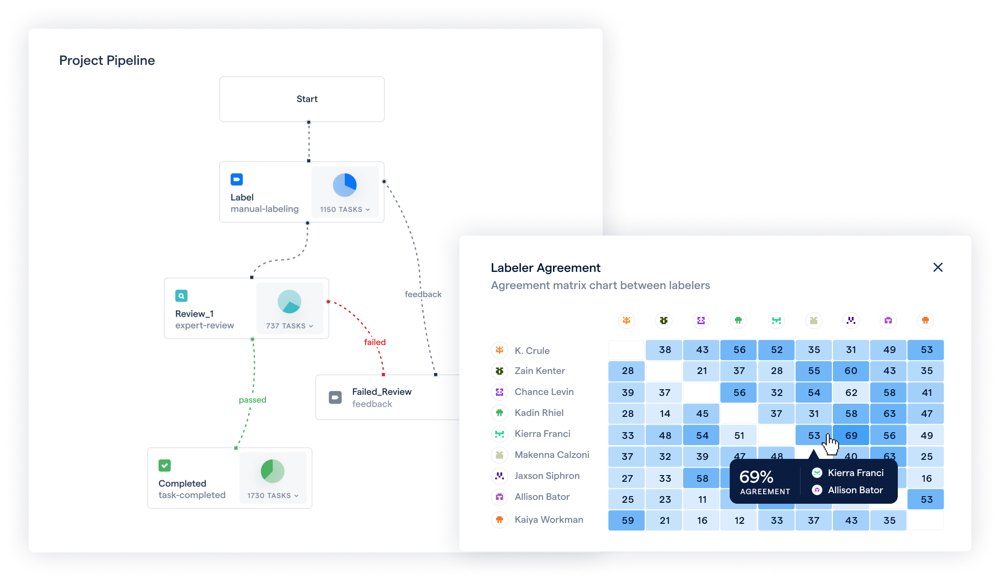

**Insight Based Decision Making - Radiomics & RedBrick AI**

Shivam Sharma

June 8, 2023

{width="6.4998611111111115in"
height="3.6586045494313213in"}

**Introduction**

[Radiomics](http://radiomics.bio/) is a Belgium-based cutting-edge
MedTech scale-up. Their team uses artificial intelligence on medical
images to deliver insight-based decision-making to optimize
pharmaceutical and biotech companies[']{dir="rtl"} clinical trials in
oncology.

The [Radiomics](http://radiomics.bio/) vision is a simple yet laudable
one, that RedBrick AI also shares; ["]{dir="rtl"}make precision medicine
a reality via AI & image analysis".

We recently had a chance to sit down with Medical Communication Manager,
Fabio Bottari to discuss the technology and products developed by
[Radiomics](http://radiomics.bio/) , as well as how their team uses
RedBrick AI[']{dir="rtl"}s platform.

**What does ["]{dir="rtl"}radiomics" mean?**

In medicine, ***radiomics*** is the discipline of extracting
quantitative features from medical images to uncover information
invisible to the naked eye. After the features are extracted, they can
be used to build statistical and machine learning models for descriptive
and predictive analysis.

**Why is that important?**

Say an unfortunate patient has been diagnosed with non-small cell lung
cancer.

To better treat this patient and assure the highest chance of survival,
the current standard criteria sometimes fall short. For this reason,
[Radiomics](http://radiomics.bio/) want to quantify all the information
inside medical images, looking at all the lesions and based on objective
and reproducible parameters. 

[Radiomics](http://radiomics.bio/) can extract what the human eye is
physically unable to interpret from the images and capture details about
things such as a tumor\'s shape, size, texture, intensity, and much
more.

These descriptors can ultimately be used to predict outcomes such as
expected tumor growth and potential response to treatment. But also, to
describe the type of tumor and the inherent biology of the lesion
(specific mutations, micro-environment, protein expression, etc.).

**What does the team at Radiomics.bio do?**

Broadly speaking, [Radiomics](http://radiomics.bio/) builds artificial
intelligence to analyze medical images and guide clinical trials.

But that[']{dir="rtl"}s perhaps a bit too broad of an answer, so
let[']{dir="rtl"}s break things down a bit.

In the pharmaceutical industry, clinical trials are a crucial step in
the process of getting a new drug approved. These trials are typically
broken up into four phases, where the early phases (Phase I) is focused
on assessing a drug[']{dir="rtl"}s safety and appropriate dose levels,
and later stages (Phases II to IV) are focused on assessing the efficacy
on patient populations and long-term effects.

Clinical trials can be a massive and expensive undertaking, as they can
last for several years. On top of that, drug manufacturers face many
challenges that can add to the risk and cost of clinical trials,
including recruiting the right participants for the later phases and
executing the trials with the correct dosage.

As the team at [Radiomics](http://radiomics.bio/) has observed,
pharmaceutical organizations often resort to trial and error to identify
a drug\'s maximum and optimal dose during the early stages of a trial.

In contrast, Radiomics [']{dir="rtl"}s approach can identify which
dosage of a drug will be most effective by tracking how a patient
responds to treatment from the very beginning of a trial.

This type of information is immensely useful to pharmaceutical
organizations and contributes significantly to their ability to better
plan later-stage trials.

In the later stages of a trial, [Radiomics](http://radiomics.bio/) helps
organizations identify which patient population is most appropriate for
a drug.

As Fabio said:

If you have a drug that works better in young adult than older patients,
it[']{dir="rtl"}s an easy criterion for constructing a trial. However,
some of those criterium can be hidden in the image, like tumors having a
specific shape, texture or phenotype which is not seen by the naked eye.
We can help stratify the patient population with radiomics analysis and
predict which patients will respond better to the drug.

Fabio Bottari

Communications Manager

**Where RedBrick AI Comes In**

The basis for Radiomics technology is the extraction of radiomics
features from medical images. To do so, the CT or MRI scans needs to be
segmented (i.e. identified and delineated) and annotated by experts, to
select the region of the body (organ or lesion) from which the radiomics
features will be extracted. So the first step of each radiomics analysis
is the creation of a large *annotated dataset*.

In the past, the team at [Radiomics](http://radiomics.bio/) used
locally-installed open source software combined with in-house tools for
annotation and quality control.

As Fabio describes it:

Earlier, at the end of the segmentation process, we needed to add a
lengthy quality control step, to ensure that no mistakes were made. For
example, we would notice mistakes in the segmentations due to incorrect
matching of segmentation masks to images and other similar issues. We
also had the burden of transferring files from one system to another. At
a certain point, **we also decided that developing and maintaining
tooling for annotation and segmentation in-house was not our main
focus** and, therefore, not worth the effort.

Fabio Bottari

Communications Manager

Now, [Radiomics](http://radiomics.bio/) uses RedBrick AI[']{dir="rtl"}s
medical data annotation platform to prepare **ground truth** data for
training their segmentation algorithms **and for the extraction of
radiomics features.**

With RedBrick AI, \[our\] project managers, engineers, and data managers
think there is a huge leap forward regarding data security, ease of data
management, tracking, and data sorting. **It was a significant
improvement in our data management processes.**

Fabio Bottari

Communications Manager

RedBrick AI\'s project management tools and command line interface (CLI)

RedBrick AI also offers a wide variety of tools to effectively manage
projects & workflows, as well as APIs to integrate with data stores and
Machine Learning Operations. This tool suite includes comprehensive
quality control features, including the ability to create multi-stage
review workflows, measure inter-annotator agreement, and track
individual labeler quality scores. 

The feature that [Radiomics](http://radiomics.bio/) uses and find most
useful is the review workflow.

The review cycles on RedBrick AI have been **key** in most of our
annotation projects.

Fabio Bottari

Communications Manager

Configurable review workflows, and inter-annotator agreement matrix

Everything we build at RedBrick AI, from the supported data formats
(DICOM, NIfTI, etc.) to the viewing tools (multi-series, 3D, MPR, etc.)
to the annotation tools (intelligent contouring, threshold-based
segmentation, etc.), is built for radiology data and the people who work
with it every day. 

The annotation tool layout is intuitive and allows for easy management
of multiple images at different timepoints. **This capability was
lacking in our earlier Open Source solution** that required us to open
multiple instances of the software, each with one image. With RedBrick
AI, you can easily drag and drop images into the viewport. The biggest
advantage is that we can now work on annotation with multiple images at
a patient level, whereas earlier, we were constrained to a single image.

Fabio Bottari

Communications Manager

At RedBrick AI, we firmly believe that technology can make the world a
better, healthier place. The work of startups such as
[Radiomics](http://radiomics.bio/) is both inspiring to behold and
serves a key role in the advancement of medical technologies.

We[']{dir="rtl"}re thrilled to continue our collaboration with
[Radiomics](http://radiomics.bio/) and have the chance to watch as they
transform clinical trials through insight-based decision-making.

‍
