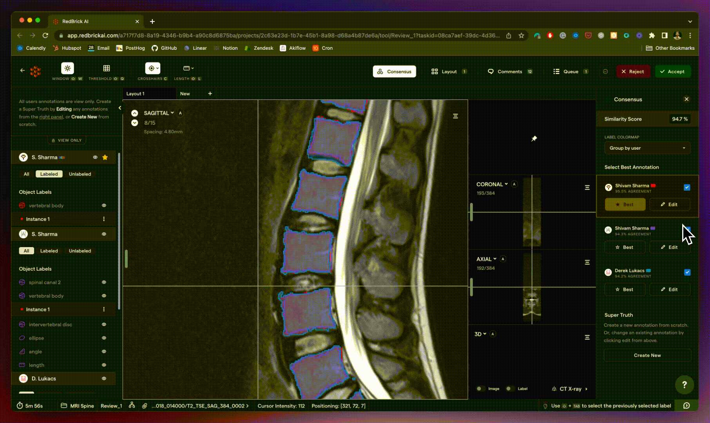

**Accessible healthcare using AI - Qure AI & RedBrick AI**

**Summarize**

Shivam Sharma

[Qure.ai](http://qure.ai/) is an innovative artificial intelligence (AI)
provider with a mission to make healthcare more accessible and
affordable. The company uses deep learning to offer automated
interpretation of radiology exams, including X-rays, CT scans, and
ultrasound scans. This not only conserves resources for hospitals and
saves time for radiologists, but also enhances the accuracy of
diagnoses.

Qure AI[']{dir="rtl"}s suite of products, AI for Chest X-ray, Chest CT,
and Head CT, have been adopted by institutions in over 70 countries and
their products serve over 10 million patients every year!

**Improving Lung Health using AI**

Qure AI[']{dir="rtl"}s lung health products are some of the most widely
adopted AI algorithms in the industry. When [Qure.ai](http://qure.ai/)
was founded in 2016, they started with a Chest X-ray product that can
now detect over 30 abnormalities and provide automated reporting. Since
then, [Qure.ai](http://qure.ai/) has launched products for the early
detection of lung cancer using Chest CT.

**Lung cancer is responsible for 1.74 million deaths a year**

[Lung cancer is the leading cancer
killer](https://www.lung.org/lung-health-diseases/lung-disease-lookup/lung-cancer/resource-library/lung-cancer-fact-sheet)
in both men and women in the U.S., responsible for about 1 in 5 of all
cancer deaths. Each year, [more people die of lung
cancer](https://www.chestnet.org/newsroom/chest-news/2020/07/world-lung-cancer-day-2020-fact-sheet)
than of colon, breast, and prostate cancers combined.

Early detection of cancer is instrumental in increasing chance of
survival. From the graphic below, [notice how the 5-year survival
rate](https://www.cancer.org/cancer/types/lung-cancer/detection-diagnosis-staging/survival-rates.html)
for non-small cell lung cancer drops from 65% to 9% when the cancer
spreads.

Medical imaging plays an important role in diagnosing and grading lung
cancer. Screening patients with CT scans, as opposed to chest X-rays,
has resulted in a 20% reduction in lung cancer-specific deaths.

**Empowering lung cancer screening with AI**

Radiologists face several challenges in accurately diagnosing lung
cancer, despite having access to the right imaging tools. For instance,
according to a study (<https://pubmed.ncbi.nlm.nih.gov/24149862/>),
42.5% of malpractice suits against radiologists result from a failure to
diagnose lung cancer.

Radiologists often disagree on factors such as the presence of cancerous
nodules, nodule texture, and nodule size, leading to a common source of
error. Qure AI\'s products can increase inter-reader agreement, which
measures how often different radiologists agree on the prognosis of a
single scan, by over 33%.

Diagnosing lung cancer is not a one-time event, as the NELSON lung
protocol recommends measuring the growth of nodules to assess malignancy
after a patient has been diagnosed. However, measuring the volumes of
multiple nodules in chest CT scans and comparing them over time can be a
tedious exercise.

Qure AI\'s AI for Chest CT products address several real-world
challenges faced by radiologists. Specifically,
[Qure.ai](http://qure.ai/) can:

To train their high-performance deep learning algorithms,
[Qure.ai](http://qure.ai/) had to amass a large annotated dataset for
each use-case. The Qure.ai team uses the RedBrick AI platform to
annotate scans, manage projects, and enforce quality standards.

**Purpose built annotation for Radiology AI**

[Qure.ai](http://qure.ai/)[']{dir="rtl"}s products, ranging from 2D
X-ray reporting to 3D nodule detection in Chest CT, require highly
specialized annotation and workflow tools.

Before transitioning to RedBrick AI, [Qure.ai](http://qure.ai/) used a
combination of internal and open-source tools, such as 3D Slicer.
However, the [Qure.ai](http://qure.ai/) team found that they were
spending a significant amount of time maintaining their internal
labeling infrastructure. By transitioning to a platform like RedBrick
AI, they can now better focus on model building.

After switching to RedBrick AI, we experienced several benefits:

Onboarding and training annotators became much easier.

RedBrick AI\'s review workflows improved project management.

The time it takes to load a scan for annotation was drastically reduced.

RedBrick AI\'s taxonomies allowed us to capture more structured data.

Prakash Vanapalli

Director of Data Science

**Quality control with consensus and validation**

As discussed above, the diagnosis and classification of cancerous lung
nodules can be subjective. However, to train an accurate algorithm,
annotations representative of the truth are needed, rather than a single
annotator\'s opinion. [Qure.ai](http://qure.ai/) uses RedBrick AI\'s
consensus tools to arbitrate between several annotator opinions.

Radiology annotations can be subjective. For example, radiologists may
often disagree on the size of a nodule in a chest CT scan. Therefore, we
need excellent tools to help us get closer to the truth. RedBrick AI
allows us to give a single CT scan to multiple radiologists and view all
of their opinions overlapping, which is incredibly insightful. **With
RedBrick AI, we can manage the entire workflow** of measuring consensus
during our annotation projects.

Souvik Mandal

Senior AI Scientist

Arbitrate between multiple annotations and measure consensus

Sometimes disagreement between annotators may result in lower quality
annotations. However, not adhering to the labeling schema can also be a
big source of annotation quality problems. For example, forgetting to
annotate a particular category or attribute. These \"schema\" mistakes
are usually found at the end of an annotation project, when engineers
are preparing to train with the data.

Previously, we used to perform extensive post-processing of our
annotations in order to identify errors such as missing label
attributes. Now, we use RedBrick AI\'s custom label validation script to
automatically check for these mistakes in real-time. **This has
significantly reduced the post-processing burden and saved us a
considerable amount of time.**

Ritvik Jain

Product Manager

Write a custom JS script to validate labels

**Clinical performance for regulatory approval**

In 2023 the [Qure.ai](http://qure.ai/) team received CE Class IIb
certification for their Chest CT product. To receive regulatory
clearance, you must conduct a clinical performance study, where you
measure the performance of the algorithm against a reference standard.
Qure.ai used RedBrick AI in collaboration with their European partners
to conduct this clinical performance study.

While pursuing Class IIb certification, **being able to deploy RedBrick
AI within a research institutions private environment was crucial**.
Doing so restricted access to data within a private environment building
a lot of trust in the system.

Ritvik Jain

Product Manager

‍

[Qure.ai](http://qure.ai/)\'s AI products for radiology are improving
healthcare accessibility and affordability while saving lives. RedBrick
AI is excited to help [Qure.ai](http://qure.ai/) build high-performance
deep learning algorithms with our annotation and workflow tools!

**The best thing about RedBrick AI is their excellent support.** They
truly listen to our feedback and act on it quickly. I have worked with
their competitors before, and this level of support really sets them
apart. In fact, **they really stand out compared to any company we\'ve
worked with.**

Ritvik Jain

Product Manager
