**Introduction to DICOM for Computer Vision Engineers**

**Summarize**

Shivam Sharma

{width="2.3194444444444446in"
height="1.3055555555555556in"}

DICOM (Digital Imaging and Communications in Medicine) is a standard for
storing, processing, and transmitting medical images and related
information.

If you come from a background of computer science/machine learning and
are new to medical imaging, working with medical imaging datasets can be
confusing. I know I was confused by the idiosyncrasies of medical
imaging datasets when I first encountered them. This blog is a light
introduction into DICOM for data scientists/computer vision engineers.

Here is a [link to the GitHub
repository](https://github.com/redbrick-ai/blogs/blob/master/intro-to-dicom-for-computer-vision/dicom.ipynb)
with data and code that accompanies this blog.

**What is DICOM?**

DICOM is a standard that defines how medical imaging information can be
stored and communicated. The DICOM standard enables integration and
interoperability between various systems like storage and image
acquisition devices. Just like we expect to be able to share, open and
interact with PNG files no matter what system they were generated on,
DICOM allows you to interact with complex imaging data irrespective of
the equipment used to generate the image or the system used to store the
image.

At a high level, DICOM has two important components --- a data storage
format, and a list of services.

**The DICOM File Format.** The format defines the way images and
corresponding information is stored. For example, a CT scan and the
ID of the device that generated the scan.

**DIMSE/DICOM web services.** DICOM defines several services governing
the storage and communication of data over a network - for example,
storage, query, retrieve, etc.

**DICOM Information Model**

The standard defines a hierarchy within which information is stored and
organized. The highest level object in a DICOM dataset is the *patient*.
Within the *patient* there can be multiple *studies,* which are single
scan sessions. Each scan session can have multiple individual scans
called *series.* Each study has *instances* that can represent a single
or multi-frame scan, along with other relevant medical information
stored in the *data elements*

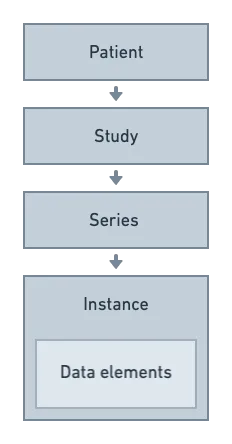{width="3.2222222222222223in"
height="6.166666666666667in"}

DICOM Information Model

In DICOM speak, a real world object like a CT scan is called an
Information Object Definition (IOD). The IOD specifies the data elements
within the DICOM instance --- the data elements store useful information
about the image, patient, and one data element stores the actual pixel
data of the scan. [Here is a link to the Computed Tomography (CT)
IOD](https://dicom.nema.org/dicom/2013/output/chtml/part03/sect_A.3.html).

{width="6.4998611111111115in"
height="1.203678915135608in"}

Structure of a DICOM data element

Every data element is uniquely identified by the *data element tag*
which is a hexadecimal number.

The elements contain an optional *value representation* which is
basically the data type of the element e.g. Unsigned Long (UL), Short
String (SH) etc.

The *value length* depends on VR and specifies the length of the value.

The *value field* contains the actual value of the data element.

While working with DICOM datasets, it[']{dir="rtl"}s extremely important
to refer to the standard to understand what information is stored within
each data element and which ones are required so you can rely on them
for your analysis. The *Usage* column will define each entry as either
**M**andatory or **U**ser defined i.e. optional.

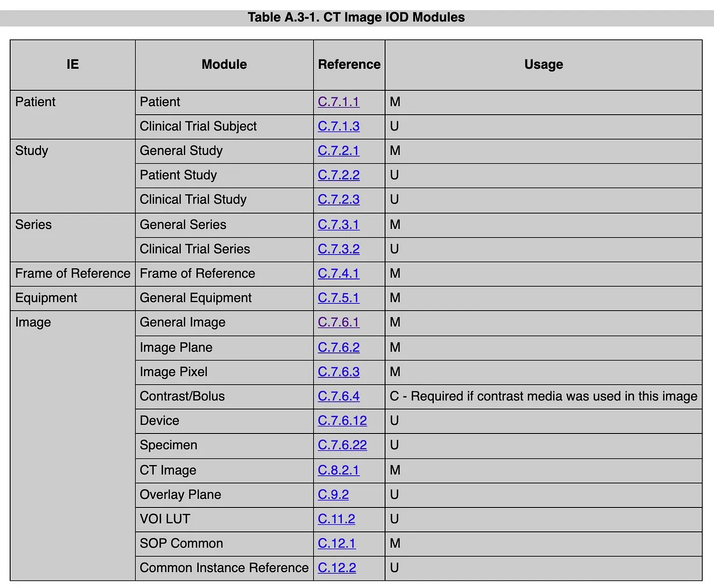{width="6.4998611111111115in"
height="5.353100393700787in"}

Top level CT IOD elements. Each element has sub-elements as well that
are defined in the standard.

**Exploring a DICOM Dataset**

Let[']{dir="rtl"}s have a look at all these concepts in play with real
DICOM datasets. If you[']{dir="rtl"}re lucky and your DICOM dataset is
stored as per the DICOM information model hierarchy, you will be able to
navigate the dataset in your file system.

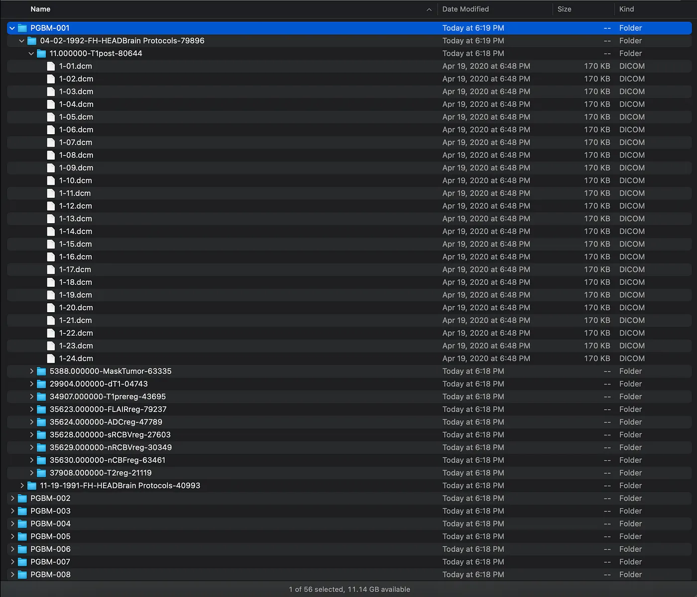{width="6.4998611111111115in"
height="5.575952537182852in"}

Brain Tumor regression dataset

The screenshot above shows the [brain tumor regression
dataset](https://www.kaggle.com/sosonger/tumor-regression/data?select=Brain-Tumor-Progression),
structured with the top level folder as a *patient,* within which there
are multiple *studies,* within which there are various *series,* and
finally *instances.*

Let[']{dir="rtl"}s have a look at another dataset, found in the [Harvard
Dataverse](https://dataverse.harvard.edu/dataset.xhtml?persistentId=doi:10.7910/DVN/6ACUZJ).
If you look at the image below, you[']{dir="rtl"}ll see several hundred
dcm files comprising of multiple series within a single patient folder.

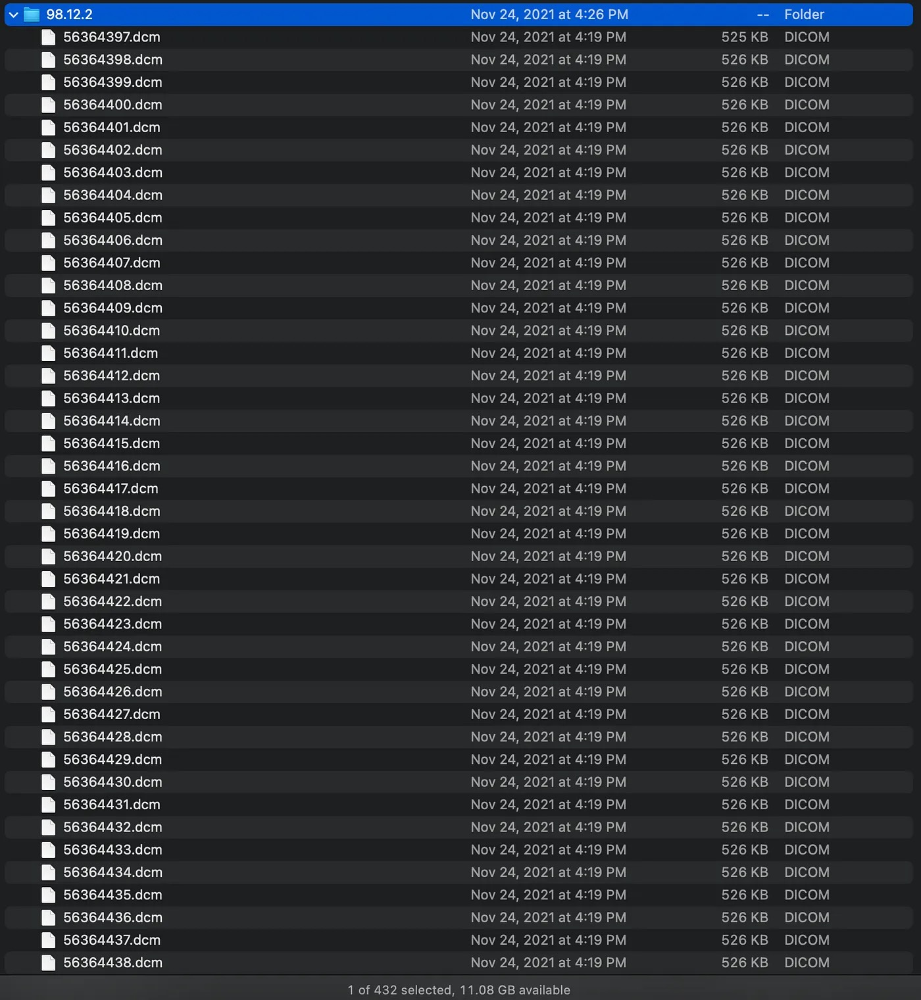{width="6.4998611111111115in"
height="7.056992563429572in"}

Multiple series of a single patient of [Harvard Dataverse Chest
CT Dataset](https://dataverse.harvard.edu/dataset.xhtml?persistentId=doi:10.7910/DVN/6ACUZJ)

In scenarios like these, we[']{dir="rtl"}ll have to resort to the DICOM
data elements to actually make sense of the dataset. We can read in the
files from the directory to see that there are a total of 427 instances.

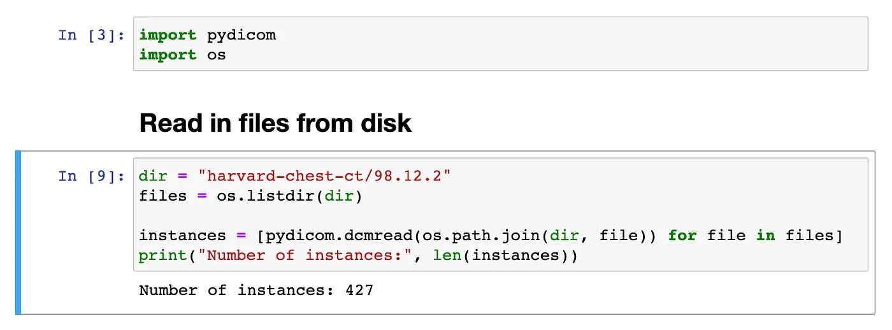{width="6.4998611111111115in"
height="2.4049496937882764in"}

We can print out a single instance to have a look at all the data
elements. You[']{dir="rtl"}ll see all the required data elements defined
in the CT IOD in the DICOM standard.

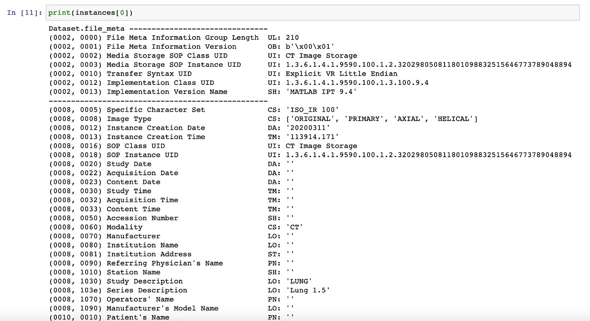{width="6.4998611111111115in"
height="3.5470680227471565in"}

DICOM instance data elements

We can specifically print out some of the useful elements that will help
us organize this dataset.

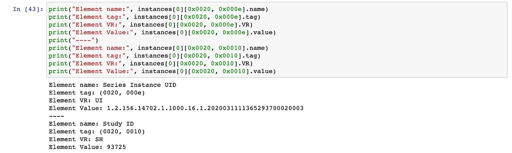{width="6.4998611111111115in"
height="1.954601924759405in"}

The code snippet above uses the hexadecimal tag[']{dir="rtl"}s of Study
ID and Series Instance UID which can be found in the [DICOM
standard](https://dicom.nema.org/dicom/2013/output/chtml/part03/sect_C.7.html#sect_C.7.3.1).
We can now parse the DICOM instance object and print both data elements.
Note that the Series Instance UID is stored as a [Unique Identifier
(UI)](https://dicom.nema.org/dicom/2013/output/chtml/part05/sect_6.2.html),
while the Study ID is stored as a [Short String
(SH)](https://dicom.nema.org/dicom/2013/output/chtml/part05/sect_6.2.html).

Let[']{dir="rtl"}s iterate through our list of instances to sort the
dataset by study and series.

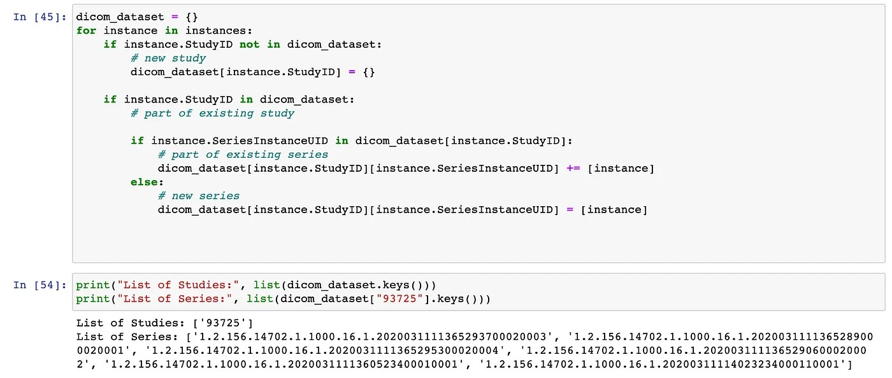{width="6.4998611111111115in"
height="2.7577985564304464in"}

From the analysis, we can see there is a single study 93725 and 6
different series within this study. We can now use this object to store
the dataset as per the correct hierarchy.

**DICOM Pixel Data**

The [Pixel data
element](https://dicom.nema.org/dicom/2013/output/chtml/part03/sect_C.7.html#table_C.7-11b)
stores the actual image pixel data of the scan in compressed JPEG
format. You can see the type of compression used within the [Photometric
Interpretation](https://dicom.nema.org/medical/Dicom/2016e/output/chtml/part03/sect_C.7.6.3.html#:~:text=2%20Photometric%20Interpretation,imposed%20by%20compressed%20Transfer%20Syntaxes.)
data element.

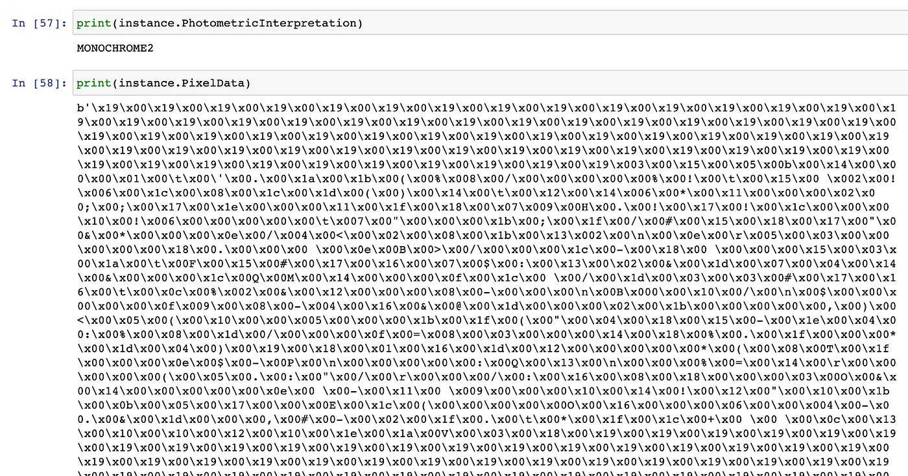{width="6.4998611111111115in"
height="3.41242782152231in"}

Have a look at the [DICOM
standard](https://dicom.nema.org/medical/Dicom/2016e/output/chtml/part03/sect_C.7.6.3.html#sect_C.7.6.3.1.2)
for an overview of the different kinds of photometric interpretations.

If we print out the value of the Pixel Data attribute, you will see a
dump of compressed image data. However, the pydicom library provides a
handy function that extracts a NumPy pixel array from the Pixel Data
data element for us.

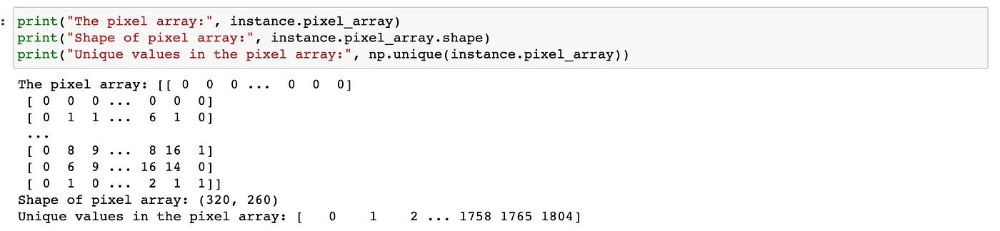{width="6.4998611111111115in"
height="1.5042541557305338in"}

From the code snippet above you should be able to see that the instance
is a 320 x 260 single channel image. But hold... the pixel values range
between \[0, 1804\]?

**Hounsfield Units**

This is because the CT pixel data is stored as Hounsfied Units.
Hounsfield Units are a measure of radiodensity i.e. they measure how
easily a radiowave can penetrate a particular material.

Here are some materials and their values on the Hounsfield scale:

Air =-1000

Water = 0

300 \< Bone \< 1900

100 \< Soft tissue \< 300

Visualizing the image and a histogram of the pixel values side by side
gives us a good understanding of the distribution of pixels --- with
most being around 0, and then peaks around 400 and 800, which makes
sense as our bodies are mostly water, tissue, and bone.

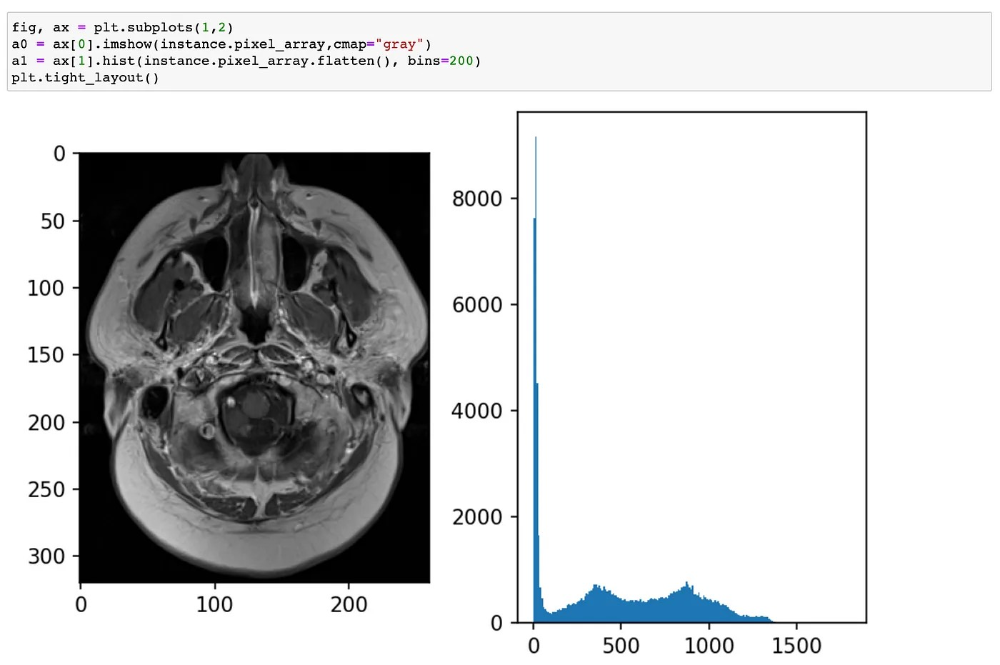{width="6.4998611111111115in"
height="4.32240813648294in"}

To visualize and store the Hounsfield Units as Grayscale images, we have
to map the HU values to Grayscale values --- this is often done along
with a *windowing* operation.

**Windowing**

Typically, the pixel data will range from -1500 HU to +1500 HU, which is
a range of 3000 HU. Displaying this as 3000 shades of gray on a regular
screen is impossible, as most screens support only 256 shades of gray
--- this is where windowing comes in.

Windowing selects a range of HU values and maps those between \[0, 255\]
allowing for higher resolution. Say you were interested in visualizing
the bone structures in a CT scan, if you were to map the HU
(let[']{dir="rtl"}s say ranging from \[0, 1800\]) to 256 grayscale
values, one shade of gray would have resolution of 1800/256 \~ 7 HU.

Alternatively, we can map only values between \[500, 1900\] to 256
grayscale values, and now we have a better resolution of \~5 HU.
Everything above 1900 HU will appear white in the image, and everything
below 500 will appear black.

To accomplish this we can define two values:

Window Center: The center point in HU of your windowing range

Window Width: The range of HU values to include in the windowed image.

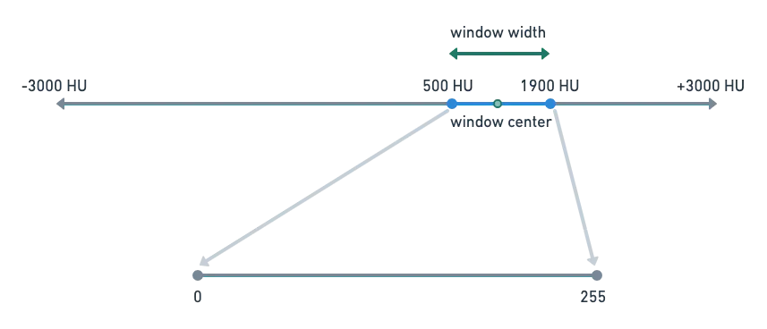{width="6.4998611111111115in"
height="2.7910728346456692in"}

Now, in code.

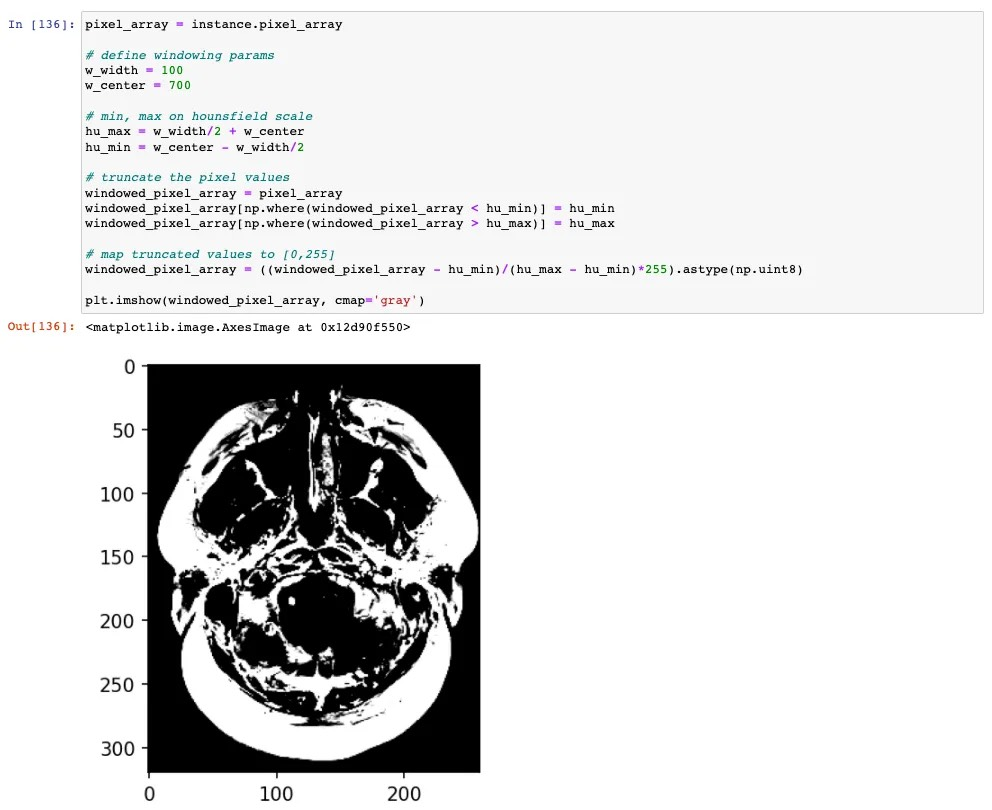{width="6.4998611111111115in"
height="5.307346894138233in"}

There you go! A windowed slice of a brain CT scan.

**References**

1.  The DICOM Standard ---
    [[https://www.dicomstandard.org/current]{.underline}](https://www.dicomstandard.org/current)

2.  Brain tumor regression dataset ---
    [[https://www.kaggle.com/sosonger/tumor-regression/data?select=Brain-Tumor-Progression]{.underline}](https://www.kaggle.com/sosonger/tumor-regression/data?select=Brain-Tumor-Progression)

3.  Harvard Dataverse COVID Chest dataset ---
    [[https://dataverse.harvard.edu/dataset.xhtml?persistentId=doi:10.7910/DVN/6ACUZJ]{.underline}](https://dataverse.harvard.edu/dataset.xhtml?persistentId=doi:10.7910/DVN/6ACUZJ)
